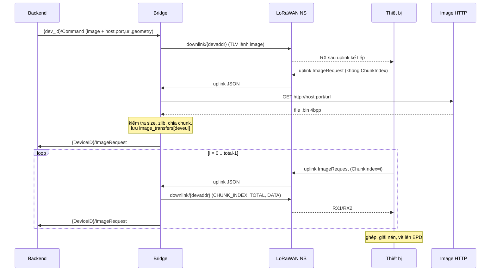

# LoRaWAN Bridge: Phân tích giao thức, bản tin và nghiệp vụ

Tài liệu mô tả chi tiết bridge nằm giữa **LoRaWAN Network Server (NS)** và **Backend**, dựa trên các file đã cung cấp:
`bridge.py`, `device_registry.py`, `protocol/tlv.py`, `protocol/uplink.py`, `protocol/downlink.py`, `decoder/rak3172.py`.

> **Chưa có:** `config.py` (giá trị `IMAGE_CHUNK_SIZE`, `EPD_*`, broker, QoS, `CLIENT_ID`) và `docker-compose.yml`. Các mục phụ thuộc những giá trị này được đánh dấu *(cần xác nhận)*.

---

## 1. Kiến trúc tổng quan

```
 Thiết bị         LoRaWAN NS        BRIDGE               Backend
 RAK3172 + EPD    (broker A)        (Python, asyncio)    (broker B)
      |                |                 |                    |
      |<--- LoRa ----->|<---- MQTT ----->|<----- MQTT ------->|
                                         |
                           +-------------+--------------+
                           |                            |
                  Redis (registry)          Image HTTP server (HTTP GET)
```

| Thành phần | Vai trò |
|---|---|
| Thiết bị RAK3172 | Gửi uplink TLV thô, nhận downlink TLV, hiển thị ảnh lên màn hình EPD |
| LoRaWAN NS | Nhận/gửi frame LoRaWAN, giao tiếp với bridge qua MQTT JSON |
| Bridge | Dịch TLV ↔ JSON, quản lý registry, tải/nén/chia chunk ảnh |
| Redis | Lưu ánh xạ `deveui ↔ DeviceID` và `devaddr` hiện tại |
| Backend | Nhận sự kiện theo `DeviceID`, gửi lệnh điều khiển |
| Image HTTP server | Chứa file ảnh thô đã chuyển sẵn sang định dạng EPD |

Bridge dùng **2 MQTT client** riêng:
- `{CLIENT_ID}-lorawan` kết nối broker LoRaWAN, subscribe `LORAWAN_UPLINK_TOPIC`.
- `{CLIENT_ID}-backend` kết nối broker Backend, subscribe `#`.

---

## 2. Ba định danh của một thiết bị

| | `DevEUI` | `DeviceID` | `DevAddr` |
|---|---|---|---|
| Tầng | Phần cứng / LoRaWAN | Ứng dụng | Phiên LoRaWAN |
| Do ai cấp | Nhà sản xuất module | Bạn đặt, firmware gửi lên | NS cấp khi join |
| Độ dài | 64 bit (16 ký tự hex) | Chuỗi tùy ý | 32 bit (8 ký tự hex) |
| Thay đổi | Không bao giờ | Khi đổi cấu hình/firmware | Mỗi lần join lại (OTAA) |
| Vai trò | **Khóa chính** của bridge | Tên topic với backend | Địa chỉ gửi downlink |
| Ví dụ | `70B3D57ED005AAAA` | `shelf-01` | `01A98B34` |

---

## 3. Các kênh MQTT và topic

| # | Broker | Topic | Hướng | Nội dung |
|---|---|---|---|---|
| 1 | LoRaWAN | `LORAWAN_UPLINK_TOPIC` | NS → Bridge | JSON uplink |
| 2 | LoRaWAN | `downlink/{devaddr}` | Bridge → NS | JSON downlink |
| 3 | Backend | `{DeviceID}/{topic_name}` | Bridge → Backend | JSON đã decode |
| 4 | Backend | `{dev_id}/Command` | Backend → Bridge | JSON lệnh |

Quy tắc nhận lệnh (`on_downlink`):
- Topic phải có **đúng 2 phần** `dev_id/topic_name`.
- `topic_name.strip().lower()` phải bằng `"command"`.
- Các topic khác (kể cả do bridge tự publish ra, vì subscribe `#`) bị bỏ qua.

### 3.1 JSON uplink từ NS (bridge nhận)

Các trường bridge sử dụng:

```json
{
  "deveui": "70B3D57ED005AAAA",
  "devaddr": "01A98B34",
  "data": "6801..."          // payload TLV dạng hex
}
```

Bridge thêm `uplink["raw"] = bytes.fromhex(uplink["data"])` rồi chuyển cho decoder. Các trường khác của NS (rssi, snr, fcnt, ...) nếu có thì chỉ được log, không được chuyển lên backend.

### 3.2 JSON downlink gửi NS (bridge publish)

```json
{
  "devaddr": "01A98B34",
  "port": 1,
  "confirmed": false,
  "data": "<hex TLV>"
}
```

- Lệnh từ backend: `port` và `confirmed` lấy từ JSON lệnh (`msg.get("port", 1)`, `msg.get("confirmed", False)`).
- Chunk ảnh: cố định `port=1`, `confirmed=false`.
- QoS publish downlink: `1`.

---

## 4. Định dạng TLV chi tiết

### 4.1 TLV là gì và vì sao dùng

**TLV = Type – Length – Value.** Mỗi mẩu thông tin được đóng gói thành một phần tử tự mô tả: byte đầu cho biết *đây là gì*, byte tiếp theo cho biết *dài bao nhiêu*, phần còn lại là *dữ liệu*.

Lý do firmware chọn TLV thay vì JSON trên LoRa:

| Tiêu chí | JSON | TLV |
|---|---|---|
| Kích thước | Lớn (tên trường dạng chữ, dấu ngoặc, dấu nháy) | Nhỏ (tên trường chỉ 1 byte) |
| Phù hợp payload LoRaWAN (vài chục byte) | Không | Có |
| Thêm trường mới | Dễ | Dễ: thêm type mới, bên nhận cũ bỏ qua |
| Thứ tự trường | Không quan trọng | Quan trọng với một số trường (xem 4.7) |

Bridge đóng vai trò **phiên dịch**: TLV nhị phân phía thiết bị ↔ JSON phía backend.

### 4.2 Cấu trúc một phần tử

```
 byte 0      byte 1       byte 2 ... byte (1 + N)
┌─────────┬────────────┬─────────────────────────┐
│  Type   │  Length N  │   Value (N byte)        │
│ (1 byte)│  (1 byte)  │                         │
└─────────┴────────────┴─────────────────────────┘
```

- `Type`: mã loại, 0 đến 255 (xem bảng mã ở mục 5).
- `Length`: **số byte của Value**, không tính 2 byte header. Tối đa 255.
- `Value`: dữ liệu thô, ý nghĩa do `Type` quyết định.
- Tổng độ dài một phần tử = `2 + N`.

Ví dụ: `01 08 73 68 65 6c 66 2d 30 31`

| Byte | Hex | Ý nghĩa |
|---|---|---|
| 0 | `01` | Type = 1 (`DEVICE_ID`) |
| 1 | `08` | Length = 8 |
| 2 đến 9 | `73 68 65 6c 66 2d 30 31` | Value = chuỗi ASCII `shelf-01` |

### 4.3 Cấu trúc một khung (frame) và cách đọc từng byte

#### 4.3.1 "Frame" ở đây nằm ở tầng nào

Chữ "frame" dễ gây nhầm vì có nhiều lớp lồng nhau. Bridge **chỉ nhìn thấy lớp trong cùng**:

```
Lớp 1. Gói LoRa trên sóng (PHY): chip radio và gateway xử lý
    Preamble | Header | [ Khung LoRaWAN (MAC) ] | CRC của radio
                              |
                              v
Lớp 2. Khung LoRaWAN (MAC): gateway và NS xử lý
    MHDR | DevAddr | FCtrl | FCnt | FPort | FRMPayload | MIC
     1B  |    4B   |   1B  |  2B  |   1B  |   N byte   |  4B
                                                 |
                                                 |  NS giải mã bằng AppSKey, đổi thành hex, đặt vào trường "data"
                                                 v
Lớp 3. Khung TLV (= FRMPayload): firmware và BRIDGE xử lý
    TLV topic | TLV dữ liệu ... | TLV CRC
```

| Lớp | Ai xử lý | Bridge có thấy không |
|---|---|---|
| Gói LoRa (PHY): preamble, header, CRC của radio | Chip radio, gateway | Không |
| Khung LoRaWAN (MAC): MHDR, DevAddr, FCtrl, FCnt, FPort, MIC | Gateway, NS | Không (NS chỉ đưa `devaddr`, `deveui`, `port`... ra JSON) |
| **FRMPayload = khung TLV** | **Firmware và bridge** | **Có, qua trường `data` (hex)** |

Hệ quả: một khung TLV 27 byte thực tế chiếm khoảng **40 byte trên sóng** (cộng 13 byte MHDR + FHDR + FPort + MIC khi không có FOpts). Giới hạn payload (11, 53, 125, 242 byte...) nói ở các phần trước chỉ tính phần **FRMPayload**, tức khung TLV.

#### 4.3.2 Khung TLV gồm những gì

Khung TLV là một chuỗi phần tử nối liền, không có header riêng, không có trường độ dài tổng:

```
[ 1. TLV topic ] [ 2. TLV dữ liệu 1 ] [ 2. TLV dữ liệu 2 ] ... [ 3. TLV CRC ]
   loại bản tin       các trường thông tin (0 đến nhiều)          type 255, luôn cuối
```

| Phần | Vai trò | Ví dụ |
|---|---|---|
| ① TLV topic | Cho biết **đây là bản tin gì**. Uplink: type 101 đến 106. Downlink: type 104 (`COMMAND`) kèm mã lệnh | `66 00` = `BUTTON` |
| ② TLV dữ liệu | Mang các trường thông tin, thứ tự theo quy ước firmware | `01 08 ...` = `DeviceID` |
| ③ TLV CRC | Kiểm tra toàn vẹn, luôn đứng **cuối** | `ff 01 25` |

Không có ký tự báo hết khung. Bên nhận biết khung hết khi **con trỏ đọc chạm cuối buffer** (độ dài FRMPayload do tầng LoRaWAN cung cấp).

#### 4.3.3 Phân tích một khung thực tế, từng byte

Khung uplink `Button` (27 byte), dạng hex mà NS đưa vào trường `data`:

```
660001087368656c662d303103014104040000015e05010aff0125
```

**Bản đồ byte theo offset** (offset bắt đầu từ 0):

| Offset | 0 | 1 | 2 | 3 | 4 | 5 | 6 | 7 | 8 | 9 | 10 | 11 | 12 | 13 | 14 | 15 | 16 | 17 | 18 | 19 | 20 | 21 | 22 | 23 | 24 | 25 | 26 |
|---|---|---|---|---|---|---|---|---|---|---|---|---|---|---|---|---|---|---|---|---|---|---|---|---|---|---|---|
| Hex | 66 | 00 | 01 | 08 | 73 | 68 | 65 | 6c | 66 | 2d | 30 | 31 | 03 | 01 | 41 | 04 | 04 | 00 | 00 | 01 | 5e | 05 | 01 | 0a | ff | 01 | 25 |
| Vai trò | T | L | T | L | V | V | V | V | V | V | V | V | T | L | V | T | L | V | V | V | V | T | L | V | T | L | V |

`T` = Type, `L` = Length, `V` = Value. Các byte nhóm lại thành 6 phần tử:

```
hex:    66 00 | 01 08 73 68 65 6c 66 2d 30 31 | 03 01 41 | 04 04 00 00 01 5e | 05 01 0a | ff 01 25
        A       B                               C          D                   E          F
```

A = TLV topic `BUTTON` · B = `DEVICE_ID` · C = `BUTTON_NAME` · D = `BUTTON_DURATION` · E = `DIP_SWITCH_STATE` · F = TLV `CRC`

**Đọc bằng con trỏ `i`**, mỗi lần làm ba việc: đọc Type tại `i`, đọc Length tại `i+1`, lấy `Length` byte tiếp theo làm Value, rồi nhảy `i += 2 + Length`:

| Lần | `i` | Type (offset `i`) | Length (offset `i+1`) | Value (offset `i+2` đến `i+1+L`) | Nhảy tới |
|---|---|---|---|---|---|
| 1 | 0 | `66` = 102 `BUTTON` | `00` = 0 | (rỗng) | 2 |
| 2 | 2 | `01` = 1 `DEVICE_ID` | `08` = 8 | offset 4 đến 11: `73 68 65 6c 66 2d 30 31` = `shelf-01` | 12 |
| 3 | 12 | `03` = 3 `BUTTON_NAME` | `01` = 1 | offset 14: `41` = `A` | 15 |
| 4 | 15 | `04` = 4 `BUTTON_DURATION` | `04` = 4 | offset 17 đến 20: `00 00 01 5e` = 350 | 21 |
| 5 | 21 | `05` = 5 `DIP_SWITCH_STATE` | `01` = 1 | offset 23: `0a` = 10 → `"0x0A"` | 24 |
| 6 | 24 | `ff` = 255 `CRC` | `01` = 1 | offset 26: `25` | 27 (= hết buffer, dừng) |

Con trỏ về đúng 27 = độ dài khung, nghĩa là khung **khớp hoàn toàn**, không thừa, không thiếu byte.

**Kiểm tra CRC** (XOR 1 byte): lấy toàn bộ byte từ offset 0 đến 23 (24 byte, mọi thứ **trước** TLV CRC, gồm cả các byte Type/Length), XOR lại được `0x25`, trùng với Value của TLV CRC → `crc_valid = True`.

#### 4.3.4 Cách bên nhận biết khung đã đọc xong và đúng

| Dấu hiệu | Ý nghĩa |
|---|---|
| Con trỏ chạm đúng cuối buffer, phần tử cuối là type 255, CRC khớp | Khung **hợp lệ** |
| Con trỏ chạm cuối nhưng phần tử cuối không phải CRC | Thiếu CRC → `validate_crc` trả `False` |
| `i + 2 + Length` vượt quá cuối buffer | Khung **bị cắt cụt**, `parse_tlv` dừng, các TLV trước đó vẫn được giữ |
| CRC không khớp | Có byte bị sai (nhiễu, lỗi firmware) |

#### 4.3.5 Cùng nguyên tắc cho downlink

Khung downlink của lệnh `ping` (19 byte dữ liệu + 3 byte CRC = 22 byte):

```
hex:    01 08 73 68 65 6c 66 2d 30 31 | 10 04 00 00 00 01 | 68 01 01 | ff 01 2c
        A                               B                   C          D
```

A = `DEVICE_ID` · B = `SERVER_MESSAGE_ID` · C = `COMMAND` (mã lệnh PING = 1) · D = TLV `CRC`


| Điểm khác với uplink | Chi tiết |
|---|---|
| Phần tử "topic" | Là TLV `COMMAND` (type 104), Value 1 byte là **mã lệnh** (1 = PING, 2 = RESET, ...), không đứng đầu khung mà đứng sau `DEVICE_ID` và `SERVER_MESSAGE_ID` |
| Các TLV mở đầu | Luôn có `DEVICE_ID` rồi `SERVER_MESSAGE_ID` để thiết bị biết lệnh dành cho mình và đối chiếu khi phản hồi |
| Bản tin chunk ảnh | Không có `DEVICE_ID`, `SERVER_MESSAGE_ID`, `COMMAND`; chỉ có `CHUNK_INDEX`, `TOTAL_CHUNKS`, `CHUNK_DATA`, `CRC` |

#### 4.3.6 Tóm tắt quy tắc của khung

| Quy tắc | Chi tiết |
|---|---|
| Không header, không độ dài tổng | Độ dài khung do tầng LoRaWAN biết |
| Mỗi phần tử tự mô tả | `Type` (1B) + `Length` (1B) + `Value` (`Length` byte) |
| Số nhiều byte | Big-endian |
| TLV CRC luôn cuối | `ff 01 XX` (XOR/SUM) hoặc `ff 02 LL HH` (CRC16) |
| Thứ tự khuyến nghị | TLV topic trước, dữ liệu sau, CRC cuối (decoder phụ thuộc thứ tự với `Button`) |
| Kích thước | Tối đa bằng payload LoRaWAN của DR hiện tại |

### 4.4 Cách mã hóa Value theo kiểu dữ liệu

| Kiểu | Mã hóa | Ví dụ giá trị | Hex của Value | Cách decoder đọc |
|---|---|---|---|---|
| Chuỗi | UTF-8, **không** có ký tự `\0` kết thúc; `Length` = số **byte** | `"shelf-01"` | `73 68 65 6c 66 2d 30 31` | `v.decode("utf-8", errors="replace")` |
| uint16 | 2 byte big-endian | 8080 | `1f 90` | `int.from_bytes(v, "big")` nếu `len(v) >= 2`, ngược lại `None` |
| uint32 | 4 byte big-endian | 350 | `00 00 01 5e` | `int.from_bytes(v, "big")` nếu `len(v) >= 4`, ngược lại `None` |
| uint8 / enum | 1 byte | `PING = 1` | `01` | `v[0]` |
| Bitmask hiển thị hex | 1 byte | DIP = 10 | `0a` | `f"0x{v[0]:02X}"` → `"0x0A"` |
| float32 | IEEE-754, big-endian, đúng 4 byte | 3.70 | `40 6c cc cd` | `struct.unpack(">f", v)`, làm tròn 2 chữ số; `None` nếu độ dài ≠ 4 |
| int8 có dấu | 1 byte bù 2, đọc như uint8 rồi trừ 256 nếu > 127 | -85 dBm | `ab` | `rssi_dbm` |
| Byte thô | Không diễn giải | dữ liệu zlib | tùy ý | Chỉ bridge **gửi** (`CHUNK_DATA`), thiết bị tự xử lý |

Lưu ý quan trọng:
- Chuỗi đo bằng **byte**, không phải ký tự. Ký tự có dấu tiếng Việt chiếm 2 đến 3 byte trong UTF-8.
- Decoder dùng `int.from_bytes(v, "big")` trên **toàn bộ** Value, nên nếu Value dài hơn kích thước chuẩn thì vẫn đọc ra số lớn hơn dự kiến, không báo lỗi.
- Bridge dùng `to_bytes(n, "big")` khi build downlink; `COMMAND` thì dùng `to_bytes(1, "little")` nhưng 1 byte nên không ảnh hưởng.

### 4.5 Thuật toán duyệt (parse) và dựng (build)

`parse_tlv(data)`:

```
i = 0
while i + 2 <= len(data):          # còn đủ chỗ cho Type + Length
    t = data[i]
    length = data[i+1]
    v = data[i+2 : i+2+length]
    if len(v) != length: dừng      # bị cắt cụt, bỏ phần còn lại
    yield (t, v)
    i += 2 + length
```

Minh họa với `66 00 01 08 73 68 ...`:

| Vòng | `i` | `t` | `length` | `v` | `i` mới |
|---|---|---|---|---|---|
| 1 | 0 | 0x66 | 0 | rỗng | 2 |
| 2 | 2 | 0x01 | 8 | `shelf-01` | 12 |
| 3 | 12 | 0x03 | 1 | `A` | 15 |
| ... | | | | | |

`build_tlv(elements, crc_type)`:

```
buf = rỗng
với mỗi (t, v):  buf += [t & 0xFF, len(v) & 0xFF] + v
nếu crc_type:     crc = calculate_crc(buf)
                  buf += [0xFF, len(crc)] + crc
trả về buf
```

Hệ quả:
- `len(v) & 0xFF` làm Length bị **cắt về 8 bit**: Value dài hơn 255 byte sẽ ghi sai Length mà không báo lỗi.
- Bridge gọi `build_downlink(commands=...)`, hàm này trả về chuỗi **hex** để đặt vào trường `data` của JSON downlink.

### 4.6 CRC

| Loại | Giá trị enum | Độ dài CRC | Cách tính |
|---|---|---|---|
| SUM | 0 | 1 byte | Tổng các byte, lấy 8 bit thấp |
| **XOR** | 1 | 1 byte | XOR mọi byte (**mặc định, firmware đang dùng**) |
| CRC16 | 2 | 2 byte (lo, hi) | CRC-16-CCITT |

- CRC tính trên **toàn bộ byte đứng trước TLV CRC** (gồm cả header Type/Length của các phần tử).
- TLV CRC có dạng `ff 01 XX` (XOR/SUM) hoặc `ff 02 LL HH` (CRC16).
- `validate_crc` nhận dạng loại theo độ dài Value của CRC: 2 byte thì CRC16, còn lại coi là XOR. Gói dùng SUM sẽ luôn bị đánh sai.
- Nếu phần tử cuối **không** phải type 255 (ví dụ gói bị cắt cụt), `validate_crc` trả `False`.
- XOR 1 byte chỉ phát hiện được một phần lỗi bit (ví dụ hai byte đổi chỗ, hoặc hai lỗi bù nhau sẽ không bị phát hiện).

### 4.7 Quy tắc và bẫy thường gặp khi giải mã

| Tình huống | Hành vi của code hiện tại |
|---|---|
| Trùng type trong một khung | `data[...] = ...` ghi đè, **giá trị cuối thắng** |
| Type lạ | Lưu vào `unknown_type_0xNN` dạng hex, không báo lỗi |
| Khung bị cắt cụt | `parse_tlv` dừng im lặng, các TLV đứng trước vẫn được decode, `crc_valid=False` |
| Value ngắn hơn yêu cầu (ví dụ `IMAGE_PORT` chỉ 1 byte) | Trường nhận `None` |
| TLV trường đến **trước** TLV `BUTTON` | `data["Button"]` chưa tồn tại → `KeyError` |
| Không có TLV topic | Không có `topic_name`; bridge publish `{DeviceID}/None` |
| `SSID`, `IPv4`, `IPv6` của `Register` | Luôn chuỗi rỗng vì chưa có TLV nào gán |
| CRC sai | Chỉ log warning, **vẫn publish lên backend** (xem mục 13) |

Vì vậy firmware cần gửi **TLV topic trước, các TLV dữ liệu sau, CRC cuối cùng**.

### 4.8 Ví dụ 1: Uplink TLV → bản tin MQTT (sự kiện `Button`)

**Tình huống:** người dùng nhấn nút `A` trên thiết bị `shelf-01` trong 350 ms, DIP switch = `0x0A`.

*(Thứ tự TLV và việc TLV topic có `Length = 0` là giả định hợp lý theo `uplink.py`; firmware thực tế có thể khác.)*

#### Bước 1. Firmware dựng khung TLV

| # | Phần tử | Hex | Giải thích |
|---|---|---|---|
| 1 | `BUTTON` (102) | `66 00` | TLV topic, Length 0, decoder không đọc Value |
| 2 | `DEVICE_ID` (1) | `01 08 73 68 65 6c 66 2d 30 31` | Chuỗi `shelf-01` |
| 3 | `BUTTON_NAME` (3) | `03 01 41` | Chuỗi `A` |
| 4 | `BUTTON_DURATION` (4) | `04 04 00 00 01 5e` | uint32 BE = 0x015E = 350 |
| 5 | `DIP_SWITCH_STATE` (5) | `05 01 0a` | 1 byte = 0x0A |
| 6 | `CRC` (255) | `ff 01 25` | XOR 1 byte |

Tính CRC XOR trên 24 byte đầu (từ `66` đến `0a`): kết quả `0x25`.

Chuỗi hex đầy đủ (27 byte):

```
660001087368656c662d303103014104040000015e05010aff0125
```

#### Bước 2. Gateway và NS đóng gói thành JSON, publish lên broker LoRaWAN

Topic: `LORAWAN_UPLINK_TOPIC`. Trường `data` là chuỗi hex ở trên. NS có thể thêm các trường khác (rssi, snr, fcnt, ...), bridge chỉ dùng ba trường sau:

```json
{
  "deveui": "70B3D57ED005AAAA",
  "devaddr": "01A98B34",
  "data": "660001087368656c662d303103014104040000015e05010aff0125"
}
```

#### Bước 3. Bridge đổi hex thành bytes

```python
uplink["raw"] = bytes.fromhex(uplink["data"])
# b'\x66\x00\x01\x08shelf-01\x03\x01A\x04\x04\x00\x00\x01\x5e\x05\x01\x0a\xff\x01\x25'
```

#### Bước 4. `decode_uplink` duyệt từng TLV

| Type | Value | Nhánh `match` | Kết quả ghi vào dict |
|---|---|---|---|
| (kiểm tra trước) | cả khung | `validate_crc` | `crc_valid = True` (CRC `0x25` khớp) |
| 102 | rỗng | `TLVTopicName.BUTTON` | `topic_name = "Button"`, `Button = {}` |
| 1 | `shelf-01` | `DEVICE_ID` | `DeviceID = "shelf-01"` |
| 3 | `A` | `BUTTON_NAME` | `Button["ButtonName"] = "A"` |
| 4 | `00 00 01 5e` | `BUTTON_DURATION` | `Button["ButtonDurationMs"] = 350` |
| 5 | `0a` | `DIP_SWITCH_STATE` | `DipSwitch = "0x0A"` |
| 255 | `25` | `CRC` | bỏ qua (đã kiểm tra ở trên) |

Kết quả của `decode_uplink`:

```python
{
  "crc_valid": True,
  "topic_name": "Button",
  "Button": {"ButtonName": "A", "ButtonDurationMs": 350},
  "DeviceID": "shelf-01",
  "DipSwitch": "0x0A"
}
```

`Rak3172Decoder.decode` xóa `crc_valid` rồi trả dict còn lại cho bridge.

#### Bước 5. `on_uplink` xử lý

| Thứ tự | Việc làm |
|---|---|
| 1 | Tra Redis: `deveui:70B3D57ED005AAAA:dev_id` → `"shelf-01"` (đã đăng ký) |
| 2 | So `DeviceID` trong payload với `dev_id` đã lưu: giống nhau nên không đổi |
| 3 | Ghi Redis: `deveui:70B3D57ED005AAAA:devaddr = "01A98B34"` |
| 4 | `topic_name != "ImageRequest"` nên không có nhánh tải ảnh |
| 5 | Dựng topic: `f"{decoded.get('DeviceID')}/{decoded.pop('topic_name', None)}"` → `shelf-01/Button` (đồng thời xóa `topic_name` khỏi dict) |
| 6 | `json.dumps(decoded)` và publish lên broker backend với `qos=BACKEND_QOS` |

#### Bước 6. Bản tin MQTT backend nhận được

Topic:

```
shelf-01/Button
```

Payload:

```json
{
  "Button": { "ButtonName": "A", "ButtonDurationMs": 350 },
  "DeviceID": "shelf-01",
  "DipSwitch": "0x0A"
}
```

#### Tóm tắt biến đổi

```
660001087368656c662d303103014104040000015e05010aff0125   (hex, 27 byte, qua LoRa)
        │  bytes.fromhex
        ▼
b'\x66\x00\x01\x08shelf-01...'                            (bytes)
        │  parse_tlv + match
        ▼
{"topic_name":"Button","DeviceID":"shelf-01",...}         (dict)
        │  tách topic_name làm tên topic, dumps phần còn lại
        ▼
MQTT  topic: shelf-01/Button   payload: {JSON}
```

Ghi chú:
- Tên thiết bị trong topic lấy từ `DeviceID` **trong payload**, không phải từ `dev_id` của Redis. Hai giá trị khác nhau sẽ kích hoạt nhánh đổi DeviceID.
- Khung 27 byte vừa DR1 trở lên của US915 (uplink tối đa 53 byte) nhưng **không** vừa DR0 (11 byte).
- Trong dữ liệu gửi lên backend không có `deveui`, `devaddr`, hay các chỉ số của gateway, vì bridge chỉ publish dict đã decode.

### 4.9 Ví dụ 2: Lệnh MQTT → downlink TLV (lệnh `clear`)

**Tình huống:** backend yêu cầu thiết bị `shelf-01` làm refresh màn hình sau 30 giây.

#### Bước 1. Backend publish lên broker backend

Topic: `shelf-01/Command`

```json
{
  "DeviceID": "shelf-01",
  "MessageID": 7,
  "Command": "clear",
  "Refresh": 30
}
```

#### Bước 2. Bridge kiểm tra và tra Redis

| Việc | Kết quả |
|---|---|
| Tách topic | `dev_id = "shelf-01"`, `topic_name = "Command"` (hợp lệ) |
| `dev_id → deveui` | `dev_id:shelf-01:deveui` → `70B3D57ED005AAAA` |
| `deveui → devaddr` | `deveui:70B3...:devaddr` → `01A98B34` |
| Kiểm tra JSON | `DeviceID` khớp, có `MessageID`, `Command` hợp lệ, có `Refresh` |

#### Bước 3. Bridge dựng danh sách TLV

```python
commands_list = [
  (1,   b"shelf-01"),                  # DEVICE_ID
  (16,  (7).to_bytes(4, "big")),       # SERVER_MESSAGE_ID
  (104, (4).to_bytes(1, "little")),    # COMMAND = CLEAR
  (18,  (30).to_bytes(4, "big")),      # REFRESH
]
```

| Phần tử | Hex | Giải thích |
|---|---|---|
| `DEVICE_ID` | `01 08 73 68 65 6c 66 2d 30 31` | `shelf-01` |
| `SERVER_MESSAGE_ID` | `10 04 00 00 00 07` | MessageID = 7 |
| `COMMAND` | `68 01 04` | Type 104, mã lệnh `CLEAR = 4` |
| `REFRESH` | `12 04 00 00 00 1e` | 30 giây |
| `CRC` | `ff 01 27` | XOR = `0x27` |

Chuỗi hex (28 byte):

```
01087368656c662d303110040000000768010412040000001eff0127
```

#### Bước 4. Bridge publish lên broker LoRaWAN

Topic: `downlink/01A98B34`, QoS 1

```json
{
  "devaddr": "01A98B34",
  "port": 1,
  "confirmed": false,
  "data": "01087368656c662d303110040000000768010412040000001eff0127"
}
```

#### Bước 5. Thiết bị nhận (sau uplink kế tiếp, vì Class A)

Firmware kiểm tra CRC, đọc `DEVICE_ID` để chắc đúng thiết bị, ghi nhớ `MessageID = 7`, thực thi `CLEAR` với `Refresh = 30`, rồi gửi uplink `Handshake` mang `MessageID = 7` và `Status` (`Received`, `Complete` hoặc `Failed`). Bridge chuyển `Handshake` đó lên backend dưới topic `shelf-01/Handshake`.

```
Backend                    Bridge                      Thiết bị
  │ shelf-01/Command        │                              │
  ├────────────────────────►│ JSON → TLV + CRC             │
  │                         ├─ downlink/01A98B34 ─────────►│ (chờ RX)
  │                         │◄── uplink Handshake ─────────┤ MessageID=7, Status
  │◄─ shelf-01/Handshake ───┤ TLV → JSON                   │
```

### 4.10 Ví dụ 3: Cùng khung nhưng gặp sự cố

| Sự cố | Khung | Kết quả decode | Hậu quả trong bridge |
|---|---|---|---|
| CRC sai (đổi một byte) | `...ff 01 26` | `crc_valid=False`, dữ liệu vẫn decode | Log `CRC validation failed` nhưng vẫn publish; dữ liệu có thể sai |
| Bị cắt cụt giữa `BUTTON_DURATION` | `66 00 01 08 ... 04 04 00 00` | TLV cuối bị bỏ, `Button` chỉ có `ButtonName`, `crc_valid=False` | Backend nhận bản tin thiếu trường |
| Thiếu TLV topic | `01 08 ... ff 01 xx` | Không có `topic_name` | Publish lên `shelf-01/None` |
| TLV `BUTTON_NAME` đứng trước TLV `BUTTON` | `03 01 41 66 00 ...` | `KeyError: 'Button'` | Ngoại lệ thoát khỏi `decode`, callback `on_uplink` hỏng |
| `IMAGE_PORT` chỉ 1 byte | `14 01 50` | `ImagePort = None` | `decoded.get("ImagePort", 80)` trả `None`, URL thành `http://host:None/...` |

---

## 5. Bảng mã giá trị

### 5.1 `TLVTopicName` (loại bản tin)

| Giá trị | Tên | `topic_name` trong JSON | Hướng |
|---|---|---|---|
| 101 | REGISTER | `Register` | Uplink |
| 102 | BUTTON | `Button` | Uplink |
| 103 | HEARTBEAT | `Heartbeat` | Uplink |
| 104 | COMMAND | (dùng làm **type** của TLV lệnh) | Downlink |
| 105 | HANDSHAKE | `Handshake` | Uplink |
| 106 | IMAGE_REQUEST | `ImageRequest` | Uplink |

### 5.2 `TLVType` (trường dữ liệu)

| Giá trị | Tên | Kiểu / kích thước | Trường JSON uplink | Dùng ở |
|---|---|---|---|---|
| 1 | DEVICE_ID | chuỗi UTF-8 | `DeviceID` | Cả hai chiều |
| 2 | MESSAGE_NUM | uint16 BE | `MessageNum` | Uplink |
| 3 | BUTTON_NAME | chuỗi | `Button.ButtonName` | Uplink |
| 4 | BUTTON_DURATION | uint32 BE | `Button.ButtonDurationMs` | Uplink |
| 5 | DIP_SWITCH_STATE | 1 byte | `DipSwitch` (`"0xNN"`) | Uplink |
| 6 | SWITCH_STATE | - | (chưa decode) | - |
| 7 | DEVICE_STATUS | - | (chưa decode) | - |
| 8 | IMAGE_URL | chuỗi | `ImageURL` | Cả hai |
| 9 | QR_CODE | chuỗi | `qr_code` | Uplink |
| 10 | DEVICE_TYPE | chuỗi | `DeviceType` | Uplink |
| 11 | FIRMWARE_VERSION | chuỗi | `FirmwareVersion` | Uplink |
| 12 | BATTERY_LEVEL | float32 BE | `Battery` (làm tròn 2 số) | Uplink |
| 13 | SIGNAL_STRENGTH | int8 | `rssi_dbm` | Uplink |
| 14 | TIMESTAMP | uint32 BE | `timestamp` | Uplink |
| 15 | HANDSHAKE | - | (chưa decode) | - |
| 16 | SERVER_MESSAGE_ID | uint32 BE | `MessageID` | Cả hai |
| 17 | COMMAND_STATUS | 1 byte | `Status` | Uplink |
| 18 | REFRESH | uint32 BE | - | Downlink |
| 19 | IMAGE_HOST | chuỗi | `ImageHost` | Cả hai |
| 20 | IMAGE_PORT | uint16 BE | `ImagePort` | Cả hai |
| 21 | IMAGE_HEIGHT | uint16 BE | `ImageHeight` | Cả hai |
| 22 | IMAGE_WIDTH | uint16 BE | `ImageWidth` | Cả hai |
| 23 | IMAGE_X | uint16 BE | `ImageX` | Cả hai |
| 24 | IMAGE_Y | uint16 BE | `ImageY` | Cả hai |
| 25 | CHUNK_INDEX | uint16 BE | `ChunkIndex` | Cả hai |
| 26 | TOTAL_CHUNKS | uint16 BE | `TotalChunks` | Cả hai |
| 27 | CHUNK_DATA | byte thô | - | Downlink |
| 28 | IMAGE_TRANSFER_STATUS | 1 byte | `ImageTransferStatus` | Uplink |
| 29 | COMPRESSED_SIZE | - | (định nghĩa, **chưa dùng**) | - |
| 255 | CRC | 1 hoặc 2 byte | `crc_valid` (nội bộ) | Cả hai |

Type lạ được giữ lại dạng `unknown_type_0xNN: "<hex>"`.

### 5.3 `TLVCommand` (giá trị của TLV `COMMAND`, 1 byte)

| Giá trị | Lệnh | Chuỗi trong JSON backend |
|---|---|---|
| 1 | PING | `ping` |
| 2 | RESET | `reset` |
| 3 | SHELF | `shelf` |
| 4 | CLEAR | `clear` |
| 5 | IMAGE | `image` |

### 5.4 `TLVCommandStatus` (trường `Status` trong Handshake)

| Giá trị | Tên |
|---|---|
| 1 | Received |
| 2 | Complete |
| 3 | Failed |

Giá trị ngoài bảng được ghi dạng `0xNN`.

Các enum còn lại (`TLVButtonStatus`, `TLVSwitchStatus`: 0 = RELEASED, 1 = PRESSED; `TLVDeviceStatus`: 1 = Online, 0 = Offline; `TLVRegisterMode`: 0 = NORMAL, 1 = TEST) được định nghĩa nhưng hiện chưa dùng trong luồng bridge.

---

## 6. Danh mục bản tin uplink (Thiết bị → Bridge → Backend)

Mọi uplink được decode, bridge publish lên `{DeviceID}/{topic_name}` với JSON là dict đã decode (đã bỏ `topic_name` và `crc_valid`).

### 6.1 `Register`

| Trường | Nguồn TLV | Ghi chú |
|---|---|---|
| `DeviceID` | DEVICE_ID | Bắt buộc để đăng ký |
| `DipSwitch` | DIP_SWITCH_STATE | |
| `DeviceType`, `FirmwareVersion`, `qr_code` | tương ứng | Tùy firmware |
| `SSID`, `IPv4`, `IPv6` | - | Decoder khởi tạo chuỗi rỗng, không TLV nào gán giá trị |

### 6.2 `Button`

```json
{ "DeviceID": "shelf-01", "Button": { "ButtonName": "A", "ButtonDurationMs": 350 } }
```

### 6.3 `Heartbeat`

Trường thường gặp: `DeviceID`, `Battery`, `rssi_dbm`, `DipSwitch`, `timestamp`, `FirmwareVersion`.

### 6.4 `Handshake` (phản hồi lệnh)

| Trường | Ý nghĩa |
|---|---|
| `MessageID` | Đối chiếu với `MessageID` backend đã gửi trong lệnh |
| `Status` | `Received` / `Complete` / `Failed` |
| `MessageNum` | Số thứ tự bản tin phía thiết bị |

Bridge **không xử lý riêng**, chỉ chuyển lên backend. Backend dùng `MessageID` để biết lệnh nào đã được xác nhận.

### 6.5 `ImageRequest`

Có hai dạng, phân biệt bằng `ChunkIndex`:

| Dạng | `ChunkIndex` | Trường đi kèm | Bridge làm gì |
|---|---|---|---|
| Yêu cầu ban đầu | **vắng mặt** | `ImageHost`, `ImagePort`, `ImageURL`, `ImageHeight/Width/X/Y` | Tải, nén, chia chunk |
| Xin chunk | **có** (uint16) | `ChunkIndex` (có thể kèm `TotalChunks`) | Trả chunk tương ứng |
| Báo trạng thái | tùy | `ImageTransferStatus` | Chỉ chuyển lên, chưa xử lý |

---

## 7. Danh mục bản tin downlink (Backend → Bridge → Thiết bị)

### 7.1 Khung chung của lệnh JSON (backend gửi vào `{dev_id}/Command`)

| Trường | Bắt buộc | Kiểm tra |
|---|---|---|
| `DeviceID` | Có | Phải bằng `dev_id` trong topic |
| `MessageID` | Có | Phải ép được sang số nguyên, chuyển thành 4 byte BE |
| `Command` | Có | `strip().lower()`, thuộc `ping/reset/shelf/clear/image` |
| `port` | Không | Mặc định 1 |
| `confirmed` | Không | Mặc định `false` |

Bridge luôn thêm 2 TLV đầu: `DEVICE_ID` rồi `SERVER_MESSAGE_ID`, sau đó TLV `COMMAND`, các TLV tham số, và cuối cùng CRC XOR.

### 7.2 Bảng lệnh

| Lệnh | Tham số JSON | TLV tham số thêm | Kích thước |
|---|---|---|---|
| `ping` | - | - | - |
| `reset` | - | - | - |
| `shelf` | - | - | - |
| `clear` | `Refresh` (bắt buộc) | REFRESH | 4B BE |
| `image` | `ImageHost`, `ImagePort`, `ImageURL` (bắt buộc); `ImageHeight`, `ImageWidth`, `ImageX`, `ImageY` (mặc định 0) | IMAGE_HOST, IMAGE_PORT, IMAGE_URL, IMAGE_HEIGHT, IMAGE_WIDTH, IMAGE_X, IMAGE_Y | host/url: chuỗi; còn lại 2B BE |

`Refresh`: `0` xóa ngay; số giây > 0 thì chờ rồi làm refresh thay vì clear.

### 7.3 Ví dụ lệnh `image`

JSON backend:

```json
{
  "DeviceID": "shelf-01",
  "MessageID": 42,
  "Command": "image",
  "ImageHost": "192.168.1.50",
  "ImagePort": 8080,
  "ImageURL": "/epd/shelf01.bin",
  "ImageX": 0, "ImageY": 0, "ImageWidth": 0, "ImageHeight": 0
}
```

TLV tạo ra: `DEVICE_ID`, `SERVER_MESSAGE_ID`, `COMMAND=5`, `IMAGE_HOST`, `IMAGE_PORT`, `IMAGE_URL`, `IMAGE_HEIGHT`, `IMAGE_WIDTH`, `IMAGE_X`, `IMAGE_Y`, `CRC`.

Overhead cố định của lệnh này (không tính chuỗi biến đổi): `6 (MsgID) + 3 (Command) + 4 (Port) + 16 (4 trường kích thước) + 3 (CRC) = 32 byte`, cộng `2 + độ dài` cho mỗi chuỗi `DeviceID`, `ImageHost`, `ImageURL`. Tổng có thể vượt giới hạn payload ở DR thấp, cần kiểm tra.

### 7.4 Bản tin chunk (bridge tự sinh)

| TLV | Giá trị | Byte (kể cả header 2B) |
|---|---|---|
| CHUNK_INDEX | uint16 BE | 4 |
| TOTAL_CHUNKS | uint16 BE | 4 |
| CHUNK_DATA | tối đa `IMAGE_CHUNK_SIZE` | 2 + n |
| CRC (XOR) | 1 byte | 3 |

Overhead cố định **13 byte**. Quy tắc: `IMAGE_CHUNK_SIZE ≤ payload_tối_đa − 13`. Chunk không có `DEVICE_ID` hay `SERVER_MESSAGE_ID`.

> Payload tối đa LoRaWAN phụ thuộc vùng tần số và data rate (tham khảo: nhiều vùng cho 51 byte ở DR thấp, 115 byte ở DR3, 222 byte hoặc hơn ở DR cao hơn). Cần đối chiếu với plan vùng thực tế của bạn.

---

## 8. Registry Redis

### 8.1 Ba key

| Key | Giá trị | Chiều tra cứu |
|---|---|---|
| `deveui:{deveui}:dev_id` | DeviceID | Uplink: deveui → DeviceID |
| `dev_id:{dev_id}:deveui` | DevEUI | Downlink: DeviceID → deveui |
| `deveui:{deveui}:devaddr` | DevAddr hiện tại | Downlink: deveui → devaddr |

Quy ước `loại:định danh:thuộc tính`. Key 1 và 2 là cặp tra cứu hai chiều (index ngược), key 3 thay đổi theo từng uplink.

### 8.2 Hàm và thời điểm gọi

| Hàm | Khi nào | Ghi/đọc |
|---|---|---|
| `get_dev_id_by_deveui` | Mỗi uplink | đọc key 1 |
| `register_if_missing` | Uplink `Register` từ thiết bị chưa có | ghi key 1, 2 (nếu key 1 chưa tồn tại) |
| `update_device_id` | Uplink có DeviceID khác key 1 | xóa key 2 cũ, ghi key 2 mới, ghi đè key 1 |
| `update_session` | **Mỗi uplink** | ghi key 3 |
| `get_devaddr_by_dev_id` | Mỗi lệnh downlink | đọc key 2 rồi key 3 |
| `bind_module` | Thủ công khi thay module LoRa | ghi đè key 1, 2 |

Đặc điểm: không có TTL, không validate đầu vào, không phân biệt chuẩn hóa hoa/thường của `deveui`, dùng client Redis **đồng bộ** trong chương trình asyncio.

---

## 9. Các nghiệp vụ và luồng từng bước

### 9.1 Đăng ký thiết bị

| Bước | Từ → Đến | Mô tả |
|---|---|---|
| 1 | Thiết bị → NS → Bridge | Uplink TLV `REGISTER` + `DEVICE_ID` |
| 2 | Bridge | `fromhex`, `decode` |
| 3 | Bridge → Redis | `GET deveui:{eui}:dev_id` → rỗng (chưa đăng ký) |
| 4 | Bridge | `topic_name == "Register"` → `register_if_missing(deveui, DeviceID)` |
| 5 | Bridge → Redis | Ghi key 1 và key 2 |
| 6 | Bridge → Redis | `update_session` → ghi key 3 |
| 7 | Bridge → Backend | Publish `{DeviceID}/Register` |

Nếu thiết bị chưa đăng ký mà gửi bản tin khác `Register`: chỉ cảnh báo `Device not found in registry`, nhưng bridge vẫn chạy tiếp (update session, publish lên backend).

### 9.2 Uplink thông thường (Button / Heartbeat / Handshake)

| Bước | Mô tả |
|---|---|
| 1 | NS publish JSON uplink |
| 2 | Bridge decode TLV, tra `dev_id` |
| 3 | Nếu DeviceID trong payload khác `dev_id` đã lưu: đổi DeviceID (xem 9.7) |
| 4 | `update_session(deveui, devaddr)` (trước khi publish, để lệnh phản hồi ngay có devaddr) |
| 5 | Publish `{DeviceID}/{topic_name}` với QoS `BACKEND_QOS` |

### 9.3 Lệnh `ping` / `reset` / `shelf`

| Bước | Từ → Đến | Mô tả |
|---|---|---|
| 1 | Backend → Bridge | `{dev_id}/Command` JSON |
| 2 | Bridge → Redis | `dev_id → deveui → devaddr`; không có thì bỏ lệnh |
| 3 | Bridge | Kiểm tra `DeviceID == dev_id`, có `MessageID`, `Command` |
| 4 | Bridge | Đóng TLV: `DEVICE_ID`, `SERVER_MESSAGE_ID`, `COMMAND`, `CRC` |
| 5 | Bridge → NS | Publish `downlink/{devaddr}` |
| 6 | NS → Thiết bị | Gửi ở cửa sổ RX **sau uplink kế tiếp** (Class A) |
| 7 | Thiết bị → Bridge → Backend | `Handshake {MessageID, Status}` xác nhận |

### 9.4 Lệnh `clear`

Như 9.3 nhưng thêm bước kiểm tra `Refresh` (thiếu thì bỏ lệnh) và TLV `REFRESH` (4 byte BE) sau `COMMAND`.

### 9.5 Hiển thị ảnh lên màn hình EPD

#### Pha A. Backend ra lệnh

| Bước | Mô tả |
|---|---|
| 1 | Backend gửi `{dev_id}/Command` với `Command="image"` và tham số ảnh |
| 2 | Bridge kiểm tra thiếu host/port/URL thì bỏ lệnh |
| 3 | Bridge đóng TLV, publish downlink. **Chưa tải ảnh ở bước này.** |

#### Pha B. Thiết bị yêu cầu ảnh

| Bước | Mô tả |
|---|---|
| 4 | Thiết bị gửi uplink `ImageRequest` **không có ChunkIndex**, kèm host/port/URL/geometry |
| 5 | `on_uplink` tạo task nền `handle_image_download` |
| 6 | Kiểm tra geometry (xem 10.2) |
| 7 | `requests.get("http://{host}:{port}{url}", timeout=30)` |
| 8 | Kiểm tra kích thước file thô (xem 10.2) |
| 9 | Nén `zlib.compress(level=9)` |
| 10 | Chia chunk: `total_chunks = ceil(len(compressed) / IMAGE_CHUNK_SIZE)` |
| 11 | Lưu `image_transfers[deveui]` (RAM) |
| 12 | Bridge vẫn publish `{DeviceID}/ImageRequest` lên backend |

Bridge **không gửi downlink nào** ở pha này; thiết bị tự biết phải xin chunk 0.

#### Pha C. Vòng truyền chunk (pull model)

| Bước | Mô tả |
|---|---|
| 13 | Thiết bị gửi uplink `ImageRequest` kèm `ChunkIndex = i` |
| 14 | Bridge tra `image_transfers[deveui]` (không có: log `No image transfer found`, bỏ qua) |
| 15 | Kiểm tra hết hạn (20 phút), `i < total_chunks` |
| 16 | Cắt `compressed[i*size : i*size+size]` |
| 17 | Đóng TLV `CHUNK_INDEX`, `TOTAL_CHUNKS`, `CHUNK_DATA`, `CRC` |
| 18 | Publish `downlink/{devaddr}`, port 1, `confirmed=false` |
| 19 | Mỗi chunk request cũng được publish lên backend `{DeviceID}/ImageRequest` |

Lặp 13 → 19 cho `i = 0 … total-1`. Chunk cuối đánh dấu `completed`, giữ 20 phút để thiết bị xin lại. Thiết bị tự ghép, giải nén zlib (tinfl, `PARSE_ZLIB_HEADER`) và vẽ lên EPD.

#### Sơ đồ tuần tự



### 9.6 Phản hồi lệnh (Handshake)

```
Backend gửi lệnh (MessageID = N)
   → thiết bị nhận, gửi Handshake {MessageID=N, Status=Received}
   → thực thi xong, gửi Handshake {MessageID=N, Status=Complete | Failed}
```

Bridge chỉ chuyển tiếp; việc ghép cặp lệnh/phản hồi do backend đảm nhận.

### 9.7 Đổi DeviceID

| Bước | Mô tả |
|---|---|
| 1 | Uplink có `DeviceID` khác `dev_id` lưu trong key 1 |
| 2 | `update_device_id`: xóa `dev_id:{cũ}:deveui`, ghi `dev_id:{mới}:deveui`, ghi đè key 1 |
| 3 | `dev_id` cục bộ cập nhật, publish theo `DeviceID` mới |

Không cần `Register`, không xác thực, không kiểm tra trùng với thiết bị khác.

---

## 10. Chi tiết nghiệp vụ ảnh

### 10.1 Định dạng ảnh

Bridge **không chuyển đổi ảnh**. File tải về phải là dữ liệu thô sẵn sàng cho màn hình EPD, **4 bit mỗi pixel** (2 pixel/byte).

### 10.2 Kiểm tra hợp lệ

| Điều kiện | Ý nghĩa |
|---|---|
| `ImageHost` và `ImageURL` có giá trị | Thiếu thì lỗi |
| `width` và `height` cùng bằng 0, hoặc cùng khác 0 | Lệch thì lỗi `Invalid partial image geometry` |
| Nếu vùng con: `x + w ≤ EPD_WIDTH`, `y + h ≤ EPD_HEIGHT` | Vượt thì lỗi `out of bounds` |
| Toàn màn hình: kích thước = `EPD_SCREEN_BYTES` | Sai thì `size mismatch` |
| Vùng con: kích thước = `((w + 1) // 2) * h` | Sai thì `size mismatch` |
| HTTP status = 200 | Khác thì lỗi, timeout 30 giây |

### 10.3 Cấu trúc `image_transfers[deveui]`

```python
{
  "compressed": bytes,      # dữ liệu zlib
  "total_chunks": int,
  "chunk_size": int,        # IMAGE_CHUNK_SIZE
  "image_height": int, "image_width": int,
  "image_x": int, "image_y": int,
  "timestamp": float,       # thời điểm tạo (KHÔNG làm mới theo chunk)
  "completed": bool,        # đặt khi gửi chunk cuối
  "completion_time": float
}
```

### 10.4 Vòng đời transfer

| Thời điểm | Sự kiện |
|---|---|
| Tải xong | Tạo transfer |
| Mỗi chunk | Không đổi trạng thái |
| Chunk cuối | `completed=True`, giữ dữ liệu |
| Chunk request tiếp theo, chưa hoàn tất, quá 20 phút kể từ `timestamp` | Xóa |
| Chunk request tiếp theo, đã hoàn tất, quá 20 phút kể từ `completion_time` | Xóa |
| Initial request mới cùng `deveui` | Ghi đè |

Dọn dẹp chỉ xảy ra **lười (lazy)** bên trong `handle_chunk_request`; không có task nền.

### 10.5 Đặc tính

- **Idempotent:** bridge không nhớ thiết bị đang ở chunk nào, thiết bị xin lại chunk cũ bao nhiêu lần cũng trả đúng.
- **Thiết bị điều khiển nhịp:** phù hợp Class A vì downlink chỉ đến sau uplink.
- **Chi phí:** mỗi chunk tốn 1 uplink + 1 downlink.

---

## 11. Bảng tổng hợp bản tin

| Bản tin | Hướng | Kênh | Bridge xử lý |
|---|---|---|---|
| `Register` | Thiết bị → Backend | uplink | Ghi registry, chuyển lên |
| `Button` | Thiết bị → Backend | uplink | Chuyển lên |
| `Heartbeat` | Thiết bị → Backend | uplink | Chuyển lên |
| `Handshake` | Thiết bị → Backend | uplink | Chuyển lên (ACK lệnh) |
| `ImageRequest` (ban đầu) | Thiết bị → Bridge | uplink | Tải ảnh, chuyển lên |
| `ImageRequest` (ChunkIndex) | Thiết bị → Bridge | uplink | Trả chunk, chuyển lên |
| Lệnh `ping/reset/shelf` | Backend → Thiết bị | downlink | Đóng TLV + CRC |
| Lệnh `clear` | Backend → Thiết bị | downlink | Đóng TLV + `REFRESH` |
| Lệnh `image` | Backend → Thiết bị | downlink | Đóng TLV tham số ảnh |
| Chunk | Bridge → Thiết bị | downlink | `CHUNK_INDEX/TOTAL/DATA` |

---

## 12. Xử lý lỗi hiện tại

| Tình huống | Hành vi hiện tại | Thiết bị/Backend có biết? |
|---|---|---|
| CRC uplink sai | Chỉ log warning ở decoder, **vẫn xử lý** | Không |
| Payload rỗng | Decoder trả `{"error": ...}`, bridge **vẫn chạy tiếp** | Không |
| Thiết bị chưa đăng ký, không phải `Register` | Cảnh báo, vẫn chạy tiếp | Không |
| Downlink: không có `devaddr` | Log, bỏ lệnh | Không |
| Downlink: thiếu `DeviceID/MessageID/Command/Refresh/ImageHost...` | Log, bỏ lệnh | Không |
| `Command` không phải chuỗi | `AttributeError` (không có try/except) | Không |
| `Command` lạ | Log `Unknown command`, bỏ | Không |
| Tải ảnh lỗi (HTTP, size, geometry, exception) | Log lỗi, **không tạo transfer** | Không |
| Chunk request khi không có transfer | Log `No image transfer found`, bỏ | Không (thiết bị timeout) |
| `chunk_index >= total_chunks` | Log, bỏ | Không |
| Transfer quá hạn | Xóa, bỏ | Không |

Nhìn chung bridge **không có kênh báo lỗi ngược** về thiết bị hoặc backend.

---

## 13. Vấn đề đã phát hiện và đề xuất

### 13.1 Mức nghiêm trọng

| # | Vấn đề | Đề xuất |
|---|---|---|
| 1 | `requests.get`, `zlib.compress` và Redis đồng bộ chặn event loop | `asyncio.to_thread` hoặc `aiohttp`, `redis.asyncio` |
| 2 | CRC sai vẫn được xử lý; `crc_valid` bị xóa trước khi tới bridge | Decoder trả lỗi khi CRC sai, bridge `return` khi có `error` |
| 3 | `msg.get("Command").strip()` ném lỗi nếu thiếu `Command`, kiểm tra `None` phía sau vô tác dụng | Kiểm tra `isinstance(str)` trước khi `.strip()` |
| 4 | SSRF: `ImageHost/Port/URL` lấy từ uplink của thiết bị | Allowlist host, hoặc lưu yêu cầu ảnh ở server và chỉ gửi token |
| 5 | `timestamp` không làm mới theo chunk, ảnh dài dễ bị xóa giữa chừng | `transfer["timestamp"] = time.time()` mỗi chunk |
| 6 | `update_device_id` không kiểm tra trùng, thiết bị có thể chiếm DeviceID của thiết bị khác | Từ chối nếu `dev_id:{new}:deveui` thuộc deveui khác |

### 13.2 Mức trung bình

| # | Vấn đề | Đề xuất |
|---|---|---|
| 7 | Race: chunk request đến trước khi tải xong | Tạo transfer `pending` kèm `asyncio.Event` ngay khi nhận initial request |
| 8 | Tải lỗi không báo thiết bị | Gửi TLV báo lỗi, hoặc dùng `IMAGE_TRANSFER_STATUS` |
| 9 | Rò rỉ bộ nhớ `image_transfers` | Task nền quét định kỳ |
| 10 | `ImagePort`: `decoded.get("ImagePort", 80)` trả `None` nếu key có giá trị `None` | `decoded.get("ImagePort") or 80` |
| 11 | `data["Button"]` KeyError nếu TLV trường đến trước TLV topic | Dùng `setdefault("Button", {})` |
| 12 | Uplink của thiết bị lạ vẫn publish lên `None/...` | Bỏ gói nếu không xác định được `dev_id` |
| 13 | Không có try/except trong `on_uplink`/`on_downlink` | Bọc handler, `return 0` |
| 14 | Không kiểm tra giới hạn payload LoRa | Kiểm tra `len(hex)/2` và `IMAGE_CHUNK_SIZE ≤ max − 13` |
| 15 | `create_task` không giữ tham chiếu | Lưu vào `set`, `add_done_callback(discard)` |
| 16 | Mọi chunk request đều bị chuyển lên backend | Bỏ publish khi `ChunkIndex is not None` |

### 13.3 Mức nhẹ

- `subscribe("#")` nhận cả thông điệp bridge tự publish: nên subscribe `+/Command`.
- Không có `on_connect` để subscribe lại sau reconnect; không có `on_disconnect`.
- `from gmqtt.mqtt.package import logger` thừa và dễ nhầm với `logging`.
- `deveui` không được chuẩn hóa hoa/thường, dễ sinh key trùng khác dạng.
- Log INFO quá nhiều (toàn bộ uplink, verify Redis mỗi lần); chuyển sang DEBUG.
- Comment "Keep data for 10 minutes" lệch với code (1200 giây = 20 phút).
- `SSID/IPv4/IPv6` trong `Register` luôn rỗng; `COMPRESSED_SIZE` định nghĩa nhưng không dùng.
- Class A: chunk retry có thể làm hàng đợi downlink của NS chứa bản trùng.

---

## 14. Chẩn đoán: `No image transfer found for {deveui}, chunk request ignored`

Log phát sinh khi `image_transfers.get(deveui)` trả rỗng. Mọi nguyên nhân quy về: transfer **chưa từng được tạo**, **đã bị mất**, hoặc **nằm ở chỗ khác/sai key**.

| Nhóm | Nguyên nhân | Dấu vết trong log |
|---|---|---|
| A1 | Tải ảnh thất bại (HTTP, sai size, geometry, `ImagePort=None`, host không truy cập được từ container) | `Failed to download`, `size mismatch`, `Error handling image download` |
| A2 | Chunk request đến trước khi tải xong | `Received chunk request` xuất hiện trước `Image ready` |
| A3 | Mất uplink initial request | Không có `Received initial IMAGE_REQUEST` |
| A4 | Uplink hỏng nhưng không bị chặn (`ChunkIndex` sai/`None`) | `CRC validation failed` |
| B1 | Hết hạn giữa chừng (timestamp không làm mới) | `Image transfer expired ... removing` |
| B2 | Transfer đã hoàn tất bị dọn | `Cleaning up completed transfer` |
| B3 | Bridge restart/crash (dữ liệu nằm trong RAM) | Log bắt đầu lại từ đầu |
| B4 | Bị ghi đè bởi initial request mới | Hai lần `Received initial IMAGE_REQUEST` gần nhau |
| C1 | Chạy nhiều instance, hoặc trùng `CLIENT_ID` đá nhau | Log nằm ở container khác; broker log `closing old connection` |
| C2 | Lệch key `deveui` (hoa/thường, `None`) | `deveui` ở các dòng log khác dạng |
| D | `IMAGE_CHUNK_SIZE` lớn hơn giới hạn payload, thiết bị không nhận chunk, xin lại đến khi quá hạn | Cần xem `config.py` |

### Quy trình khoanh vùng

1. Có `Received initial IMAGE_REQUEST` cho cùng `deveui`, **cùng container**? Không: A3 hoặc C1.
2. Sau đó có dòng lỗi tải ảnh? Có: A1.
3. Có `Image ready: N chunks`? Không mà chunk request đã đến: A2.
4. Có `expired` hoặc `Cleaning up`? Có: B1/B2.
5. Log có restart giữa chừng? B3.
6. `docker ps -a` có hơn một bridge? C1.
7. `grep "CRC validation failed"` gần thời điểm lỗi? A4.
8. `IMAGE_CHUNK_SIZE + 13` có vượt payload tối đa ở DR đang dùng? D.

Lỗi ngay chunk đầu tiên nghiêng về A1, A2, C1, D. Lỗi giữa chừng sau nhiều chunk thành công nghiêng về B1, B3, C1.

### Log nên bổ sung

```python
tag = f"[IMG {deveui}]"
logging.info("%s START url=%s", tag, url)
logging.info("%s DOWNLOADED %d bytes in %.1fs", tag, n, dt)
logging.info("%s CREATED chunks=%d", tag, total_chunks)
logging.error("%s FAILED reason=%s", tag, reason)
logging.warning("%s chunk %s NOT FOUND keys=%s", tag, idx, list(self.image_transfers))
```

Mục tiêu: mỗi lần tải ảnh kết thúc bằng đúng một dòng `CREATED` hoặc `FAILED reason=...`, và mọi dòng đều có `deveui`.

---

## 15. Triển khai và vận hành

- Chỉ chạy **một** instance: đặt `container_name` cố định, dùng `docker compose up -d --remove-orphans` từ một thư mục duy nhất.
- Trong Docker, `localhost` của `ImageHost` trỏ vào chính container; dùng IP LAN, tên service hoặc `host.docker.internal`.
- Redis cần `socket_timeout`, `socket_connect_timeout`, `health_check_interval`.
- Nếu cần nhiều instance: mỗi instance `CLIENT_ID` riêng, dùng shared subscription, lưu `image_transfers` (ảnh nén) vào Redis với TTL.

Kiểm tra Redis:

```bash
redis-cli --scan --pattern 'deveui:*:dev_id'
EUI=70B3D57ED005AAAA
redis-cli GET deveui:$EUI:dev_id
redis-cli GET deveui:$EUI:devaddr
redis-cli GET dev_id:$(redis-cli GET deveui:$EUI:dev_id):deveui   # phải bằng $EUI
```

---

## 16. Thông tin còn thiếu

| Cần | Để xác nhận |
|---|---|
| `config.py` | `IMAGE_CHUNK_SIZE`, `EPD_WIDTH/HEIGHT/SCREEN_BYTES`, broker, QoS, `CLIENT_ID`, `LORAWAN_UPLINK_TOPIC` |
| `docker-compose.yml` | Có chạy trùng container không, cấu hình mạng tới image server |
| Log ~20 dòng quanh một lần lỗi | Xác định chính xác nhóm nguyên nhân ở mục 14 |
| Mã nguồn firmware (`LoRaWAN.cpp`, `tlv_parser.c`) | Thứ tự TLV thực tế, cách xin chunk, timeout/retry, ý nghĩa `ImageTransferStatus` |
