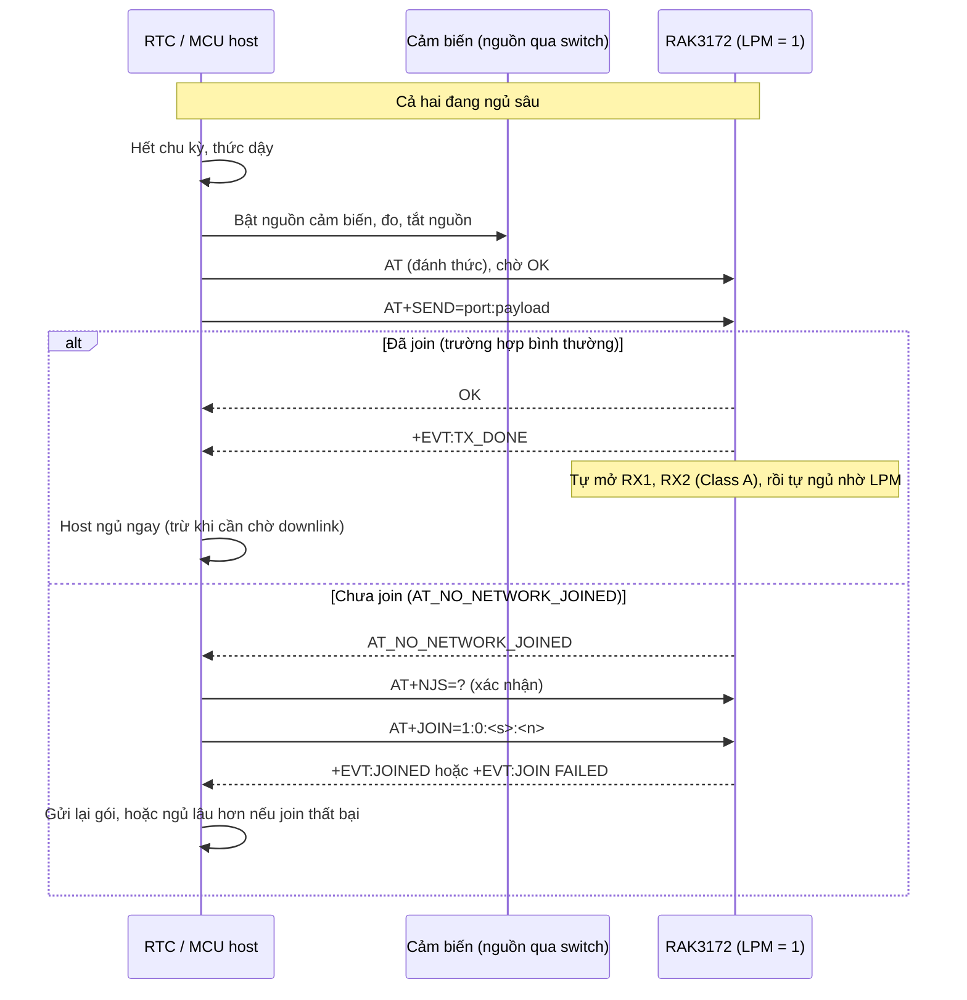
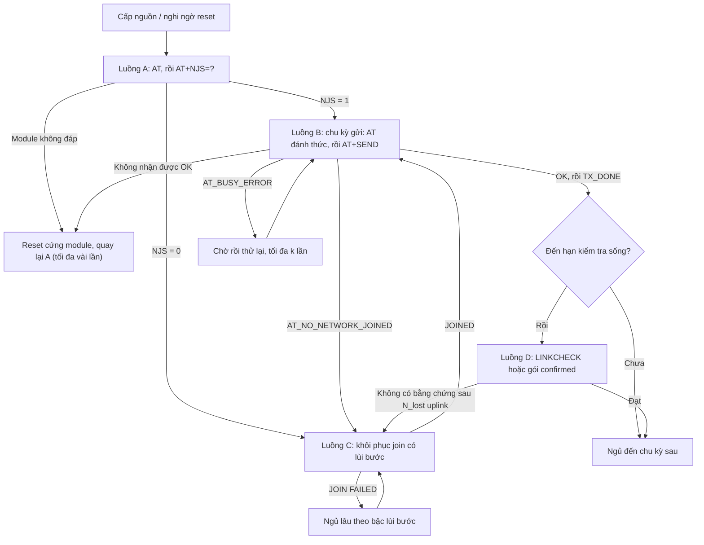

# ESP32 + RAK3172: thiết kế Deep Sleep và luồng AT (tài liệu tham khảo để lập trình)

> **Đối tượng:** kỹ sư firmware dùng **ESP32 làm host MCU** điều khiển **RAK3172 (RUI3) qua lệnh AT** trong thiết bị LoRaWAN chạy pin.
> **Ngày biên soạn:** 04/10/2026
> **Nguồn gốc:** tách từ mục 8 của tài liệu chính `LoRaWAN_ADR_DR_WisGate_RAK3172.md`, bổ sung phần riêng cho ESP32 (đấu nối, deep sleep, lưu trạng thái, mã tham chiếu Arduino-ESP32).
> **Quy ước tham chiếu:** các tham chiếu dạng "mục X.Y" **trong tài liệu này** trỏ tới mục của chính nó. Khi ghi "tài liệu chính, mục X.Y" thì trỏ tới `LoRaWAN_ADR_DR_WisGate_RAK3172.md` (ví dụ mục 2.4 về airtime, mục 3 về ADR, mục 4 về DR khởi đầu, mục 5.3 về sub-band US915, mục 6.5 về lệnh AT chung, mục 7.2 về cấu hình mạng theo vùng).
> **Trạng thái mã:** mã ở mục 7 đã được kiểm tra cú pháp biên dịch với bộ stub API, **chưa chạy thử trên phần cứng**.

## Mục lục

1. [Phạm vi và chọn kiến trúc](#1-phạm-vi-và-chọn-kiến-trúc)
2. [Số liệu nền và ngân sách năng lượng](#2-số-liệu-nền-và-ngân-sách-năng-lượng)
3. [Lệnh AT liên quan đến ngủ, thức và cấu hình một lần](#3-lệnh-at-liên-quan-đến-ngủ-thức-và-cấu-hình-một-lần)
4. [Phần cứng: đấu nối ESP32 và RAK3172](#4-phần-cứng-đấu-nối-esp32-và-rak3172)
5. [Phần mềm ESP32: deep sleep, lưu trạng thái, đồng hồ](#5-phần-mềm-esp32-deep-sleep-lưu-trạng-thái-đồng-hồ)
6. [Luồng gọi AT có kiểm tra join](#6-luồng-gọi-at-có-kiểm-tra-join)
7. [Mã tham chiếu Arduino-ESP32](#7-mã-tham-chiếu-arduino-esp32)
8. [Phương án thay thế: RAK3172 chạy riêng (không cần ESP32)](#8-phương-án-thay-thế-rak3172-chạy-riêng-không-cần-esp32)
9. [Đo kiểm, nên và không nên, xử lý sự cố](#9-đo-kiểm-nên-và-không-nên-xử-lý-sự-cố)
10. [Đối chiếu với tài liệu thiết kế và dự án thực tế](#10-đối-chiếu-với-tài-liệu-thiết-kế-và-dự-án-thực-tế)
11. [Tài liệu tham khảo](#11-tài-liệu-tham-khảo)

---

## 1. Phạm vi và chọn kiến trúc

### 1.1 Phạm vi

- **Mục tiêu:** khi chưa đến lúc gửi, toàn hệ thống (ESP32, RAK3172, cảm biến, nguồn) ở dòng thấp nhất có thể. Khi đến lúc gửi, thức dậy, gửi, rồi ngủ lại trong thời gian ngắn nhất.
- **Phần cứng giả định:** ESP32 (họ ESP32 gốc, Arduino-ESP32 hoặc ESP-IDF) nối UART với RAK3172. RAK3172 chạy firmware RUI3 mặc định, điều khiển bằng lệnh AT.
- **LoRaWAN:** node cố định, Class A, OTAA, uplink không xác nhận, ADR bật.
- **Không dùng Wi-Fi/Bluetooth** trong chu trình gửi (chúng bị tắt khi deep sleep và rất tốn năng lượng khi bật).

### 1.2 Chọn kiến trúc

| | **A. Host MCU + RAK3172 làm modem AT** | **B. RAK3172 chạy firmware RUI3 tuỳ biến (standalone)** |
|---|---|---|
| Ai giữ nhịp thời gian | MCU host (RTC) | Timer của RUI3 trong chính RAK3172 |
| Số chip luôn có điện | 2 (cả hai đều phải ngủ sâu) | 1 |
| Dòng ngủ hệ thống | Cao hơn (cộng dòng ngủ MCU host) | Thấp nhất |
| Độ phức tạp | Thấp: chỉ gửi lệnh AT | Cao hơn: lập trình bằng RUI3 API |
| Phù hợp khi | Đã có MCU host xử lý cảm biến/giao thức phức tạp | Cần ngủ tối ưu nhất, logic đơn giản (đọc cảm biến rồi gửi) |

Nếu mục tiêu là **ngủ sâu nhất**, kiến trúc B cho dòng hệ thống thấp nhất vì bỏ được MCU host. Kiến trúc A vẫn đạt tốt nếu MCU host cũng vào chế độ ngủ sâu có RTC (vài µA trở xuống) và được bố trí đánh thức theo trình tự ở mục 6.

> **Điều cần cân nhắc khi chọn ESP32 làm host.** Dòng deep sleep điển hình của ESP32 là **10 µA** (RTC timer và RTC memory), gấp khoảng 6 lần dòng ngủ của RAK3172 (1.69 µA), và ESP32 thức dậy tốn nhiều năng lượng hơn nhiều so với một lần phát LoRa (xem mục 2.3). Nếu ESP32 chỉ làm cầu nối cho cảm biến đơn giản, phương án B (mục 8) cho dòng hệ thống thấp hơn đáng kể. Nếu ESP32 có việc khác phải làm (Wi-Fi cấu hình, xử lý cục bộ, giao diện), kiến trúc A là hợp lý và tài liệu này cho cách làm tối ưu.

---

## 2. Số liệu nền và ngân sách năng lượng

### 2.1 Số liệu nền từ datasheet RAK3172

| Thông số | Giá trị (RAK3172, RAK3172-T) | Ghi chú |
|---|---|---|
| Dòng ngủ (Sleep) | **1.69 µA** (điển hình, 3.3 V) | RAK3172-F: 2.2 µA |
| Dòng nhận (RX) | **5.22 mA** | Chỉ khi cửa sổ RX đang mở |
| Dòng phát (TX) | **87 mA** ở 20 dBm, 868 MHz | Dùng làm **cận trên** khi tính pin. Công suất thấp hơn (do ADR giảm TXP) sẽ cho dòng thấp hơn |
| Điện áp cấp | 2.0 đến 3.6 V | Pin Li-SOCl2 3.6 V nằm sát giới hạn trên, cần chú ý khi mới thay pin và khi tải xung |

> Đây là giá trị điển hình theo điều kiện đo của RAK. Dòng ngủ **thực tế của sản phẩm luôn cao hơn** vì có thêm mạch xung quanh (LDO, cảm biến, linh kiện kéo, MCU host...). Số 1.69 µA là mục tiêu để đo so sánh, không phải cam kết cho cả thiết bị.

### 2.2 Ngân sách năng lượng của riêng RAK3172

Dòng trung bình xấp xỉ: `I_avg ≈ I_sleep + (I_tx × T_airtime) / T_chu_kỳ`, chưa tính cửa sổ RX, cảm biến, MCU host và tự xả pin.

Tính với `I_sleep = 1.69 µA`, `I_tx = 87 mA` (cận trên), payload ứng dụng 10 byte, BW 125 kHz (airtime ở tài liệu chính, mục 2.4):

| SF | Năng lượng TX mỗi uplink | I_avg, chu kỳ 5 phút | I_avg, 15 phút | I_avg, 60 phút |
|---|---|---|---|---|
| SF7 | 1.5 µAh | 19.7 µA | **7.7 µA** | **3.2 µA** |
| SF9 | 5.0 µAh | 61.4 µA | 21.6 µA | 6.7 µA |
| SF10 | 9.0 µAh | 109.3 µA | 37.6 µA | 10.7 µA |
| SF12 | 35.8 µAh | 431.8 µA | 145.0 µA | 37.5 µA |

Dòng ngủ cả ngày chỉ là `1.69 µA × 24 h ≈ 40.6 µAh/ngày`.

**Kết luận thiết kế:**

1. **SF cao thì TX chiếm gần hết năng lượng.** Đòn bẩy lớn nhất là để ADR đưa node về SF thấp nhất có thể (tài liệu chính, mục 3 và 4), kế đó là rút ngắn payload và kéo dài chu kỳ.
2. **SF thấp và chu kỳ dài thì dòng ngủ ngang bằng TX.** Ở SF7, chu kỳ 60 phút, phần TX (~1.5 µA) xấp xỉ dòng ngủ module (1.69 µA). Lúc này **mỗi µA rò thêm ở trạng thái ngủ đều đáng kể**: 1 µA liên tục tiêu tốn khoảng 8.8 mAh mỗi năm. Việc ngủ sâu cho toàn hệ thống quan trọng ngang việc chọn SF.
3. Các số trên **chưa gồm**: RX1/RX2 mỗi lần gửi (5.22 mA × thời gian cửa sổ mở, hãy đo thực tế), đọc cảm biến, thời gian MCU host thức, tự xả pin và ảnh hưởng nhiệt độ. Không dùng bảng này để cam kết tuổi thọ pin, chỉ để so sánh phương án.

### 2.3 Cộng thêm ESP32 vào ngân sách

**Số liệu từ datasheet và tài liệu Espressif (ESP32 gốc):**

| Thông số | Giá trị | Ghi chú |
|---|---|---|
| Deep sleep: RTC timer + RTC memory | **10 µA** (điển hình) | Mức dùng trong thiết kế này |
| Hibernation: chỉ RTC timer | 5 µA | RTC memory tắt nên phải lưu trạng thái vào flash (NVS) |
| Thêm tinh thể 32.768 kHz cho RTC | khoảng +1 µA | Đổi lấy đồng hồ ổn định hơn (mục 5.3) |

> Đây là giá trị đo tại chân cấp nguồn của chip. **Trên bo dev kit, dòng deep sleep thường cao hơn nhiều** (hàng trăm µA đến mA) do LDO, chip USB-UART và LED trên bo. Một bài viết cộng đồng báo cáo rằng ngay cả sau khi tối ưu mà không đổi bo, dòng chỉ xuống khoảng 50 đến 200 µA. Muốn gần 10 µA phải dùng module trần với mạch nguồn Iq thấp.

**Dòng ngủ của hệ thống:** `10 µA (ESP32) + 1.69 µA (RAK3172) ≈ 11.7 µA`, tức khoảng 7 lần dòng ngủ của riêng RAK3172. Chưa tính cảm biến, LDO và các mạch khác.

**Năng lượng mỗi lần ESP32 thức dậy** là phần lớn nhất và hay bị bỏ qua. Công thức:

`I_avg_thêm = I_esp_active × T_thức / T_chu_kỳ`

Ví dụ với **giả định** `I_esp_active = 40 mA` (ESP32 chạy 80 MHz, không bật radio; con số này là giả định của mình, hãy đo trên bo thật):

| ESP32 thức mỗi chu kỳ | Thêm vào dòng trung bình, chu kỳ 5 phút | 15 phút | 60 phút |
|---|---|---|---|
| 0.2 s | 26.7 µA | 8.9 µA | 2.2 µA |
| 0.5 s | 66.7 µA | 22.2 µA | 5.6 µA |
| 1 s | 133 µA | 44.4 µA | 11.1 µA |
| 2 s | 267 µA | 88.9 µA | 22.2 µA |

So sánh với phần TX của RAK3172 ở chu kỳ 15 phút (mục 2.2): SF7 khoảng 6 µA, SF9 khoảng 20 µA. **Nếu ESP32 thức 1 giây mỗi chu kỳ thì riêng việc thức đã tốn hơn một lần phát SF9.** Hệ quả thiết kế:

1. **Rút ngắn thời gian thức của ESP32 là đòn bẩy lớn thứ hai sau việc để ADR đưa node về SF thấp** (mục 5.4).
2. Chu kỳ gửi dài thì phần thức dậy chia nhỏ ra, nhưng dòng ngủ 11.7 µA lại chiếm tỷ trọng lớn hơn.
3. Cần đo thật: `T_thức` gồm thời gian boot, khởi tạo UART, chuỗi lệnh AT, và chờ `+EVT:TX_DONE`.

---

## 3. Lệnh AT liên quan đến ngủ, thức và cấu hình một lần

### 3.1 Bảng lệnh

| Lệnh | Chức năng | Khuyến nghị cho ngủ tối ưu |
|---|---|---|
| `AT+LPM=1` | Bật Low Power Mode: module **tự ngủ sau khi xử lý lệnh AT**, không cần `AT+SLEEP` | **Bật** trên thiết bị chạy pin |
| `AT+LPMLVL=2` | (Chỉ RAK3172) Mức ngủ: 1 = STOP1, 2 = STOP2. STOP2 tiết kiệm hơn STOP1 nhưng **không thể đánh thức qua UART1**; STOP1 đánh thức được qua UART1 và UART2 | Dùng **STOP2** nếu không cần đánh thức module bằng UART1. Một người dùng trên diễn đàn RAK đo thêm được vài µA tiết kiệm khi chuyển sang STOP2 |
| `AT+SLEEP=<ms>` | Ngủ trong khoảng thời gian định trước (1 đến 2^32-1 ms) | Chỉ cần khi không dùng LPM hoặc muốn ép ngủ có hẹn giờ |
| `AT+SLEEP` | Ngủ liên tục không hẹn giờ | Chờ sự kiện đánh thức (hoạt động trên UART, tuỳ mức LPM) |
| `AT+CLASS=A` | Class A | **Bắt buộc** cho thiết bị pin. Class C luôn nghe, tốn dòng RX liên tục |
| `AT+CFM=0` | Uplink không xác nhận | Giảm số lần phải mở RX và gửi lại |
| `AT+RETY=0` | Không gửi lại gói confirmed | Mặc định đã là 0 |
| `AT+LINKCHECK=0` | Tắt kiểm tra liên kết | Chỉ bật tạm khi cần đo margin, vì mỗi lần dùng thêm lưu lượng MAC |
| `AT+ADR=1`, `AT+DR`, `AT+TXP` | ADR và công suất | Để ADR đưa về SF/TXP thấp nhất (tài liệu chính, mục 3 và 4) |
| `AT+JOIN=1:1:<s>:<n>` | Join, tham số 2 = 1 là tự join khi cấp nguồn | Dùng khi khởi động. **Không gọi mỗi chu kỳ** |
| `AT+NJS=?` | Trạng thái join | Kiểm tra khi khởi động hoặc sau lỗi, không kiểm tra mỗi chu kỳ |
| `AT+SEND=<port>:<hex>` | Gửi uplink | Lệnh duy nhất cần mỗi chu kỳ khi đã cấu hình xong |
| `ATE` | Bật/tắt echo | Tắt echo để bớt lưu lượng UART (lệnh này **toggle**, kiểm tra trạng thái trước) |
| `AT+BAT=?`, `AT+SYSV=?` | Đọc điện áp | Đọc thưa (ví dụ mỗi 6-24 giờ hoặc gộp vào payload), không đọc mỗi chu kỳ |
| `AT+PRECV=0` (P2P) | Tắt chế độ thu P2P | Nếu dùng P2P, **tránh thu liên tục** (`65534`/`65533`), vì radio luôn nghe ở khoảng 5.22 mA |

> **Về đánh thức qua UART.** Theo tài liệu RAK, cổng AT mặc định của RAK3172 là **UART2** (quick start guide), còn STOP2 chỉ được ghi chú là không đánh thức qua **UART1**. Tài liệu chính thức **không mô tả đầy đủ** hành vi đánh thức qua UART2 ở STOP2, cũng như việc ký tự đầu tiên có bị mất khi module đang ngủ hay không. Hãy **kiểm chứng trên bo thật** (gửi một `AT` đánh thức, chờ `OK`, rồi mới gửi lệnh thật) và ghi kết quả vào quy trình sản xuất.
>
> **Về firmware cũ.** Diễn đàn RAK ghi nhận một thời điểm RUI3 chưa tự ngủ (dòng khoảng 7 mA) và phải dùng `AT+SLEEP`. Hãy cập nhật RUI3 mới và đo lại. Bản mới có `AT+LPM`/`AT+LPMLVL` như trên.

> **Lưu ý khi host là ESP32:** ESP32 không đánh thức được từ deep sleep bằng dữ liệu UART tới trên chân thường (xem mục 5.1). Vì vậy kênh duy nhất ESP32 nhận downlink của LoRaWAN là lúc nó đang thức. Với Class A, downlink chỉ đến ngay sau uplink, nên nếu ứng dụng cần xử lý downlink thì giữ ESP32 thức đến hết cửa sổ RX2 (xem mục 6.8) rồi mới ngủ. Nếu không cần downlink thì ngủ ngay sau `+EVT:TX_DONE`.

### 3.2 Cấu hình một lần

Thực hiện khi sản xuất hoặc lần đầu cấp nguồn, **không lặp lại mỗi chu kỳ**:

```text
// --- Cấu hình mạng (ví dụ AS923-2, xem tài liệu chính, mục 7.2 và 7.2b cho vùng khác) ---
AT+NWM=1
AT+NJM=1
AT+BAND=9
AT+CLASS=A
AT+DEVEUI=<16 hex>
AT+APPEUI=<16 hex>
AT+APPKEY=<32 hex>

// --- Tối ưu liên kết ---
AT+ADR=0
AT+DR=3                        // DR khởi đầu sát thực tế (tài liệu chính, mục 4)
AT+TXP=0
AT+ADR=1

// --- Tối ưu năng lượng ---
AT+CFM=0                       // Không xác nhận
AT+LINKCHECK=0                 // Không kiểm tra liên kết
AT+LPM=1                       // Module tự ngủ sau lệnh AT
AT+LPMLVL=2                    // STOP2 (nếu không cần đánh thức qua UART1)

// --- Join khi khởi động ---
AT+JOIN=1:1:30:3               // Tự join khi cấp nguồn, thử 3 lần cách nhau 30 s (mục 6.5)
```

Sau đó khởi động lại bằng `ATZ` rồi đọc lại các giá trị chính (`AT+ADR=?`, `AT+DR=?`, `AT+LPM=?`, `AT+LPMLVL=?`, `AT+NJS=?`) để xác nhận cấu hình còn nguyên và biết node có cần join lại sau khi khởi động hay không.

---

## 4. Phần cứng: đấu nối ESP32 và RAK3172

### 4.1 Sơ đồ đấu nối

| ESP32 | RAK3172 | Ghi chú |
|---|---|---|
| GPIO TX (ví dụ GPIO17) | **UART2_RX** | Cổng AT mặc định của RAK3172 là UART2 (theo Quick Start Guide). Tra datasheet RAK3172 để biết số chân |
| GPIO RX (ví dụ GPIO16) | **UART2_TX** | |
| GPIO (ví dụ GPIO4) | **NRST** | Dùng để reset cứng module khi nó không đáp (`hardResetRak()`) |
| GND | GND | **Bắt buộc nối chung** |
| 3V3 | VCC | Cả hai cùng 3.3 V, không cần dịch mức. RAK3172 nhận 2.0 đến 3.6 V |

Cả hai chip dùng mức 3.3 V nên nối thẳng UART. Cấp nguồn cho RAK3172 từ cùng rail 3.3 V với ESP32, và **không ngắt nguồn của RAK3172** giữa các lần gửi (mục 6.1, nguyên tắc 6).

### 4.2 Lưu ý riêng cho ESP32

| Hạng mục | Khuyến nghị |
|---|---|
| **Chọn chân UART** | Tránh các chân strapping (GPIO0, GPIO2, GPIO12, GPIO15 trên ESP32 gốc), vì mức logic trên chúng lúc boot ảnh hưởng đến khởi động. Trên module **ESP32-WROVER/PSRAM**, GPIO16 và GPIO17 thường dùng cho PSRAM, nên không dùng làm UART. Hãy tra sơ đồ chân của module bạn dùng |
| **Đường UART khi ESP32 ngủ** | Ở deep sleep, chân GPIO thường (không giữ) ở trạng thái trở kháng cao, nên đường ESP32 TX tới RAK3172 RX bị nổi. Hai cách: (1) dùng `gpio_hold_en()` kèm `gpio_deep_sleep_hold_en()` để giữ mức cao trên chân TX trước khi ngủ (mã ở mục 7 làm vậy), (2) thêm điện trở kéo lên khoảng 100 kΩ trên cả hai đường UART. Mức nhàn rỗi của UART là cao nên điện trở kéo lên gần như không tốn dòng. Đây là khuyến nghị kỹ thuật chung, hãy đo dòng sau khi đổi |
| **Rác trên đường UART khi ESP32 vừa boot** | Khi ESP32 thức dậy và khởi tạo UART, đường TX có thể có xung nhiễu. Mã ở mục 7 xả bộ đệm trước mỗi lệnh và gửi `AT` đánh thức trước khi gửi lệnh thật |
| **NRST** | Điều khiển như một chân open-drain mềm: kéo thấp khoảng 10 ms rồi thả về trạng thái trở kháng cao. STM32WL (chip trong RAK3172) thường có điện trở kéo lên nội ở NRST, hãy xác nhận trong datasheet |
| **Xung dòng TX 87 mA ở 20 dBm** | Ở ESP32, brown-out detector có thể reset chip nếu rail 3.3 V sụt khi RAK3172 phát. Dùng tụ lớn (hàng chục đến vài trăm µF) gần chân nguồn, và dùng nguồn đủ dòng tức thời |
| **Cập nhật firmware RAK3172** | Cập nhật firmware dùng UART2. Nếu ESP32 đang nối vào UART2 thì chừa cách ngắt ESP32 (jumper, điểm test) để còn nạp được firmware (cảnh báo trong Quick Start Guide) |
| **Khi đo dòng ngủ** | Tháo chip USB-UART, ST-Link/dongle gỡ lỗi và đo ở nguồn pin thật |

### 4.3 Khuyến nghị phần cứng chung cho dòng ngủ thấp

Các mục dưới đây là **khuyến nghị kỹ thuật chung** cho thiết bị chạy pin, không phải yêu cầu do RAK ban hành. Hãy đối chiếu với datasheet và tài liệu hardware design của RAK3172.

| Hạng mục | Khuyến nghị |
|---|---|
| **Nguồn** | Dùng LDO hoặc buck có dòng tĩnh (Iq) thấp, cỡ dưới 1 µA. Một LDO thông dụng với Iq hàng chục µA sẽ lấn át dòng ngủ 1.69 µA của module |
| **Xung dòng TX** | Dòng TX tới 87 mA ở 20 dBm. Với pin có nội trở cao (ví dụ Li-SOCl2) cần tụ lớn hoặc siêu tụ song song để tránh sụt áp làm module reset |
| **Cảm biến** | Cấp nguồn qua **load switch điều khiển bằng GPIO**, chỉ bật khi đo. Cảm biến luôn có điện thường là nguồn rò lớn nhất |
| **Chân không dùng và đường tín hiệu** | Không để chân nổi hoặc bị kéo lên/xuống không cần thiết. Một người dùng diễn đàn ghi nhận kéo UART1_RX xuống mass làm tăng dòng khoảng 100 µA. Tránh cấp điện ngược qua UART khi MCU host tắt còn module vẫn có điện |
| **Điện trở kéo I2C và LED** | Tránh LED báo hiệu luôn sáng. Kiểm tra dòng chảy qua điện trở kéo lên của I2C |
| **UART gỡ lỗi** | Không để mạch USB-UART (như CH340) hoặc ST-Link nối vào khi đo dòng ngủ. Quan sát từ diễn đàn RAK: bo thử nghiệm RAK5005 cho dòng ngủ cỡ 21.7 µA, còn khi tháo ST-Link thì dòng STOP2 xuống dưới 2 µA. Release note RUI3 v3.2.0 cũng có một lỗi về dòng tiêu thụ bất thường liên quan đến việc gỡ CH340 |
| **Cập nhật firmware** | Firmware và lệnh AT dùng chân UART2. Nếu MCU host nối vào UART2 thì phải chừa cách ngắt MCU host (jumper, điểm test) để còn nạp được firmware, theo cảnh báo trong Quick Start Guide |
| **Anten và RF** | Không ảnh hưởng dòng ngủ nhưng ảnh hưởng SF/TXP mà ADR hội tụ. Anten tốt giúp SF thấp hơn, tiết kiệm hơn nhiều |

---

## 5. Phần mềm ESP32: deep sleep, lưu trạng thái, đồng hồ

### 5.1 Deep sleep trên ESP32 là reset, không phải tiếp tục

Theo tài liệu ESP-IDF, ở deep sleep CPU, hầu hết RAM và mọi ngoại vi số dùng xung APB đều tắt. Chỉ RTC controller, RTC memory (và các RTC GPIO tuỳ nguồn đánh thức) còn nguồn. Sau khi thức, chương trình **chạy lại từ đầu** (`setup()` trong Arduino), nên:

- **Mọi biến thường bị mất.** Trạng thái cần giữ qua deep sleep phải nằm trong **RTC memory** (`RTC_DATA_ATTR`) hoặc **flash/NVS** (mục 5.2).
- **Phải khởi tạo lại UART** (`Serial2.begin`) mỗi lần thức.
- **Không có đánh thức bằng dữ liệu UART** trong deep sleep. Nguồn đánh thức dùng được là timer (RTC timer), RTC GPIO (ext0/ext1), touch và ULP. Đây là lý do host phải chủ động giữ nhịp thời gian, và không thể để RAK3172 đánh thức ESP32 qua UART.
- **Wi-Fi/Bluetooth tắt** trong deep sleep; trước khi ngủ cần tắt đúng cách nếu đã bật.
- Ngoài `esp_reset_reason()` còn có `esp_sleep_get_wakeup_cause()` để phân biệt thức do timer hay do nguồn khác.

### 5.2 Lưu trạng thái: RTC memory hay NVS

| Dữ liệu | Nơi lưu | Lý do |
|---|---|---|
| `rtc_uplinksSinceAck`, `rtc_cyclesSinceCheck`, `rtc_nextSlotS` (thay đổi **mỗi chu kỳ**) | **RTC memory** (`RTC_DATA_ATTR`) | Sống sót qua deep sleep, không tốn chu kỳ ghi flash. **Mất khi mất nguồn hoàn toàn** |
| Trạng thái lùi bước join: thời điểm lỗi đầu tiên, `nextAt`, số lần thử | **NVS (flash)**, chỉ ghi khi đổi | TR007 yêu cầu back-off vẫn được tôn trọng qua reset do sụt áp và mất nguồn (mục 6.5). Ghi hiếm, nên không lo mòn flash |
| Cấu hình mạng (EUI, khoá) | Trong **RAK3172** (lưu bằng lệnh AT) | Không cần lưu ở ESP32 |

Lưu ý:

- **Tránh ghi flash mỗi chu kỳ.** NVS dùng cân bằng mòn nhưng vẫn có giới hạn chu kỳ ghi. Với chu kỳ 15 phút, ghi mỗi chu kỳ là hơn 35 000 lần mỗi năm. Nếu cần lưu bộ đếm uplink qua mất nguồn, chỉ chụp nhanh vào NVS thưa (ví dụ mỗi 24 chu kỳ).
- **Hibernation (5 µA) tắt RTC memory**, nên chỉ dùng được nếu bạn lưu mọi thứ vào NVS. Mức tiết kiệm 5 µA phải đổi bằng việc ghi flash, nên thường **không đáng** với chu kỳ ngắn.
- Sau **mất nguồn hoàn toàn**, RTC memory mất và đồng hồ hệ thống về 0. Mã ở mục 7 xử lý bằng cách coi đó là khởi động lạnh, và giới hạn thời gian chặn của `nextAt` cũ.

### 5.3 Đồng hồ RTC và độ trôi của chu kỳ gửi

ESP32 dùng **RTC timer** để đánh thức khỏi deep sleep. Nguồn xung mặc định là **dao động RC nội khoảng 150 kHz** (90 đến 150 kHz tuỳ chip theo ESP-IDF mới). Tài liệu ESP-IDF cảnh báo độ ổn định tần số của nó chịu ảnh hưởng của nhiệt độ nên thời gian có thể trôi trong deep sleep và light sleep. Một bài viết cộng đồng báo cáo có thể lệch tới khoảng 8 phút mỗi ngày nếu không hiệu chỉnh, tức vào khoảng 0.5%.

| Nguồn xung RTC | Ổn định | Chi phí |
|---|---|---|
| RC nội ~150 kHz (mặc định) | Thấp nhất, trôi theo nhiệt độ | Dòng ngủ thấp nhất, không cần linh kiện ngoài |
| Tinh thể 32.768 kHz ngoài | Tốt | Khoảng +1 µA dòng ngủ, cần tinh thể và vẽ mạch đúng |
| Dao động nội 8 MHz chia 256 | Tốt hơn RC 150 kHz | Khoảng +5 µA |

Hệ quả cho chu kỳ gửi:

- Một chu kỳ danh nghĩa 900 s có thể thực tế vài giây, thậm chí hàng chục giây tuỳ nhiệt độ. Điều này **không ảnh hưởng LoRaWAN** nhưng ảnh hưởng nếu bạn cần dữ liệu đều nhịp.
- Nếu cần nhịp chính xác, dùng **tinh thể 32.768 kHz** (cấu hình `CONFIG_RTC_CLK_SRC` trong ESP-IDF) hoặc hiệu chỉnh bằng một nguồn thời gian khác (ví dụ đồng bộ NTP định kỳ, vì chu trình này cần Wi-Fi nên không phù hợp thiết bị chạy pin chặt).
- Hầu hết ứng dụng cảm biến chấp nhận độ trôi này. **Hãy gắn mốc thời gian vào payload tại node** nếu cần biết thời điểm đo chính xác (xem tài liệu chính, phần trả lời về jitter).

### 5.4 Rút ngắn thời gian thức của ESP32

Thời gian thức quyết định phần lớn năng lượng (mục 2.3). Các biện pháp (khuyến nghị kỹ thuật chung, hãy đo hiệu quả trên thiết bị của bạn):

1. **Giảm tần số CPU xuống 80 MHz** (`setCpuFrequencyMhz(80)`) khi không dùng Wi-Fi. Mã ở mục 7 làm vậy.
2. **Không in log ra Serial** trong chu trình sản xuất. Tắt log bootloader ở mức cần thiết.
3. **Tối ưu thời gian boot:** ESP-IDF có tuỳ chọn bỏ qua kiểm tra ảnh firmware khi thức từ deep sleep (`CONFIG_BOOTLOADER_SKIP_VALIDATE_IN_DEEP_SLEEP`, hãy kiểm tra tên tuỳ chọn theo phiên bản IDF của bạn).
4. **Chỉ gửi `AT+SEND` mỗi chu kỳ** và không cấu hình lại (mục 6.1, nguyên tắc 2). Không `AT+NJS=?` mỗi chu kỳ (nguyên tắc 3).
5. **Ngủ ngay sau `+EVT:TX_DONE`** nếu không cần downlink (mục 3.1).
6. **Đo cảm biến nhanh:** cấp nguồn cảm biến qua GPIO/load switch, đo, tắt (mục 4.3).
7. Nâng cao: dùng **deep sleep wake stub** để làm một việc rất nhỏ trước khi boot đầy đủ. Chỉ nên làm khi đã tối ưu hết các bước trên.

### 5.5 Trình tự đi ngủ an toàn

1. `RakSerial.flush()` để chắc chắn lệnh cuối đã gửi hết, rồi `RakSerial.end()`.
2. Đặt chân TX ở mức cao và bật `gpio_hold_en()` cùng `gpio_deep_sleep_hold_en()` (mục 4.2).
3. Tính thời gian ngủ từ **mốc tuyệt đối** `rtc_nextSlotS - now`, không dùng "ngủ T giây" (mục 6.1, nguyên tắc 1).
4. `esp_sleep_enable_timer_wakeup(µs)` rồi `esp_deep_sleep_start()`.
5. Lúc thức: gọi `gpio_hold_dis()` và `gpio_deep_sleep_hold_dis()` trước khi dùng lại chân (mã ở mục 7).

---

## 6. Luồng gọi AT có kiểm tra join

### 6.1 Chu trình thức dậy và nguyên tắc



Các nguyên tắc rút ra:

1. **Đo cảm biến trước, đánh thức module sau cùng**, để module không thức trong lúc chờ cảm biến. Về lịch gửi: dùng mốc tuyệt đối để tránh trôi, **nhưng cộng thêm một độ lệch pha cố định ngẫu nhiên cho từng thiết bị** (ví dụ băm từ DevEUI, trong khoảng 0 đến vài phần trăm chu kỳ). TR007 mục 3.7 yêu cầu thiết bị thêm trễ ngẫu nhiên vào mọi lần phát định kỳ và cấm phối hợp cả đàn thiết bị cùng phát một thời điểm (ví dụ cùng gửi lúc nửa đêm). Với một thiết bị đơn lẻ điều này không quan trọng, nhưng với hàng chục thiết bị trở lên thì có.
2. **Chỉ gửi `AT+SEND` mỗi chu kỳ.** Không cấu hình lại, không `AT+JOIN` vô điều kiện.
3. **Không cần gọi `AT+NJS=?` trước mỗi lần gửi, vì `AT+SEND` đã tự kiểm tra giúp bạn.** Nếu module chưa join, `AT+SEND` trả `AT_NO_NETWORK_JOINED` (theo RUI3 AT Command Manual), nên mã trả về của chính lệnh gửi là phép kiểm tra miễn phí. Gọi thêm `AT+NJS=?` mỗi chu kỳ chỉ tốn thêm một vòng lệnh UART (module và host phải thức lâu hơn) mà không có thông tin mới. Hãy xử lý theo nhánh lỗi (luồng gọi AT chi tiết ở mục 6.2 đến 6.8):
   - Nhận `AT_NO_NETWORK_JOINED`: lúc này mới gọi `AT+NJS=?` để xác nhận, rồi `AT+JOIN` có lùi bước (nguyên tắc 7), sau đó gửi lại.
   - Chỉ gọi `AT+NJS=?` chủ động ở **khởi động** (sau cấp nguồn, `ATZ`) và **sau khi nghi ngờ module đã reset** (nguyên tắc 6).
4. **Chờ `OK` rồi `+EVT:TX_DONE`.** Nếu nhận `AT_BUSY_ERROR`, lệnh trước chưa hoàn tất (đang chờ duty cycle hoặc cửa sổ RX), hãy chờ rồi gửi lại thay vì gửi dồn.
5. **Host có thể ngủ ngay sau `+EVT:TX_DONE`**, vì module tự quản lý cửa sổ RX và tự ngủ nhờ LPM. Chỉ giữ host thức, hoặc để ngắt chân UART RX đánh thức host, nếu ứng dụng cần xử lý downlink (`+EVT:RX_1:...`).
6. **Không ngắt nguồn module giữa các lần gửi.** Ngủ (LPM, STOP1/STOP2) vẫn giữ trạng thái đã join. Còn mất nguồn hoặc reset thì phải join lại: nhân viên RAK trả lời trên diễn đàn rằng RUI3 không lưu được phiên OTAA hiện tại (nguồn cộng đồng, bài cách đây khoảng nửa năm ứng với RUI3 4.2.x, hãy kiểm chứng với firmware của bạn). Dòng ngủ chỉ 1.69 µA nên ngắt nguồn thường không đáng. TR007 mục 3.1.2 cũng khuyến nghị thiết bị bị tắt hẳn nên lưu khoá phiên và frame counter, và chỉ phát Join-Request sau commissioning, factory reset hoặc khi mất kết nối. Vì RUI3 không lưu được phiên OTAA, cách phù hợp là không ngắt nguồn. Vì vậy cần **phát hiện module đã bị reset ngoài ý muốn** (brown-out do sụt áp lúc phát, mất nguồn thoáng qua):
   - Theo manual, lệnh `ATZ` làm module khởi động lại và in thông tin thiết bị (tên module, phiên bản, chế độ làm việc) ra UART. Nhiều khả năng module cũng in chuỗi tương tự sau cấp nguồn hoặc reset ngoài ý muốn, nhưng tài liệu không khẳng định, hãy kiểm chứng trên bo thật. Nếu đúng, host coi chuỗi này là dấu hiệu reset và chạy lại quy trình khởi động (`AT+NJS=?`, join nếu cần).
   - Dù không bắt được chuỗi đó, nhánh xử lý `AT_NO_NETWORK_JOINED` ở nguyên tắc 3 vẫn là lưới an toàn.
   - Giảm nguy cơ reset: tụ lớn cho xung TX, theo dõi `AT+BAT=?` (mục 4.3).
7. **Join lại có lùi bước.** Nếu `+EVT:JOIN FAILED`, đừng thử lại dày. Dùng tham số 3 và 4 của `AT+JOIN` (khoảng cách thử 7-255 s, số lần thử), sau đó ngủ lâu hơn rồi thử tiếp.
8. **Gửi dày hơn tạm thời** chỉ trong giai đoạn đầu để ADR hội tụ (tài liệu chính, mục 3.4), có giới hạn (ví dụ không dày hơn 1 gói mỗi 5 phút), có ngẫu nhiên, rồi chuyển về chu kỳ bình thường. TR007 mục 3.8 cảnh báo ngay cả uplink không cần phản hồi cũng có thể gây nghẽn tạm thời nếu thiết bị đột ngột tăng mạnh tần suất trong thời gian dài, nhất là khi cả đàn cùng bật nguồn lại sau mất điện. Hãy cho các thiết bị khởi động lệch nhau.

> **`AT+NJS=?` = 1 chưa chắc NS còn nhớ phiên.** Lệnh này chỉ phản ánh trạng thái **trong module**. Nếu NS xoá thiết bị hoặc mất phiên thì module vẫn báo đã join nhưng không có downlink nào về. Ở tầng ứng dụng, nên có một phép kiểm tra sống định kỳ, ví dụ gửi một gói confirmed hoặc bật `AT+LINKCHECK=1` vài giờ một lần, và giám sát phía server khi thiết bị im lặng quá lâu.

### 6.2 Tổng quan luồng gọi AT có kiểm tra join

Bốn luồng nối với nhau như sau. Luồng B là đường chạy bình thường mỗi chu kỳ. Ba luồng còn lại chỉ chạy khi cần.



Quy ước trong các đoạn mã bên dưới: `>>` là host gửi xuống module, `<<` là module trả về hoặc sự kiện bất đồng bộ.

### 6.3 Luồng A: khởi động và phát hiện reset

Chạy khi host vừa cấp nguồn cho module, khi host thấy chuỗi khởi động trên UART, hoặc khi Luồng B nghi ngờ module đã reset.

```text
(module vừa khởi động, in thông tin thiết bị ra UART, ví dụ:)
<< RAKwireless RAK3172
<< Version: RUI_x.y.z_RAK3172-...
<< Current Work Mode: LoRaWAN.            ← host coi là DẤU HIỆU RESET

>> AT                                     // kiểm tra module đáp
<< OK
>> AT+NJS=?                                // đọc trạng thái join
<< AT+NJS=1
<< OK                                     → đã join, sang Luồng B
   (hoặc)
<< AT+NJS=0
<< OK                                     → chưa join, sang Luồng C
```

Ghi chú:

- Chuỗi khởi động chỉ là dấu hiệu **nếu firmware thực sự in ra khi reset ngoài ý muốn** (mục 6.1, nguyên tắc 6). Hãy kiểm chứng bằng cách cố ý làm sụt áp hoặc ngắt nguồn thoáng qua trên bo thật. Nếu host đang ngủ lúc module reset thì không bắt được chuỗi này, và Luồng B vẫn là lưới an toàn.
- Nếu đã cấu hình tự join khi cấp nguồn (`AT+JOIN=1:1:30:3`, mục 3.2), sau reset module tự join và bắn `+EVT:JOINED`. Khi đó host chỉ cần chờ sự kiện này (hoặc `+EVT:JOIN FAILED`) thay vì tự gọi `AT+JOIN`.
- Sau mỗi lần reset và join lại, trạng thái phiên mới được tạo. DR thường trở về giá trị đã cấu hình và ADR phải hội tụ lại, nên DR khởi đầu đúng (tài liệu chính, mục 4) vẫn quan trọng.

### 6.4 Luồng B: chu kỳ gửi bình thường

```text
>> AT                                     // đánh thức module (nếu đang LPM)
<< OK                                     // chờ tối đa ~1 s, thử lại tối đa 3 lần (xem chú thích)
>> AT+SEND=2:0102                         // port 2, payload 0x01 0x02
<< OK                                     // module bắt đầu gửi
<< +EVT:TX_DONE                           // gửi xong. Host có thể ngủ
```

Xử lý theo kết quả của `AT+SEND`:

| Module trả về | Ý nghĩa | Hành động của host |
|---|---|---|
| `OK`, rồi `+EVT:TX_DONE` | Gửi thành công | Chuyển sang kiểm tra "đến hạn kiểm tra sống" (Luồng D), nếu chưa thì ngủ |
| `AT_NO_NETWORK_JOINED` | Chưa join | **Luồng C** (khôi phục join), rồi gửi lại gói này một lần |
| `AT_BUSY_ERROR` | Lệnh trước chưa xong (đang chờ duty cycle hoặc cửa sổ RX) | Chờ 1 đến 2 s rồi thử lại, tối đa `k` lần (ví dụ 5). Quá số lần thì bỏ gói này và ngủ |
| `AT_PARAM_ERROR` | Sai port hoặc payload (độ dài, ký tự hex) | Lỗi lập trình hoặc payload vượt giới hạn của DR hiện tại. **Không thử lại**, ghi log |
| `AT_ERROR` | Lỗi chung | Thử lại một lần, nếu còn lỗi thì về Luồng A |
| Không có phản hồi nào | Module không đáp (reset, treo, đang ngủ mà đánh thức thất bại) | Về **Luồng A**. Nếu vẫn không đáp thì reset cứng module |

> **Về bước `AT` đánh thức.** Tài liệu RAK không mô tả chính thức việc đánh thức qua UART khi `AT+LPM=1` (mục 3.1). Đặt thời gian chờ `OK` khoảng 1 s và cho phép thử lại tối đa 3 lần cách nhau khoảng 200 ms. Đây là giá trị khởi điểm, hãy đo lại trên bo thật.

### 6.5 Luồng C: khôi phục join có lùi bước

Vào luồng này khi nhận `AT_NO_NETWORK_JOINED` (từ Luồng B), `AT+NJS=0` (từ Luồng A), hoặc khi Luồng D kết luận mất kết nối.

#### Ràng buộc của đặc tả về việc phát Join-Request

Theo LoRaWAN L2 1.0.4 (mục 7) và LoRa Alliance TR007 (mục 3.1.2 và 3.8.2), việc phát Join-Request phải tuân theo **retransmission back-off**, kể cả sau mất nguồn. Thiết bị phải đảm bảo điều này **ngay cả khi sụt áp làm MCU reset giữa chừng**. Giới hạn tổng thời gian phát (transmit time) là:

| Giai đoạn kể từ lúc cấp nguồn hoặc reset | Giới hạn | Duty cycle tương ứng |
|---|---|---|
| Giờ đầu tiên | < 36 s mỗi giờ | 1% |
| 10 giờ tiếp theo | < 36 s mỗi 10 giờ | 0.1% |
| Sau 11 giờ, tính theo ngày | < 8.7 s mỗi 24 giờ | 0.01% |

Ngoài ra, khoảng cách giữa các lần phát lại phải **ngẫu nhiên** và khác nhau giữa các thiết bị (TR007 mục 3.7 và 3.8). Mục đích là tránh "bão join" khi cả đàn thiết bị cùng mất nguồn rồi cùng có điện lại.

Airtime của một Join-Request (23 byte, BW 125 kHz, tính theo công thức ở tài liệu chính, mục 2.4) và số lần phát tối đa mà giới hạn trên cho phép, trường hợp **tệ nhất ở SF12**:

| SF join | Airtime | Tối đa trong giờ đầu | Tối đa trong 10 giờ kế | Tối đa trong 24 giờ sau đó | Khoảng cách tối thiểu ở 1% / 0.1% / 0.01% |
|---|---|---|---|---|---|
| SF7 | 62 ms | 583 | 583 | 141 | 6 s / 1 phút / 10 phút |
| SF9 | 206 ms | 174 | 174 | 42 | 20 s / 3.4 phút / 34 phút |
| SF10 | 371 ms | 97 | 97 | 23 | 37 s / 6.2 phút / 62 phút |
| SF12 | 1483 ms | **24** | **24** | **5** | **2.5 phút / 25 phút / 4.1 giờ** |

Các con số ở dòng SF12 trùng với lịch join mà một nhà sản xuất thiết bị LoRaWAN thương mại (Digital Matter) công bố cho firmware của họ: khoảng 2.5 phút, 25 phút và 250 phút giữa các lần join ở SF12.

**Hệ quả cho việc chọn tham số.** Cấu hình `AT+JOIN=1:0:10:8` (8 lần thử cách nhau 10 s) tạo một đợt có airtime tệ nhất khoảng 11.9 s ở SF12. Lặp lại nhiều lần trong giờ đầu, hoặc dù chỉ một lần mỗi ngày sau 11 giờ (giới hạn 8.7 s), sẽ **vượt giới hạn của đặc tả nếu stack không tự chặn**. RAK không mô tả RUI3 có tự thực thi back-off này hay không. Một số stack khác có làm (ví dụ changelog của thư viện libmDot của MultiTech ghi nhận join duty cycle 1%/0.1%/0.01% và thêm tới 10 s ngẫu nhiên giữa các lần join). Vì chưa chắc, hãy **giả định không có sự bảo vệ và tự tuân thủ ở tầng host**, đồng thời **kiểm chứng trên bo thật** bằng cách ghi lại thời điểm các Join-Request thực sự phát (Packet Capture trên gateway).

#### Luồng gọi

```text
>> AT+NJS=?                               // xác nhận lại (chỉ khi vào từ Luồng B)
<< AT+NJS=0
<< OK
>> AT+JOIN=1:0:30:3                       // join, thử lại mỗi 30 s, tối đa 3 lần (đợt ngắn)
<< OK                                     // OK nghĩa là đang join, chưa phải thành công
   ... chờ sự kiện, tối đa khoảng 3 × 30 s + 15 s ...
<< +EVT:JOINED                            → thành công: xoá trạng thái lùi bước, sang Luồng B
   (hoặc)
<< +EVT:JOIN FAILED                       → thất bại: ghi nhận, ngủ theo lịch bên dưới
```

#### Lịch lùi bước theo **thời gian đã trôi qua**, không theo số lần thất bại

Lịch này được thiết kế để **tổng airtime tệ nhất ở SF12 luôn nằm trong giới hạn của bảng trên** (đây là khuyến nghị kỹ thuật của mình, bảo thủ hơn đặc tả, không phải quy định của RAK):

| Thời gian kể từ lần join thất bại đầu tiên | Mỗi đợt | Nghỉ giữa các đợt (cộng ngẫu nhiên 0 đến 20%) | Kiểm tra airtime tệ nhất ở SF12 |
|---|---|---|---|
| 0 đến 1 giờ | `AT+JOIN=1:0:30:3` | 5 phút, rồi 15 phút, rồi 30 phút | 4 đợt × 4.4 s = 17.8 s, nhỏ hơn 36 s |
| 1 đến 11 giờ | `AT+JOIN=1:0:30:3` | 2 giờ | 5 đợt × 4.4 s = 22 s, nhỏ hơn 36 s |
| Sau 11 giờ | `AT+JOIN=1:0:30:2` | 12 giờ | 2 đợt/ngày × 2 lần × 1.48 s = 5.9 s, nhỏ hơn 8.7 s |

Quy tắc:

- **Lưu trạng thái lùi bước vào bộ nhớ không mất khi mất nguồn của host** (flash hoặc backup RAM): thời điểm thất bại đầu tiên và đợt hiện tại. TR007 yêu cầu back-off vẫn được tôn trọng qua reset do sụt áp. Nếu để trong RAM thường, mỗi lần host reset lại quay về giai đoạn "1% giờ đầu".
- **Thêm trễ ngẫu nhiên** vào mỗi lần nghỉ, và dùng một giá trị gieo (seed) khác nhau trên từng thiết bị (ví dụ băm từ DevEUI). Cả đàn thiết bị không được đồng bộ (TR007 mục 3.7).
- **Không bao giờ** gửi join liên tục theo vòng lặp chặt khi không có phản hồi (TR007 mục 3.8).
- Khoảng chờ kết quả join tối thiểu tính theo độ trễ Join Accept mặc định: `AT+JN1DL` là 5 s và `AT+JN2DL` là 6 s (tài liệu chính, mục 6.5). Nếu stack tự giãn cách theo back-off thì sự kiện có thể đến muộn hơn dự kiến. Khi hết thời gian chờ, coi là thất bại tạm thời, **không gọi lại `AT+JOIN` ngay**.
- Mỗi lần join thành công thì xoá bộ đếm. Khi có gói dữ liệu đang chờ gửi, chỉ gửi lại **một lần** sau khi join xong, không xếp hàng nhiều gói cũ.
- Với US915, join dùng DR0 trên kênh 125 kHz và DR4 trên kênh 500 kHz theo khuyến nghị của TR007. Hãy giữ mặt nạ kênh đúng sub-band của gateway (tài liệu chính, mục 5.3).

### 6.6 Luồng D: kiểm tra sống định kỳ và quyết định "mất kết nối"

Mục đích: phát hiện trường hợp module vẫn báo đã join (`AT+NJS=1`) nhưng NS không còn nghe thấy node, hoặc mất đồng bộ phiên. Điểm quan trọng nhất rút ra từ TR007 mục 3.3 và 3.4: **gửi lại Join-Request khi đã có phiên là biện pháp cuối cùng**, vì từ lúc phát Join-Request các uplink bị vô hiệu cho đến khi nhận được Join-Accept (với LoRaWAN trước 1.1, không có ReJoin). Nếu sự cố chỉ là downlink bị mất, rejoin còn làm node mất luôn khả năng gửi uplink. Không được kết luận mất kết nối quá sớm.

#### Bước 1: tạo bằng chứng "còn sống" (rẻ, định kỳ)

Mỗi 6 đến 24 giờ, hoặc mỗi `N` chu kỳ, gắn một trong hai kỹ thuật dưới vào gói dữ liệu của chu kỳ đó. TR007 liệt kê đúng các kỹ thuật này (gói confirmed, LinkCheckReq) và khuyến nghị chỉ dùng **thỉnh thoảng**, vì mọi uplink cần phản hồi đều tốn downlink của mạng.

**Cách 1: LinkCheck** (nên gắn vào **chính gói dữ liệu**, đừng gửi thêm gói riêng, như mã giả ở 7)

```text
>> AT+LINKCHECK=1                         // 1 = chỉ thực hiện ở lần uplink kế tiếp
<< OK
>> AT+SEND=2:0102                         // gói dữ liệu bình thường
<< OK
<< +EVT:TX_DONE
<< +EVT:LINKCHECK:0,21,1,-60,11           // Y0=0: thành công, Y1=21: DemodMargin (dB),
                                          // Y2=1: số gateway, Y3=-60: RSSI, Y4=11: SNR
   (hoặc, khi thất bại)
<< +EVT:LINKCHECK:1,0,0,0,0               // Y0 khác 0: LinkCheck hỏng
```

**Cách 2: gói confirmed** (chắc chắn hơn nhưng tốn airtime hơn)

```text
>> AT+CFM=1
<< OK
>> AT+SEND=2:0102
<< OK
<< +EVT:SEND_CONFIRMED_OK                 // hoặc +EVT:SEND_CONFIRMED_FAILED
>> AT+CFM=0                               // đưa về unconfirmed
<< OK
```

#### Bước 2: đếm số uplink kể từ lần có bằng chứng gần nhất

Host giữ bộ đếm `uplinks_since_ack`. Tăng 1 sau mỗi uplink, đặt về 0 khi có bất kỳ bằng chứng nào: `+EVT:LINKCHECK:0,...`, `+EVT:SEND_CONFIRMED_OK`, hoặc nhận được downlink.

#### Bước 3: để cơ chế ADR backoff của chính node chạy trước

Nếu ADR bật, node tự khôi phục độ bền liên kết theo từng bước (tài liệu chính, mục 3.3): công suất tối đa, hạ DR từng bậc, bật kênh mặc định. TR007 mục 3.3.2 nói chỉ sau khi đã về cấu hình RF mặc định mà **thêm `ADR_ACK_LIMIT` uplink nữa** vẫn không có downlink thì mới được coi là mất kết nối, và nhấn mạnh phải thử **nhiều lần** ở cấu hình mặc định.

Số uplink không có phản hồi để đạt mốc đó:

`N_lost = ADR_ACK_LIMIT + ADR_ACK_DELAY × (1 + số_bước_DR + 1) + ADR_ACK_LIMIT = 64 + 32 × (số_bước_DR + 2) + 64`

| DR hiện tại (số bước tới DR thấp nhất) | N_lost | Thời gian nếu chu kỳ 15 phút | Nếu chu kỳ 60 phút |
|---|---|---|---|
| EU868 từ DR5 (5 bước) | 352 | ~88 giờ | ~14.7 ngày |
| EU868 từ DR3 (3 bước) | 288 | ~72 giờ | ~12 ngày |
| AS923 từ DR3 (DR thấp nhất khả dụng là DR2, 1 bước) hoặc US915 từ DR1 (1 bước) | 224 | ~56 giờ | ~9.3 ngày |

> Hai bảng trên giả định node chạy đúng ADR backoff theo mặc định. Khi **tắt ADR**, node không có bước phục hồi này, và bạn phải tự thiết kế phương án tương đương bằng cách hạ DR thủ công theo từng bước. Việc RUI3 thực thi đúng quy trình này chưa được tài liệu RAK xác nhận, hãy kiểm chứng.

#### Bước 4: quyết định rejoin (biện pháp cuối cùng)

| Chính sách | Khi nào rejoin | Ưu | Nhược |
|---|---|---|---|
| **Theo TR007 (khuyến nghị)** | `uplinks_since_ack >= N_lost` | An toàn, tránh bão join, tránh rejoin nhầm | Phát hiện chậm (vài ngày với chu kỳ 15 phút) |
| **Nhanh** (thiết bị cần phục hồi sớm) | Sau khi thử liên tiếp `M` lần (ví dụ 5) ở cấu hình RF bảo thủ (`AT+ADR=0`, DR thấp nhất, `AT+TXP=0`, đúng mặt nạ kênh) mà không có bằng chứng nào | Phục hồi nhanh | Nguy cơ rejoin nhầm khi chỉ downlink bị lỗi. Với US915 và gateway 8 kênh, chỉ khoảng 1/8 số gói có thể đến gateway nếu kênh sai (TR007 mục 3.3.2), nên `M` nhỏ dễ kết luận sai |

Khi chấp nhận rejoin, đi qua `ATZ` rồi **Luồng A và C** (lịch lùi bước ở 6.5). Lý do dùng `ATZ` thay vì chỉ gọi `AT+JOIN` khi module vẫn báo đã join: tài liệu RAK không mô tả hành vi của `AT+JOIN` khi đã join, còn reset rồi join lại là đường chắc chắn hơn.

Ngoài ra, TR007 nói thiết bị tĩnh chỉ nên bị buộc join lại **tối đa khoảng một lần mỗi tháng** và chỉ khi nhà vận hành mạng yêu cầu. Không nên rejoin định kỳ "cho khoẻ".

> Cả hai kỹ thuật ở Bước 1 đều cần **có downlink về**. Ở Class A, downlink chỉ nhận ngay sau uplink, nên hãy kiểm tra `AT+RX1DL`, `AT+RX2DL`, `AT+RX2DR`, `AT+RX2FQ` khớp với NS/gateway (tài liệu chính, mục 5.4 và 6.5).

### 6.7 Ánh xạ luồng sang mã

Mã giả đã được thay bằng **mã tham chiếu thật cho Arduino-ESP32 ở mục 7**. Ánh xạ giữa các luồng và hàm trong mã:

| Luồng | Hàm trong mã (mục 7) | Ghi chú |
|---|---|---|
| A: khởi động / nghi ngờ reset | `flowA()` | Gọi khi khởi động lạnh, và khi Luồng B nghi ngờ module mất đáp |
| B: chu kỳ gửi | `flowB()`, `sendUplink()` | Xử lý `AT_NO_NETWORK_JOINED`, `AT_BUSY_ERROR`, `AT_PARAM_ERROR` |
| C: khôi phục join lùi bước | `flowC()`, `pauseFor()` | Lưu trạng thái vào NVS, có trễ ngẫu nhiên |
| D: kiểm tra sống, biện pháp cuối | `livenessResult()`, `lastResortRejoin()` | LinkCheck đi kèm gói dữ liệu |
| Đánh thức, đợi sự kiện | `rakWake()`, `atCmd()`, `waitEvent()`, `waitJoinResult()` | Tầng UART/AT |
| Ngủ | `goToSleep()` | Lịch tuyệt đối, giữ mức UART, deep sleep |

### 6.8 Bảng thời gian chờ khởi điểm

Các giá trị này là điểm bắt đầu để bạn đo và chỉnh, không phải số liệu chính thức. Căn cứ: độ trễ cửa sổ RX mặc định của RUI3 (`AT+RX1DL` = 1 s, `AT+RX2DL` = 2 s, `AT+JN1DL` = 5 s, `AT+JN2DL` = 6 s) và airtime ở tài liệu chính, mục 2.4.

| Chờ | Thời gian khởi điểm | Lý do |
|---|---|---|
| Phản hồi `OK` của lệnh AT thường | 1 s | Có thể chậm hơn ngay sau khi đánh thức |
| `+EVT:TX_DONE` sau `AT+SEND` | 5 s | Airtime tới ~1.8 s ở SF12 (payload 20 byte) cộng dư |
| `+EVT:SEND_CONFIRMED_OK/FAILED` | 10 s, cộng thêm nếu `AT+RETY` > 0 | Phải chờ RX1/RX2, và mỗi lần gửi lại tốn thêm |
| `+EVT:LINKCHECK` | 8 s | Đến cùng downlink ở RX1/RX2 |
| `+EVT:JOINED` / `+EVT:JOIN FAILED` | `số_lần_thử × chu_kỳ_thử + 15 s` (ví dụ 3 × 30 + 15 = 105 s) | Mỗi lần thử cần chờ Join Accept (RX1 5 s, RX2 6 s). Có thể muộn hơn nếu stack tự giãn cách theo back-off |
| Chuỗi khởi động sau `ATZ` | 3 s | Thời gian module khởi động lại |

---

## 7. Mã tham chiếu Arduino-ESP32

Mã dưới đây cài đặt đúng các Luồng A đến D ở mục 6. Mục đích là làm **khung tham chiếu** cho bạn viết sản phẩm. **Đã kiểm tra cú pháp biên dịch** (g++ với bộ stub API Arduino/ESP-IDF), **chưa chạy thử trên ESP32 và RAK3172 thật**. Hãy kiểm tra theo phiên bản core của bạn, vì chữ ký một số hàm (ví dụ `HardwareSerial::begin`, `esp_random`) khác nhau giữa Arduino-ESP32 2.x và 3.x, và giữa các phiên bản ESP-IDF.

### 7.1 Các điểm thiết kế trong mã

- **Mỗi lần thức chạy lại `setup()`**, không dùng `loop()`. Kết thúc bằng `esp_deep_sleep_start()`.
- **Khởi động lạnh** (`esp_reset_reason() != ESP_RST_DEEPSLEEP`: cấp nguồn, brown-out, reset) thì chạy Luồng A kiểm tra join. **Thức do timer** thì vào thẳng Luồng B (chỉ `AT+SEND`).
- **Lịch tuyệt đối:** `rtc_nextSlotS` tăng thêm đúng `CYCLE_S` mỗi lần thức, không tính từ lúc xong việc. Có **độ lệch pha cố định theo thiết bị** (băm từ eFuse MAC) cộng vào lần đầu để cả đàn thiết bị không đồng bộ (TR007).
- **Tầng UART không dùng `String`** để tránh phân mảnh heap, dùng bộ đệm cố định.
- **`AT_NO_NETWORK_JOINED` là lưới an toàn** thay cho việc gọi `AT+NJS=?` mỗi chu kỳ.
- **Lùi bước join** lưu vào NVS, có trễ ngẫu nhiên 0 đến 20%.
- **LinkCheck gắn vào chính gói dữ liệu** mỗi `CHECK_EVERY_N_CYCLES` chu kỳ; rejoin chỉ khi `rtc_uplinksSinceAck >= LOST_THRESHOLD`.
- **`LOST_THRESHOLD`** phải tính theo DR hiện tại và chu kỳ (bảng ở mục 6.6). Mã dùng 288 làm ví dụ.

### 7.2 Mã nguồn

```cpp
// esp32_rak3172_node.ino
// Node LoRaWAN: ESP32 (host) + RAK3172 (RUI3, lệnh AT). Class A, OTAA, chu kỳ cố định.
// Mã THAM CHIẾU: chưa chạy thử trên phần cứng. Kiểm tra theo phiên bản Arduino-ESP32 / ESP-IDF bạn dùng.
#include <Arduino.h>
#include <Preferences.h>
#include <time.h>
#include "esp_sleep.h"
#include "esp_system.h"
#include "driver/gpio.h"
#if __has_include("esp_random.h")
#include "esp_random.h"
#endif

// ---------------- Cấu hình ----------------
#define PIN_RAK_TX     17          // ESP32 TX  -> RAK3172 UART2_RX
#define PIN_RAK_RX     16          // ESP32 RX  <- RAK3172 UART2_TX
#define PIN_RAK_NRST    4          // ESP32 GPIO -> RAK3172 NRST
#define UART_BAUD  115200

static const uint32_t CYCLE_S              = 900;   // chu kỳ gửi 15 phút
static const uint32_t PHASE_WINDOW_S       = 60;    // độ lệch pha cố định theo thiết bị (0..59 s)
static const uint16_t CHECK_EVERY_N_CYCLES = 48;    // kiểm tra sống mỗi 48 chu kỳ (12 giờ)
static const uint16_t LOST_THRESHOLD       = 288;   // N_lost (xem bảng mục 6.6)
static const uint8_t  BUSY_RETRY_MAX       = 5;
static const uint8_t  LORA_PORT            = 2;

enum AtStatus { AT_OK, AT_ERR_GENERIC, AT_ERR_PARAM, AT_ERR_BUSY, AT_ERR_NOT_JOINED, AT_ERR_TIMEOUT };

HardwareSerial RakSerial(2);
Preferences    prefs;

// Trạng thái sống sót qua deep sleep (mất khi mất nguồn hoàn toàn)
RTC_DATA_ATTR uint32_t rtc_nextSlotS        = 0;
RTC_DATA_ATTR uint16_t rtc_uplinksSinceAck  = 0;
RTC_DATA_ATTR uint16_t rtc_cyclesSinceCheck = 0;

static uint32_t nowS() { return (uint32_t)time(nullptr); }   // đồng hồ hệ thống, tiếp tục qua deep sleep

// ---------------- Tầng UART / AT ----------------
// Đọc một dòng không rỗng, tối đa timeoutMs. Trả true nếu có dòng.
static bool readLine(char *buf, size_t n, uint32_t timeoutMs) {
  size_t len = 0;
  uint32_t t0 = millis();
  while (millis() - t0 < timeoutMs) {
    while (RakSerial.available()) {
      char c = (char)RakSerial.read();
      if (c == '\n') {
        buf[len] = 0;
        if (len > 0) return true;
        len = 0;
        continue;
      }
      if (c != '\r' && len < n - 1) buf[len++] = c;
    }
    delay(1);
  }
  buf[len] = 0;
  return false;
}

static uint32_t remaining(uint32_t t0, uint32_t timeoutMs) {
  uint32_t used = millis() - t0;
  return used >= timeoutMs ? 0 : timeoutMs - used;
}

static bool parseStatus(const char *l, AtStatus &st) {
  if (!strcmp(l, "OK"))                   { st = AT_OK;            return true; }
  if (!strcmp(l, "AT_PARAM_ERROR"))       { st = AT_ERR_PARAM;     return true; }
  if (!strcmp(l, "AT_BUSY_ERROR"))        { st = AT_ERR_BUSY;      return true; }
  if (!strcmp(l, "AT_NO_NETWORK_JOINED")) { st = AT_ERR_NOT_JOINED; return true; }
  if (!strncmp(l, "AT_", 3))              { st = AT_ERR_GENERIC;   return true; }  // AT_ERROR, AT_RX_ERROR...
  return false;                                                     // dòng giá trị hoặc sự kiện
}

// Gửi lệnh, đợi dòng trạng thái. Dòng giá trị đầu tiên (nếu có) được chép vào val.
static AtStatus atCmd(const char *cmd, uint32_t timeoutMs, char *val = nullptr, size_t valN = 0) {
  while (RakSerial.available()) RakSerial.read();      // xả dữ liệu thừa (kể cả rác khi ESP32 vừa boot)
  RakSerial.print(cmd);
  RakSerial.print("\r\n");
  if (val && valN) val[0] = 0;
  char line[96];
  uint32_t t0 = millis();
  while (remaining(t0, timeoutMs) > 0) {
    if (!readLine(line, sizeof line, remaining(t0, timeoutMs))) break;
    if (!strcmp(line, cmd)) continue;                  // bỏ dòng echo nếu ATE đang bật
    AtStatus st;
    if (parseStatus(line, st)) return st;
    if (val && valN && val[0] == 0) {                  // dòng giá trị, ví dụ "AT+NJS=1"
      strncpy(val, line, valN - 1);
      val[valN - 1] = 0;
    }
  }
  return AT_ERR_TIMEOUT;
}

// Đợi sự kiện bất đồng bộ bắt đầu bằng prefix
static bool waitEvent(const char *prefix, uint32_t timeoutMs, char *out = nullptr, size_t outN = 0) {
  char line[96];
  uint32_t t0 = millis();
  while (remaining(t0, timeoutMs) > 0) {
    if (!readLine(line, sizeof line, remaining(t0, timeoutMs))) break;
    if (!strncmp(line, prefix, strlen(prefix))) {
      if (out && outN) { strncpy(out, line, outN - 1); out[outN - 1] = 0; }
      return true;
    }
  }
  return false;
}

// 1 = JOINED, 0 = JOIN FAILED, -1 = hết thời gian chờ
static int waitJoinResult(uint32_t timeoutMs) {
  char line[96];
  uint32_t t0 = millis();
  while (remaining(t0, timeoutMs) > 0) {
    if (!readLine(line, sizeof line, remaining(t0, timeoutMs))) break;
    if (!strncmp(line, "+EVT:JOINED", 11)) return 1;
    if (!strncmp(line, "+EVT:JOIN", 9))     return 0;   // "JOIN FAILED" hoặc "JOIN_FAILED_..."
  }
  return -1;
}

static bool waitLinkCheckOk(uint32_t timeoutMs) {
  char l[96];
  if (!waitEvent("+EVT:LINKCHECK:", timeoutMs, l, sizeof l)) return false;
  // "+EVT:LINKCHECK:" dài 15 ký tự. Theo mô tả lệnh AT+LINKCHECK, Y0 = 0 là thành công.
  // Bảng sự kiện trong manual ghi quy ước khác, hãy đo thực tế trên firmware của bạn.
  return l[15] == '0';
}

static void hardResetRak() {
  pinMode(PIN_RAK_NRST, OUTPUT);
  digitalWrite(PIN_RAK_NRST, LOW);
  delay(10);
  pinMode(PIN_RAK_NRST, INPUT);            // thả nổi, dựa vào điện trở kéo lên của NRST (kiểm tra datasheet)
  delay(300);
}

static bool rakWake() {                    // đánh thức module (nếu đang LPM) và xác nhận còn đáp
  for (int i = 0; i < 3; i++) {
    if (atCmd("AT", 1000) == AT_OK) return true;
    delay(200);
  }
  return false;
}

// ---------------- Trạng thái join lưu trong NVS (flash, chỉ ghi khi đổi) ----------------
struct JoinNv { uint32_t t0; uint32_t nextAt; uint8_t attempts; };

static void nvLoad(JoinNv &j) {
  prefs.begin("lora", true);
  j.t0       = prefs.getUInt("t0", 0);
  j.nextAt   = prefs.getUInt("next", 0);
  j.attempts = prefs.getUChar("att", 0);
  prefs.end();
}
static void nvStore(const JoinNv &j) {
  prefs.begin("lora", false);
  prefs.putUInt("t0", j.t0);
  prefs.putUInt("next", j.nextAt);
  prefs.putUChar("att", j.attempts);
  prefs.end();
}

// ---------------- Luồng C: khôi phục join có lùi bước (mục 6.5) ----------------
static uint32_t pauseFor(uint32_t elapsedS, uint8_t attempts) {
  static const uint32_t firstHour[3] = { 300, 900, 1800 };       // 5, 15, 30 phút
  if (elapsedS < 3600)  return firstHour[attempts < 3 ? attempts : 2];
  if (elapsedS < 39600) return 2UL * 3600;                        // 1 đến 11 giờ: 2 giờ
  return 12UL * 3600;                                             // sau 11 giờ: 12 giờ
}

static bool flowC() {
  JoinNv j;
  nvLoad(j);
  uint32_t now = nowS();
  // Đồng hồ về 0 sau mất nguồn: không để nextAt cũ chặn quá lâu
  const uint32_t maxPause = 12UL * 3600 * 12 / 10;
  if (j.nextAt > now && j.nextAt - now > maxPause) j.nextAt = now + maxPause;
  if (j.nextAt && now < j.nextAt) return false;                   // chưa đến lúc thử lại
  if (j.t0 == 0 || j.t0 > now) j.t0 = now;
  uint32_t elapsed = now - j.t0;

  const bool shortPhase = elapsed < 39600;
  const char *cmd   = shortPhase ? "AT+JOIN=1:0:30:3" : "AT+JOIN=1:0:30:2";
  uint32_t timeoutMs = shortPhase ? 105000UL : 75000UL;

  if (atCmd(cmd, 1000) == AT_OK) {
    int r = waitJoinResult(timeoutMs);
    if (r == 1) {
      JoinNv clear = { 0, 0, 0 };
      nvStore(clear);
      rtc_uplinksSinceAck = 0;
      return true;
    }
  }
  uint32_t p = pauseFor(elapsed, j.attempts);
  j.nextAt = now + p + (esp_random() % (p / 5 + 1));              // cộng ngẫu nhiên 0..20%
  if (j.attempts < 255) j.attempts++;
  nvStore(j);
  return false;
}

// ---------------- Luồng A: khởi động / nghi ngờ reset (mục 6.3) ----------------
static bool flowA() {
  if (!rakWake()) {
    hardResetRak();
    if (!rakWake()) return false;
  }
  char v[32];
  if (atCmd("AT+NJS=?", 1000, v, sizeof v) != AT_OK) return false;
  if (strstr(v, "=1")) return true;                               // dạng "AT+NJS=1"
  return flowC();                                                 // NJS = 0
}

// ---------------- Luồng D: bằng chứng "còn sống" và biện pháp cuối (mục 6.6) ----------------
static void lastResortRejoin() {
  RakSerial.print("ATZ\r\n");                                     // reset module, mất phiên cũ
  delay(3000);
  while (RakSerial.available()) RakSerial.read();
  rtc_uplinksSinceAck = 0;
  flowA();                                                        // NJS = 0 nên rơi vào Luồng C (có lùi bước)
}

static void livenessResult(bool ok) {
  rtc_cyclesSinceCheck = 0;
  if (ok) rtc_uplinksSinceAck = 0;
}

// ---------------- Luồng B: một chu kỳ gửi (mục 6.4) ----------------
static AtStatus sendUplink(const char *cmd) {
  for (uint8_t r = 0; r <= BUSY_RETRY_MAX; r++) {
    AtStatus st = atCmd(cmd, 2000);
    if (st != AT_ERR_BUSY) return st;
    delay(1500);                                                  // chờ duty cycle / cửa sổ RX
  }
  return AT_ERR_BUSY;
}

static void flowB(const char *hexPayload) {
  if (!rakWake() && !flowA()) { hardResetRak(); return; }

  char cmd[112];
  snprintf(cmd, sizeof cmd, "AT+SEND=%u:%s", (unsigned)LORA_PORT, hexPayload);

  bool checkDue = (++rtc_cyclesSinceCheck >= CHECK_EVERY_N_CYCLES);
  if (checkDue) atCmd("AT+LINKCHECK=1", 1000);                    // LinkCheck đi kèm chính gói dữ liệu

  AtStatus st = sendUplink(cmd);
  if (st == AT_ERR_NOT_JOINED) {                                  // lưới an toàn: chưa join
    if (!flowC()) return;
    st = sendUplink(cmd);                                         // gửi lại đúng một lần
  }

  if (st == AT_OK) {
    if (waitEvent("+EVT:TX_DONE", 5000)) {
      rtc_uplinksSinceAck++;
      if (checkDue) livenessResult(waitLinkCheckOk(8000));
      if (rtc_uplinksSinceAck >= LOST_THRESHOLD) lastResortRejoin();
    }
  } else if (st == AT_ERR_PARAM) {
    Serial.printf("payload/port sai, khong thu lai\n");           // lỗi lập trình, không thử lại
  } else if (st != AT_ERR_BUSY) {                                 // AT_ERROR hoặc không phản hồi
    if (!flowA()) hardResetRak();
  }
}

// ---------------- Payload mẫu: nhiệt độ (int16, 0.01 °C) + pin (uint16, mV) ----------------
static void buildPayload(char *out, size_t n) {
  int16_t  temp_c100 = 2534;     // thay bằng giá trị đo thực
  uint16_t vbat_mV   = 3300;     // thay bằng giá trị đo thực
  snprintf(out, n, "%04X%04X", (unsigned)(uint16_t)temp_c100, (unsigned)vbat_mV);
}

// ---------------- Vào deep sleep ----------------
static void goToSleep() {
  uint32_t now = nowS();
  if (rtc_nextSlotS <= now + 1) rtc_nextSlotS = now + CYCLE_S;    // đã trễ: đồng bộ lại, không dồn gói
  uint32_t sleepS = rtc_nextSlotS - now;

  RakSerial.flush();
  RakSerial.end();
  pinMode(PIN_RAK_TX, OUTPUT);                                    // giữ mức cao (idle UART) trên đường tới RAK3172
  digitalWrite(PIN_RAK_TX, HIGH);
  gpio_hold_en((gpio_num_t)PIN_RAK_TX);
  gpio_deep_sleep_hold_en();

  esp_sleep_enable_timer_wakeup((uint64_t)sleepS * 1000000ULL);
  esp_deep_sleep_start();                                         // không quay lại; lần thức kế tiếp chạy lại setup()
}

// ---------------- Điểm vào: chạy mỗi lần thức ----------------
void setup() {
  setCpuFrequencyMhz(80);                                         // giảm dòng khi thức (không dùng Wi-Fi/BT)
  gpio_hold_dis((gpio_num_t)PIN_RAK_TX);
  gpio_deep_sleep_hold_dis();

  const bool cold = (esp_reset_reason() != ESP_RST_DEEPSLEEP);    // cấp nguồn, brown-out, reset...
  uint32_t slot;
  if (cold) {
    uint32_t phase = (uint32_t)(ESP.getEfuseMac() % PHASE_WINDOW_S);
    slot = nowS();
    rtc_nextSlotS = slot + CYCLE_S + phase;                       // chỉ lần đầu cộng độ lệch pha
    rtc_uplinksSinceAck = 0;
    rtc_cyclesSinceCheck = 0;
  } else {
    slot = rtc_nextSlotS;
    rtc_nextSlotS = slot + CYCLE_S;                               // mốc kế tiếp tính từ mốc gốc, không từ lúc xong việc
  }

  RakSerial.begin(UART_BAUD, SERIAL_8N1, PIN_RAK_RX, PIN_RAK_TX);

  if (cold) flowA();                                              // lần đầu / sau reset: kiểm tra join

  char payload[24];
  buildPayload(payload, sizeof payload);
  flowB(payload);

  goToSleep();
}

void loop() {}                                                    // không bao giờ chạy
```

### 7.3 Việc cần làm trước khi dùng

1. Đặt đúng `PIN_RAK_TX`, `PIN_RAK_RX`, `PIN_RAK_NRST` theo bo của bạn và kiểm tra không trùng chân strapping hoặc PSRAM (mục 4.2).
2. Cấu hình một lần cho RAK3172 bằng bộ lệnh ở mục 3.2 (EUI, khoá, vùng tần số, ADR, LPM). Mã này **không** cấu hình mạng mỗi lần chạy.
3. Thay `buildPayload()` bằng dữ liệu cảm biến thật, giữ payload ngắn.
4. Tính lại `CYCLE_S`, `CHECK_EVERY_N_CYCLES`, `LOST_THRESHOLD` theo ứng dụng.
5. Kiểm chứng trên bo thật các điểm đã đánh dấu chưa xác minh: đánh thức RAK3172 qua UART khi `AT+LPM=1`, chuỗi khởi động khi module reset, hành vi `AT+JOIN`, quy ước giá trị Y0 của LinkCheck.
6. Nếu dùng Arduino-ESP32 3.x hoặc ESP-IDF thuần, rà lại các hàm GPIO hold, `esp_random` và UART theo tài liệu phiên bản đó.

---

## 8. Phương án thay thế: RAK3172 chạy riêng (không cần ESP32)

Với firmware viết bằng RUI3 (Arduino/PlatformIO), các API quản lý nguồn nằm trong *RUI3 System API*:

| API | Chức năng |
|---|---|
| `api.system.lpm.set(1)` / `api.system.lpm.get()` | Bật/đọc Low Power Mode |
| `api.system.lpmlvl.set(2)` | Chọn mức ngủ (tương đương `AT+LPMLVL`). Cách dùng này xuất hiện trong hướng dẫn của đội RAK trên diễn đàn |
| `api.system.sleep.cpu(ms)`, `api.system.sleep.lora(ms)`, `api.system.sleep.all(ms)` | Cho ngủ CPU, radio, hoặc tất cả, có hoặc không hẹn giờ |
| `api.system.sleep.setup(mode, pin)` | Cấu hình chân đánh thức: cạnh lên (`RUI_WAKEUP_RISING_EDGE`) hoặc cạnh xuống (`RUI_WAKEUP_FALLING_EDGE`) |
| `api.system.sleep.registerWakeupCallback(...)` | Đăng ký hàm gọi lại khi thức dậy |

Thiết kế khuyến nghị (đối chiếu với các ví dụ chính thức trong RUI3-Best-Practice, xem mục 10):

- **Không dùng `loop()` kèm `api.system.sleep.all()`.** Ví dụ chính thức của RAK giải thích cách này gây vấn đề về thời gian, vì sự kiện TX-done đánh thức hệ thống và nó không tự ngủ lại. Thay vào đó dùng timer đánh thức theo chu kỳ gửi, rồi để hệ thống tự ngủ.
- Dùng các **callback** join, send, receive và LinkCheck thay vì thăm dò. Kiểm tra trạng thái join bằng `api.lorawan.njs.get()` trước mỗi lần gửi như ví dụ của RAK. Trong firmware chạy riêng, đây chỉ là một lời gọi hàm nội bộ, **không tốn lệnh UART**, nên khác với kiến trúc A (mục 6.1, nguyên tắc 3) nơi mã trả về của `AT+SEND` đã làm việc đó.
- Cho phép **đổi chu kỳ gửi từ xa** qua downlink hoặc lệnh AT tuỳ biến lưu vào flash (ví dụ RUI3-Downlinks của RAK), để không phải ra hiện trường khi cần chỉnh.
- Cấp nguồn cảm biến chỉ khi cần đo (ví dụ RAK5811, RAK12022 trong repo của RAK).
- Dùng **kiến trúc hướng sự kiện** (timer định kỳ hoặc ngắt GPIO), để RUI3 tự đưa thiết bị vào ngủ khi không có việc. Đội RAK hướng dẫn xem ví dụ *RUI3-LowPower-Example* (mức tiêu thụ tối thiểu) và *RUI3-RAK13011-Alarm* (gửi theo ngắt GPIO).
- Bật `lpm` và đặt `lpmlvl` ngay từ `setup()`.
- **Tránh đánh thức thường xuyên** chỉ để phục vụ việc phụ. Một người dùng đo trên RAK3172-SiP báo cáo rằng việc đánh thức mỗi 5 giây để làm mới watchdog kéo dòng trung bình lên khoảng 35 µA, trong khi khi kéo dài timeout watchdog và làm mới mỗi 30 giây thì còn khoảng 6.2 µA. Đây là số đo cộng đồng trên một biến thể khác, hãy tự đo lại với cấu hình của bạn.
- Dùng đúng cấu hình ADR và DR khởi đầu như ở tài liệu chính, mục 3 và 4.

---

## 9. Đo kiểm, nên và không nên, xử lý sự cố

### 9.1 Đo kiểm và nghiệm thu dòng ngủ

1. Dùng thiết bị đo dòng có độ phân giải µA và ghi được dạng sóng (ví dụ Nordic PPK2 hoặc Otii). Đo ở **nguồn pin thật**, không đo qua cổng USB.
2. **Đo từng trạng thái riêng**: ngủ sâu, đang đo cảm biến, TX, RX1/RX2, sau RX (kiểm tra module có tự ngủ lại không).
3. Tính dòng trung bình trên **ít nhất một chu kỳ gửi đầy đủ** và so sánh với ngân sách ở mục 2.2.
4. Đo **hai trạng thái nhiệt độ** (nhiệt độ phòng và nhiệt độ lắp đặt thực tế), vì dòng rò tăng theo nhiệt độ.
5. Lặp lại phép đo sau khi **cập nhật firmware**, vì hành vi ngủ có thể thay đổi giữa các bản RUI3.
6. Nghiệm thu khi: dòng ngủ hệ thống đạt mục tiêu thiết kế, module tự ngủ lại sau mỗi lần gửi, host không bị đánh thức ngoài kế hoạch, và dòng trung bình khớp ngân sách trong sai số chấp nhận được.

Với hệ ESP32 + RAK3172, đo **riêng từng khối** để biết ai tiêu thụ nhiều nhất:

| Phép đo | Mục tiêu tham chiếu |
|---|---|
| Dòng ngủ của cả hệ | Gần `10 + 1.69 µA` nếu mạch xung quanh sạch; thực tế sản phẩm sẽ cao hơn |
| Thời gian thức của ESP32 mỗi chu kỳ | Ngắn nhất có thể (hàng trăm ms), vì nó dùng nhiều năng lượng hơn lần phát (mục 2.3) |
| Dòng ngủ của ESP32 khi rút RAK3172 và ngược lại | Tách nguồn rò |
| Dòng sau khi `esp_deep_sleep_start()` có giữ mức UART | So sánh có và không có `gpio_hold_en` |

### 9.2 Bảng "nên và không nên"

| Nên | Không nên |
|---|---|
| `AT+LPM=1`, `AT+LPMLVL=2`, Class A | Class B/C hoặc P2P thu liên tục trên thiết bị pin |
| Unconfirmed, ADR bật, DR khởi đầu sát thực tế | Confirmed cho mọi gói, DR khởi đầu quá thấp |
| Cấu hình một lần, mỗi chu kỳ chỉ `AT+SEND` | Cấu hình lại và `AT+JOIN` mỗi chu kỳ |
| Cảm biến cấp nguồn qua switch | Cảm biến luôn có điện |
| Payload ngắn, chu kỳ gửi vừa đủ nhu cầu | Gửi dày hơn nhu cầu "cho chắc" |
| Đo dòng thật bằng thiết bị ghi sóng | Tin hoàn toàn vào số datasheet |
| Join lại có lùi bước | Thử join liên tục khi mất mạng |

| Nên (riêng cho ESP32) | Không nên |
|---|---|
| Khởi tạo UART mỗi lần thức, xả bộ đệm trước lệnh đầu | Giả định UART còn nguyên sau deep sleep |
| Trạng thái đổi mỗi chu kỳ để ở RTC memory, trạng thái đổi hiếm để ở NVS | Ghi NVS mỗi chu kỳ |
| `setCpuFrequencyMhz(80)`, tắt log, tối ưu boot | Chạy 240 MHz và in log mỗi lần thức |
| Giữ mức cao đường UART TX khi ngủ | Để đường UART nổi |
| Cân nhắc tinh thể 32.768 kHz nếu cần nhịp đều | Tin rằng chu kỳ dùng RC nội luôn chính xác |

### 9.3 Xử lý sự cố riêng cho ESP32

| Triệu chứng | Nguyên nhân thường gặp | Cách xử lý |
|---|---|---|
| Dòng deep sleep của hệ cao hơn nhiều so với 10 µA + 1.69 µA | Dev kit có USB-UART và LDO Iq lớn, LED, chân nổi, điện trở kéo | Đo module trần, tháo mạch gỡ lỗi, dùng LDO Iq thấp (mục 4.3) |
| ESP32 reset ngay khi RAK3172 phát | Sụt áp làm brown-out | Tăng tụ, kiểm tra nguồn đủ dòng tức thời, kiểm tra `esp_reset_reason()` |
| Lệnh AT đầu tiên sau khi ESP32 thức không có phản hồi | RAK3172 đang ngủ, rác trên đường UART, hoặc baud không khớp | Xả bộ đệm, gửi `AT` đánh thức và thử lại, kiểm tra baud 115200 |
| Chu kỳ gửi lệch dần so với đồng hồ thật | Dao động RC nội của RTC trôi theo nhiệt độ | Dùng tinh thể 32.768 kHz hoặc chấp nhận độ trôi, gắn mốc thời gian vào payload |
| Biến trạng thái về 0 sau mỗi lần thức | Quên `RTC_DATA_ATTR`, hoặc nguồn bị ngắt (mất RTC memory) | Dùng `RTC_DATA_ATTR`, kiểm tra không có reset do mất nguồn |
| Không join sau khi mất nguồn | RUI3 không lưu phiên OTAA khi mất nguồn | Theo Luồng C, có lùi bước (mục 6.5) |
| Thiết bị im lặng nhiều ngày rồi mới rejoin | `N_lost` lớn theo thiết kế TR007 | Chấp nhận, hoặc dùng chính sách nhanh có cân nhắc rủi ro (mục 6.6) |

---

## 10. Đối chiếu với tài liệu thiết kế và dự án thực tế

Mục này ghi lại những gì mình đã đối chiếu, phần nào đã được áp dụng, và giới hạn của đợt đối chiếu. **Mình không tìm thấy mã nguồn của dự án thương mại quy mô lớn nào dùng RAK3172 được công bố công khai**, nên đây không phải là khảo sát các sản phẩm đại trà. Những gì đối chiếu được là các tài liệu thiết kế có thẩm quyền, mã ví dụ chính thức của RAK và vài tài liệu của nhà sản xuất thiết bị khác.

| Nguồn | Nội dung chính | Đã áp dụng ở đâu |
|---|---|---|
| **LoRa Alliance TR007, *Developing LoRaWAN Devices* v1.0** (2021, soạn bởi Technical Committee, có đóng góp từ Semtech, ST, The Things Network, Senet, Actility, Alibaba...) | Chỉ join khi cần. Back-off join 1% / 0.1% / 0.01%, kể cả sau reset do sụt áp. Thêm trễ ngẫu nhiên vào mọi lần phát định kỳ. Ưu tiên kỹ thuật không đòi phản hồi. Phát hiện mất kết nối theo từng bước, rejoin là biện pháp cuối. Thiết bị tĩnh rejoin tối đa khoảng một lần mỗi tháng. ADR nên bật mặc định | Tài liệu chính mục 3.1 và 3.5; mục 6.1 (nguyên tắc 1, 6, 8), 6.5, 6.6 |
| **LoRaWAN L2 1.0.4, mục 7 (retransmission back-off)** | Bảng giới hạn thời gian phát Join-Request | 6.5 |
| **RAKwireless RUI3-Best-Practice** và **RUI3-LowPower-Example** (Bernd Giesecke) | Thiết kế hướng sự kiện: timer đánh thức, gửi, rồi hệ thống tự ngủ. **Không dùng `loop()` kèm `api.system.sleep.all()`** vì sự kiện TX-done đánh thức hệ thống và nó không ngủ lại. Dùng các callback join, send, receive, LinkCheck. Kiểm tra `api.lorawan.njs.get()` trước mỗi lần gửi. Cấp nguồn cho cảm biến chỉ khi cần đo. Đổi chu kỳ gửi từ xa qua downlink hoặc lệnh AT tuỳ biến lưu trong flash | Mục 8 và 4.3 |
| **Digital Matter**, tài liệu lịch join của thiết bị thương mại | Join bị làm chậm theo 1% / 0.1% / 0.01%, khoảng 2.5 / 25 / 250 phút giữa các lần ở SF12. Sau reset thì lịch bắt đầu lại từ 1% | 6.5 (đối chiếu với số tự tính) |
| **MultiTech libmDot changelog** | Thực thi join duty cycle 1% / 0.1% / 0.01%, thêm tới 10 s ngẫu nhiên giữa các lần join | 6.5 (ví dụ stack có tự chặn) |
| **Diễn đàn RAK** (có trả lời của nhân viên RAK) | RUI3 không lưu được phiên OTAA khi mất nguồn. Không nên ngắt nguồn. Kéo UART1_RX xuống tăng dòng. STOP2 tiết kiệm hơn STOP1 | Mục 3.1, 6.1 (nguyên tắc 6), 4.3 |

**Những điều đã thay đổi so với bản đầu của mục Deep Sleep (khi còn nằm trong tài liệu chính) sau đợt đối chiếu:**

1. Lịch join ở Luồng C cũ (8 lần thử cách nhau 10 s, lịch lùi bước theo số lần thất bại) có thể vượt giới hạn của đặc tả nếu stack không tự chặn. Đã thay bằng lịch theo thời gian đã trôi qua, tính theo airtime tệ nhất ở SF12, lưu trạng thái ở bộ nhớ không mất, có trễ ngẫu nhiên.
2. Luồng D cũ kết luận mất phiên sau 3 lần LinkCheck hỏng rồi rejoin. Đã sửa theo TR007: rejoin là biện pháp cuối, chỉ sau khi ADR backoff chạy xong cộng thêm `ADR_ACK_LIMIT` uplink, kèm cảnh báo riêng cho US915.
3. Bổ sung độ lệch pha ngẫu nhiên cho từng thiết bị vào lịch gửi, để cân bằng với nguyên tắc "lịch tuyệt đối" (mục 6.1, nguyên tắc 1).
4. Giới hạn việc gửi dày tạm thời để ADR hội tụ.

**Giới hạn của đợt đối chiếu (cần bạn lưu ý):**

- Mình đọc toàn văn TR007 và đọc các đoạn trích, mô tả của các repo và tài liệu còn lại, **chưa đọc đầy đủ mã nguồn** của RUI3-Best-Practice hay stack RUI3. Vì vậy các câu hỏi như "RUI3 có tự thực thi back-off join không", "RUI3 có chạy đúng ADR backoff không", "module có in chuỗi khởi động khi reset ngoài ý muốn không" **vẫn chưa được xác minh** và đã được đánh dấu cần kiểm chứng trên bo thật.
- Các mã ví dụ của RAK dùng API RUI3 trong firmware tuỳ biến (kiến trúc B). Phần luồng AT cho host MCU (kiến trúc A) là sự kết hợp giữa tài liệu AT chính thức và khuyến nghị của TR007, không phải sao chép từ dự án có sẵn.
- Việc tinh chỉnh các thông số như độ dài lịch lùi bước hay `N_lost` nên dựa trên phép đo trên đội thiết bị thật của bạn.

**Nguồn bổ sung cho phần ESP32** (Espressif và cộng đồng):

| Nguồn | Nội dung | Đã áp dụng ở |
|---|---|---|
| **Espressif, ESP-IDF Programming Guide: Sleep Modes** | Deep sleep tắt CPU và hầu hết RAM, RTC memory còn nguồn, `RTC_DATA_ATTR`, nguồn đánh thức timer/ext/touch/ULP, chức năng HOLD cho GPIO | 5.1, 5.5, 7 |
| **Espressif, ESP-IDF Programming Guide: System Time** | Nguồn xung RTC (RC nội, tinh thể 32 kHz, 8 MHz chia 256), độ trôi theo nhiệt độ, thời gian tiếp tục qua reset trừ khi mất nguồn | 5.3 |
| **Espressif, ESP32 Series Datasheet** | Deep sleep 10 µA (RTC timer và RTC memory), hibernation 5 µA | 2.3 |
| **Bài viết cộng đồng về dòng deep sleep thực tế và độ trôi RTC** | Dòng trên dev kit cao hơn datasheet rất nhiều, trôi tới vài phút mỗi ngày với RC nội | 2.3, 5.3 |

Các điểm sau là **suy luận kỹ thuật của mình, không có trong tài liệu nguồn**: mô hình dòng 40 mA khi ESP32 thức (mục 2.3, là giả định cần đo), khuyến nghị điện trở kéo lên 100 kΩ trên đường UART, và kỹ thuật giữ mức TX bằng `gpio_hold_en` trước khi ngủ.

---

## 11. Tài liệu tham khảo

Truy cập tháng 10/2026. Giao diện, API và giá trị mặc định có thể đổi theo phiên bản firmware, hãy đối chiếu với phiên bản bạn dùng.

**RAK và LoRa Alliance:**

1. RAKwireless, *RUI3 AT Command Manual* (RAK3172): https://docs.rakwireless.com/RUI3/Serial-Operating-Modes/AT-Command-Manual/
2. RAKwireless, *RAK3172 WisDuo LoRaWAN Module Datasheet* (dòng ngủ, RX, TX, điện áp): https://docs.rakwireless.com/product-categories/wisduo/rak3172-module/datasheet/
3. RAKwireless, *RUI3 System API* (lpm, sleep, wake-up): https://docs.rakwireless.com/product-categories/software-apis-and-libraries/rui3/system/
4. RAKwireless, *RAK3172 Quick Start Guide* (UART2 cho AT và cập nhật firmware): https://docs.rakwireless.com/product-categories/wisduo/rak3172-module/quickstart/
5. RAKwireless, *RUI3 v3.2.0 Release Note*: https://docs.rakwireless.com/release-notes/rui3/2022/v3.2.0
6. RAKwireless, *RAK3172 WisDuo LoRaWAN Module Deprecated AT Command Manual* (firmware cũ): https://docs.rakwireless.com/product-categories/wisduo/rak3172-module/deprecated-at-command/
7. LoRa Alliance, *TR007 Developing LoRaWAN Devices v1.0* (2021): https://lora-alliance.org/wp-content/uploads/2021/05/TR007_Developing_LoRaWAN_Devices-v1.0.0.pdf
8. LoRa Alliance, *LoRaWAN L2 1.0.4 Specification* (mục 7, retransmission back-off): https://lora-alliance.org/wp-content/uploads/2021/11/LoRaWAN-Link-Layer-Specification-v1.0.4.pdf

**Espressif:**

9. Espressif, *ESP-IDF Programming Guide: Sleep Modes (ESP32)*: https://docs.espressif.com/projects/esp-idf/en/stable/esp32/api-reference/system/sleep_modes.html
10. Espressif, *ESP-IDF Programming Guide: System Time (ESP32)* (nguồn xung RTC): https://docs.espressif.com/projects/esp-idf/en/latest/esp32/api-reference/system/system_time.html
11. Espressif, *ESP32 Series Datasheet*: https://www.espressif.com/sites/default/files/documentation/esp32_datasheet_en.pdf

**Mã ví dụ và dự án tham chiếu:**

12. beegee-tokyo, *RUI3-LowPower-Example* (thiết kế hướng sự kiện, không dùng loop): https://github.com/beegee-tokyo/RUI3-LowPower-Example
13. RAKwireless, *RUI3-Best-Practice* (ví dụ cảm biến công suất thấp, RUI3-Downlinks, kiểm tra `api.lorawan.njs.get()`): https://github.com/RAKWireless/RUI3-Best-Practice
14. Digital Matter, *LoRaWAN stack join schedule*: https://support.digitalmatter.com/en_US/327-digital-matter-lorawan%C2%AE-stack-join-schedule
15. MultiTech, *libmDot Change Log* (join duty cycle): https://os.mbed.com/teams/MultiTech/code/libmDot/wiki/libmDot-Change-Log

**Nguồn cộng đồng (không phải tài liệu chính thức, chỉ để tham khảo và cần tự đo xác nhận):**

16. RAK forum, *Ignoring UART1 RX Wake-Up*: https://forum.rakwireless.com/t/ignoring-uart1-rx-wake-up/12513
17. RAK forum, *Sleep the MCU and wake up only when RX call comes*: https://forum.rakwireless.com/t/sleep-the-mcu-and-wakeup-only-rxcall-comes/17368
18. RAK forum, *RAK3172 lowlevel sleep mode*: https://forum.rakwireless.com/t/rak3172-lowlevel-sleep-mode/9703
19. RAK forum, *RAK3172 New Firmware Power Consumption Sleep Mode*: https://forum.rakwireless.com/t/rak3172-new-firmware-power-consumption-sleep-mode/7105
20. RAK forum, *RUI3 Watchdog LowPower on RAK3172*: https://forum.rakwireless.com/t/rui3-watchog-lowpower-on-rak3172/14861
21. RAK forum, *RAK3172 persistent session*: https://forum.rakwireless.com/t/rak3172-persistant-session/16914
22. RAK forum, *RAK3172 join attempt every time*: https://forum.rakwireless.com/t/rak3172-join-attempt-every-time/9017
23. RAK forum, *RAK3172 Rejoin OTAA Without Join Requests*: https://forum.rakwireless.com/t/rak3172-rejoin-otaa-without-join-requests/6414/1
24. Hubble, *ESP32 Deep Sleep Current: What the Datasheet Says vs What You'll Actually Measure*: https://hubble.com/community/guides/esp32-deep-sleep-current-what-the-datasheet-says-vs-what-you-ll-actually-measure/
25. climbers.net, *ESP32 low-power accurate clock using network time* (trôi đồng hồ RC): https://climbers.net/sbc/esp32-accurate-clock-sleep-ntp/
