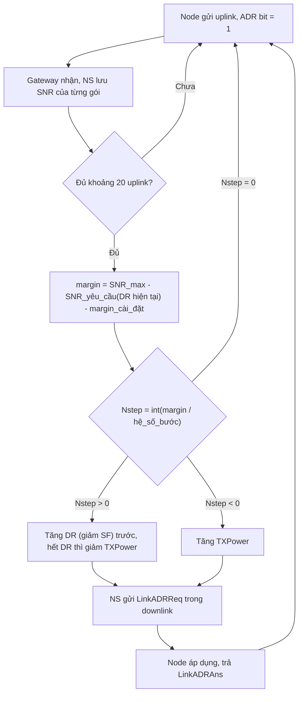

# LoRaWAN ADR và tinh chỉnh DR: WisGate Edge V2 + RAK3172

> **Đối tượng:** kỹ sư IoT triển khai LoRaWAN với gateway RAK WisGate (WisGateOS 2) và module RAK3172 (RUI3).
> **Ngày biên soạn:** 04/10/2026
> **Phạm vi:** node cố định, Class A, mục tiêu cân bằng giữa độ tin cậy, tuổi thọ pin, tốc độ và dung lượng mạng.
> **Vùng tần số có hướng dẫn riêng:** EU868, AS923 (AS923-2 cho Việt Nam) và **US915** (xem các mục đánh dấu "US915").

## Mục lục

1. [Lưu ý về model gateway](#1-lưu-ý-về-model-gateway)
2. [Kiến thức nền: SF, DR, SNR, airtime](#2-kiến-thức-nền-sf-dr-snr-airtime)
3. [ADR chi tiết](#3-adr-adaptive-data-rate-chi-tiết)
4. [Tinh chỉnh DR khởi đầu](#4-tinh-chỉnh-dr-khởi-đầu)
5. [Cấu hình trên gateway WisGate Edge V2 (WisGateOS 2)](#5-cấu-hình-trên-gateway-wisgate-edge-v2-wisgateos-2)
6. [Lệnh AT trên RAK3172 (RUI3)](#6-lệnh-at-trên-rak3172-rui3)
7. [Cấu hình khuyến nghị: node cố định, Class A, cân bằng](#7-cấu-hình-khuyến-nghị-node-cố-định-class-a-cân-bằng)
8. [Thiết kế Deep Sleep (tài liệu riêng)](#8-thiết-kế-deep-sleep-đã-tách-thành-tài-liệu-riêng)
9. [Quy trình triển khai và nghiệm thu](#9-quy-trình-triển-khai-và-nghiệm-thu)
10. [Xử lý sự cố](#10-xử-lý-sự-cố)
11. [Tài liệu tham khảo](#11-tài-liệu-tham-khảo)

---

## 1. Lưu ý về model gateway

Tài liệu chính thức của RAKwireless **không có model tên "WisGate 6610 V2"**. Phần cấu hình gateway trong tài liệu này dựa trên **WisGateOS 2 cho dòng WisGate Edge / Soho phiên bản V2** (ví dụ RAK7268V2, RAK7289V2, RAK7240V2). WisGateOS 2 chỉ tương thích với phần cứng V2, không dùng được cho V1.

Nếu model thực tế của bạn khác, hãy đối chiếu tên menu trong giao diện web. Các tham số LoRa (Work mode, Region, Network server parameters) dùng chung trong họ WisGateOS 2. Dòng X Industrial có trang cấu hình riêng nhưng cũng có tuỳ chọn ADR và ADR Margin.

Tại thời điểm biên soạn, trang release notes của RAK liệt kê WisGateOS 2 mới nhất là **v2.3.1 (22/07/2026)**. Nên cập nhật firmware trước khi triển khai.

---

## 2. Kiến thức nền: SF, DR, SNR, airtime

### 2.1 Spreading Factor (SF)

SF là hệ số trải phổ của điều chế LoRa, nhận giá trị **SF7 đến SF12** trong LoRaWAN. Các SF khác nhau gần như trực giao, nên gateway giải mã được nhiều gói dùng SF khác nhau trên cùng kênh cùng lúc.

| SF thấp (SF7) | SF cao (SF12) |
|---|---|
| Tốc độ cao, airtime ngắn | Tốc độ thấp, airtime dài |
| Tiết kiệm pin | Tốn pin |
| Tầm phủ ngắn, kém chịu nhiễu | Tầm phủ xa, độ nhạy tốt |

### 2.2 Data Rate (DR)

LoRaWAN không thao tác trực tiếp với SF mà dùng chỉ số **DR**. Ánh xạ DR sang SF/băng thông **phụ thuộc vùng tần số**.

**EU868 / AS923 (uplink, BW 125 kHz):**

| DR | Cấu hình | Tốc độ bit (xấp xỉ) |
|---|---|---|
| DR0 | SF12 / 125 kHz | 250 bps |
| DR1 | SF11 / 125 kHz | 440 bps |
| DR2 | SF10 / 125 kHz | 980 bps |
| DR3 | SF9 / 125 kHz | 1760 bps |
| DR4 | SF8 / 125 kHz | 3125 bps |
| DR5 | SF7 / 125 kHz | 5470 bps |

**US915 (uplink):**

| DR | Cấu hình | Ghi chú |
|---|---|---|
| DR0 | SF10 / 125 kHz | **Thấp nhất, tầm xa nhất** (không có SF11/SF12 cho uplink) |
| DR1 | SF9 / 125 kHz | |
| DR2 | SF8 / 125 kHz | |
| DR3 | SF7 / 125 kHz | Cao nhất trên kênh 125 kHz |
| DR4 | SF8 / 500 kHz | Chỉ chạy trên các kênh 500 kHz (kênh 64-71). Airtime rất ngắn |

**US915 (downlink):** DR8 = SF12/500 kHz, DR9 = SF11, DR10 = SF10, DR11 = SF9, DR12 = SF8, DR13 = SF7 (đều 500 kHz). Cửa sổ RX2 mặc định là **923.3 MHz, DR8**.

> **So sánh nhanh EU868 và US915:** cùng một SF nhưng khác chỉ số DR. SF9 là DR3 ở EU868/AS923 nhưng là **DR1** ở US915. SF7 là DR5 (EU868) nhưng là **DR3** (US915). Khi chuyển cấu hình giữa hai vùng, **không copy nguyên giá trị `AT+DR`**.

**Giới hạn DR theo vùng trên RAK3172 (RUI3, lệnh `AT+DR`):**

| Vùng | Dải DR cho phép |
|---|---|
| EU433, RU864, IN865, EU868, CN470, KR920 | DR0 đến DR5 |
| **AS923** | **DR2 đến DR5** |
| US915 | DR0 đến DR4 |
| AU915, LA915 | DR0 đến DR6 |

> **Quan trọng với AS923:** DR0 và DR1 (SF12, SF11) không dùng được, SF thấp nhất cho uplink là SF10 (DR2). Điều này ảnh hưởng đến việc chọn DR khởi đầu cho node ở xa.

### 2.3 SNR và RSSI

- **RSSI (dBm):** công suất tín hiệu thu được.
- **SNR (dB):** chênh lệch giữa tín hiệu và nhiễu nền. LoRa giải điều chế được cả khi SNR âm nhờ trải phổ.

**SNR tối thiểu để giải mã (BW 125 kHz):**

| SF | SNR tối thiểu |
|---|---|
| SF7 | -7.5 dB |
| SF8 | -10 dB |
| SF9 | -12.5 dB |
| SF10 | -15 dB |
| SF11 | -17.5 dB |
| SF12 | -20 dB |

Mỗi bậc SF cách nhau **2.5 dB** về yêu cầu SNR. ADR dùng **SNR** làm chỉ số chính, không dùng RSSI.

### 2.4 Airtime theo SF

Tính theo công thức Semtech: BW 125 kHz, CR 4/5, preamble 8 symbol, header tường minh, có CRC, overhead LoRaWAN 13 byte (không có FOpts).

| SF | Airtime (payload ứng dụng 10 B) | Airtime (20 B) | Số gói tối đa/ngày với 30 s airtime/ngày (10 B) | Chu kỳ gửi tối thiểu tương ứng |
|---|---|---|---|---|
| SF7 | 62 ms | 72 ms | 486 | ~3 phút |
| SF8 | 113 ms | 134 ms | 265 | ~5.5 phút |
| SF9 | 206 ms | 247 ms | 145 | ~10 phút |
| SF10 | 371 ms | 453 ms | 80 | ~18 phút |
| SF11 | 823 ms | 987 ms | 36 | ~40 phút |
| SF12 | 1483 ms | 1810 ms | 20 | ~72 phút |

Nhận xét:

- SF12 chiếm kênh lâu hơn SF7 khoảng **24 lần** với cùng payload. Đây là lý do ADR hạ SF mang lại lợi ích lớn về pin và dung lượng mạng.
- Cột 30 s/ngày là giới hạn **fair use của The Things Network (cộng đồng)**. Nếu dùng NS riêng (built-in, ChirpStack), giới hạn này không áp dụng nhưng **duty cycle theo quy định địa phương** vẫn cần tuân thủ (ví dụ EU868 thường là 1% theo sub-band). Hãy kiểm tra quy định hiện hành tại quốc gia triển khai.
- Payload tối đa cho phép cũng phụ thuộc DR và vùng. Ở DR thấp payload tối đa nhỏ hơn, hãy tra Regional Parameters.
- **US915:** SF thấp nhất của uplink là SF10 (DR0), nên airtime lớn nhất tương đương hàng SF10 trong bảng (không có SF11/SF12). US915 không có giới hạn duty cycle kiểu ETSI nhưng có **giới hạn dwell time 400 ms** trên kênh 125 kHz, vì vậy payload tối đa ở DR0 rất nhỏ (theo RP002 khoảng 11 byte payload ứng dụng, hãy xác nhận trong bản Regional Parameters bạn dùng). Giới hạn 30 s/ngày của TTN cộng đồng vẫn áp dụng nếu dùng TTN.

---

## 3. ADR (Adaptive Data Rate) chi tiết

### 3.1 ADR làm gì và vì sao nên bật

**Định nghĩa.** Theo LoRa Alliance, để tối đa hoá đồng thời tuổi thọ pin của thiết bị đầu cuối và dung lượng toàn mạng, Network Server (NS) quản lý riêng từng thiết bị về Data Rate (DR) và công suất phát RF bằng cơ chế ADR. Tài liệu của The Things Network mô tả ADR là cơ chế tối ưu data rate, airtime và năng lượng, điều khiển **spreading factor, băng thông và công suất phát**. Theo khoá học LoRaWAN 1.0.4 của Semtech, NS còn điều khiển cả **kênh** mà node dùng và **số lần phát lại (NbTrans)**.

**Khuyến nghị của LoRa Alliance.** TR007 (*Developing LoRaWAN Devices*, mục 3.15) nêu mục tiêu của ADR là tối đa hoá khả năng kết nối, giảm airtime và giảm tiêu thụ năng lượng của thiết bị. Tài liệu này khuyến nghị ADR **nên được hỗ trợ đầy đủ và bật theo mặc định**, vì mạng là bên có tầm nhìn toàn cục để chọn cấu hình tối ưu cho từng thiết bị.

**Nguyên tắc cốt lõi:** thiết bị gần gateway dùng SF thấp và data rate cao, thiết bị xa dùng SF cao vì cần link budget lớn hơn. Nhưng mọi node dùng SF cao "cho chắc" là một sự lãng phí lớn, và đó chính là thứ ADR loại bỏ.

#### Bảy lý do cần bật ADR

**1. Cắt giảm airtime, tức cắt giảm năng lượng mỗi gói.**
Ví dụ của chính TTN: một gói thu ở SF12/125 kHz với SNR +5 dB có margin tới **25 dB** (SNR yêu cầu của SF12 là -20 dB). Con số đó là sự lãng phí airtime và năng lượng. Nếu chuyển sang SF7, margin vẫn còn **12.5 dB** nhưng hiệu quả về airtime và năng lượng cao hơn nhiều lần.

Với số liệu của tài liệu này (payload 10 byte, BW 125 kHz, dòng TX 87 mA là cận trên theo datasheet RAK3172):

| SF | Airtime | Năng lượng TX mỗi uplink | So với SF7 |
|---|---|---|---|
| SF7 | 62 ms | 1.5 µAh | 1× |
| SF9 | 206 ms | 5.0 µAh | 3.3× |
| SF10 | 371 ms | 9.0 µAh | 6× |
| SF12 | 1483 ms | 35.8 µAh | **24×** |

Một node bị "kẹt" ở SF12 tốn gấp khoảng 24 lần năng lượng phát so với khi ADR đưa nó về SF7, trong khi dữ liệu gửi đi y hệt nhau. Với chu kỳ 15 phút, dòng trung bình chênh nhau khoảng 19 lần (7.7 µA so với 145 µA, xem `ESP32_RAK3172_DeepSleep_Reference.md`, mục 2.2).

**2. Giảm công suất phát khi vẫn còn dư biên.**
Khi đã ở data rate cao nhất mà margin vẫn còn, ADR tiếp tục hạ công suất phát. TTN ghi rõ việc này vừa tiết kiệm năng lượng vừa **gây ít nhiễu hơn** cho các thiết bị khác. Semtech cũng nêu lợi ích kép: bảo toàn pin và giảm nhiễu để mọi thiết bị trong mạng có cơ hội liên lạc thành công cao nhất.

**3. Tăng dung lượng mạng và giảm xung đột.**
Các gói dùng DR khác nhau gần như không gây nhiễu cho nhau, tạo thành một tập "kênh ảo" làm tăng dung lượng gateway (LoRa Alliance). ADR phân tán các node ra nhiều SF khác nhau, và quan trọng hơn là **rút ngắn thời gian mỗi gói chiếm kênh**. Bài khảo sát về ADR trên tạp chí Sensors (PMC7571005) cũng kết luận rằng tối ưu ADR làm tăng dung lượng mạng nhờ SF trực giao và airtime ngắn hơn.

Minh hoạ bằng mô hình ALOHA thuần (một kênh, các node cùng SF, chu kỳ 15 phút, payload 10 byte, xác suất gói không bị va chạm `e^(-2G)` với `G = N × airtime / chu_kỳ`):

| Số node trên một kênh | Cả mạng ở SF7 | Cả mạng ở SF9 | Cả mạng ở SF12 |
|---|---|---|---|
| 100 | 98.6% | 95.5% | 71.9% |
| 300 | 96.0% | 87.2% | 37.2% |
| 1000 | 87.1% | 63.3% | **3.7%** |

> Đây là **mô hình đơn giản để minh hoạ xu hướng**: bỏ qua hiệu ứng capture của LoRa, tính trực giao của các SF không hoàn hảo, nhiều kênh song song và duty cycle. Điều rút ra không phụ thuộc vào con số cụ thể: càng nhiều node bị kẹt ở SF cao thì xác suất va chạm càng tăng rất nhanh, và ADR đưa phần lớn node về SF thấp giữ cho mạng khỏi bão hoà. Gateway của bạn càng được nhiều node dùng chung thì lý do này càng quan trọng.

**4. Biến độ tin cậy thành một thông số chỉnh được (ADR margin).**
Theo tài liệu The Things Stack, tăng ADR margin làm data rate thấp đi và dung lượng mạng giảm nhưng tỷ lệ mất gói thấp hơn trong mạng tải nhẹ. Giảm margin cho kết quả ngược lại. Người vận hành chọn điểm cân bằng cho từng môi trường thay vì cố định bằng tay từng node. NS cũng có thể tăng số lần phát lại (NbTrans) khi thấy mất gói, và một số NS cho giới hạn NbTrans theo từng DR.

**5. Tự thích nghi khi môi trường đổi, và tự phục hồi khi mất liên lạc.**
Cây cối, công trình mới, mùa mưa, thay đổi anten hay gateway đều làm kênh truyền đổi theo thời gian. ADR liên tục đo lại SNR nên có thể điều chỉnh. Khi node mất liên lạc với NS, cơ chế **ADR backoff** phía node (mục 3.3) tự nâng dần độ bền liên kết: đặt lại công suất tối đa, hạ DR từng bậc, đặt lại NbTrans và bật tất cả kênh mặc định, rồi khi nối lại được mạng thì NS lại tối ưu xuống. Nếu cố định DR bằng tay, bạn phải tự giám sát và tự can thiệp khi kênh truyền xấu đi, vì không còn NS liên tục tối ưu cho node.

**6. Không cần khảo sát và đặt tay từng node.**
Mỗi node ở một khoảng cách và điều kiện khác nhau. Không có ADR thì kỹ sư phải khảo sát, đo SNR và chọn DR cho từng thiết bị, rồi chọn lại mỗi khi hiện trường thay đổi. ADR làm việc đó tự động và đồng nhất, rất quan trọng khi triển khai hàng trăm thiết bị.

**7. Cho phép gửi thường xuyên hơn trong giới hạn dùng chung.**
Giới hạn airtime (fair use của TTN cộng đồng, duty cycle theo quy định địa phương) tính trên tổng airtime. Với bảng ở mục 2.4: ở SF7 cho phép gửi khoảng 3 phút một lần trong khi ở SF12 chỉ cho phép khoảng 72 phút một lần, với cùng giới hạn 30 giây airtime mỗi ngày. ADR đưa node về SF thấp nên **mở rộng đáng kể tần suất gửi hợp lệ**.

#### So sánh: bật ADR và cố định DR

| Tiêu chí | **ADR bật** (node cố định) | DR cố định thấp (SF cao, "cho chắc") | DR cố định cao (SF thấp) |
|---|---|---|---|
| Tuổi thọ pin | Tối ưu theo từng node | Kém, airtime tới 24× | Tốt nếu liên kết đủ mạnh |
| Dung lượng mạng | Cao | Thấp, dễ va chạm khi đông node | Cao |
| Độ tin cậy | Cân bằng nhờ margin, có backoff | Cao nếu node ở xa, thừa biên nếu node gần | Nguy cơ mất gói, join thất bại nếu node ở xa |
| Thích nghi khi môi trường đổi | Tự động | Không | Không |
| Công sức cấu hình | Thấp, chỉ cần DR khởi đầu hợp lý | Thấp | Phải khảo sát từng node |
| Điểm yếu | Cần ~20 uplink để hội tụ, cần downlink để áp dụng | Lãng phí pin và dung lượng | Mất kết nối khi kênh xấu đi |

**Kết luận:** với node **cố định**, ADR cho kết quả tốt hơn cả hai phương án cố định ở hầu hết các tiêu chí. Semtech khuyến nghị trực tiếp rằng nếu thiết bị luôn đứng yên thì bạn **nên luôn dùng ADR**, và TTN cũng nói ADR nên bật bất cứ khi nào điều kiện RF của thiết bị đủ ổn định, nghĩa là nhìn chung áp dụng được cho thiết bị tĩnh.

### 3.2 Luồng hoạt động



Các bước chính, theo mô tả của The Things Stack (dựa trên thuật toán khuyến nghị của Semtech):

1. NS lấy **SNR lớn nhất** trong khoảng **20 uplink gần nhất** (lấy gateway thu tốt nhất nếu có nhiều gateway). Khi node tắt ADR bit thì số liệu cũ bị bỏ và đo lại từ đầu.
2. Tính SNR tối thiểu để giải điều chế với tham số hiện tại.
3. `margin = SNR_max - SNR_yêu_cầu - margin_cài_đặt`. Nếu có ít uplink hơn cần thiết thì cộng thêm biên an toàn.
4. `Nstep = int(margin / hệ_số_bước)`. The Things Stack dùng **2.5 dB/bước** (đúng bằng khoảng cách SNR giữa hai SF liền kề). Các NS khác có thể dùng hệ số khác (ví dụ 3 dB), hãy tra tài liệu NS của bạn.
5. Nếu `Nstep > 0`: tăng DR từng bậc đến hết biên. Nếu còn dư sau khi đạt DR tối đa thì giảm công suất phát (mỗi bậc 3 dB theo ví dụ trong tài liệu The Things Stack).
6. Nếu `Nstep < 0` và công suất chưa tối đa: tăng công suất phát.
7. Tuỳ mức mất gói (đo qua frame counter), NS có thể tăng số lần phát lại NbTrans.
8. NS gửi **LinkADRReq** gắn vào downlink kế tiếp, node phản hồi **LinkADRAns**.

**Ví dụ tính toán** (theo tài liệu The Things Stack): SNR lớn nhất trong 20 uplink là 7 dB, node đang ở DR3 (SF9, SNR yêu cầu -12.5 dB).

| Margin cài đặt | Tính toán | Nstep | Hành động của NS |
|---|---|---|---|
| 15 dB (mặc định của The Things Stack) | 7 - (-12.5) - 15 = 4.5 → int(4.5/2.5) | 1 | Tăng lên DR4 |
| 18 dB | 7 + 12.5 - 18 = 1.5 → int(1.5/2.5) | 0 | Không đổi |
| 25 dB | 7 + 12.5 - 25 = -5.5 → int(-5.5/2.5) | -1 | Tăng công suất 3 dB nếu chưa tối đa, DR giữ nguyên |

Ví dụ này cho thấy **margin cài đặt là núm vặn bảo thủ hay tích cực** của ADR. Giá trị mặc định ở NS khác nhau và với built-in NS của RAK tài liệu không nêu con số, hãy đọc giá trị trên giao diện của bạn.

### 3.3 Phía node: cờ ADR và cơ chế dự phòng (ADR backoff)

Node bật **ADR bit** trong header uplink để cho phép NS điều khiển. Khi đã rời khỏi cấu hình mặc định (công suất, DR, kênh, NbTrans), node phải thực hiện **ADR backoff** theo đặc tả (mô tả trong khoá học LoRaWAN 1.0.4 của Semtech), với `ADR_ACK_LIMIT = 64` và `ADR_ACK_DELAY = 32` (giá trị mặc định theo Regional Parameters RP002):

| Số uplink liên tiếp không nhận được downlink | Hành động của node |
|---|---|
| 64 | Đặt cờ **ADRACKReq** để buộc NS phản hồi |
| +32 (96) | Đặt lại **công suất phát về mặc định (tối đa)** |
| +32 (128) | Hạ DR một bậc (tăng tầm phủ) |
| +32 mỗi lần tiếp theo | Tiếp tục hạ DR từng bậc đến DR thấp nhất |
| +32 sau khi đã ở DR thấp nhất | Đặt lại NbTrans = 1, **bật kênh mặc định** (vùng kênh động) hoặc **bật tất cả kênh** (vùng kênh cố định) |

Khi nhận được bất kỳ downlink nào, node đặt lại bộ đếm và quy trình bắt đầu lại. Kết quả: node ở trạng thái "dễ nghe thấy nhất" (công suất tối đa, DR thấp nhất, mọi kênh), và ngay khi nối lại được NS sẽ tối ưu xuống lần nữa để tiết kiệm pin.

Cơ chế này giải thích vì sao ADR vừa tiết kiệm vừa an toàn: nó **tự cứu hộ** khi NS mất liên lạc hoặc kênh xấu đi. Lưu ý quan trọng: thời gian cứu hộ rất dài với chu kỳ gửi thưa (xem 3.4), nên thiết bị quan trọng cần có cảnh báo mất tín hiệu ở tầng ứng dụng.

### 3.4 Thời gian hội tụ

ADR cần khoảng 20 uplink để bắt đầu quyết định. Do đó:

| Chu kỳ gửi | Thời gian tối thiểu để ADR hội tụ lần đầu | Thời gian đến hành động tự phục hồi đầu tiên của node (96 uplink, mục 3.3) |
|---|---|---|
| 5 phút | ~1.7 giờ | ~8 giờ |
| 15 phút | ~5 giờ | ~24 giờ |
| 60 phút | ~20 giờ | ~4 ngày |

Với node gửi thưa, **DR khởi đầu đúng** quan trọng hơn nhiều (xem mục 4). Có thể gửi dày hơn trong giai đoạn đầu sau khi join để ADR hội tụ nhanh. Ở US915 và AU915, TTN còn gửi một yêu cầu ADR đầu tiên ngay sau join, chủ yếu để đặt mặt nạ kênh cho thiết bị.

Các thời điểm NS gửi LinkADRReq (theo TTN): khi đủ số đo và DR chưa tối ưu thì lập lịch gửi và gắn vào một downlink ứng dụng đang có (ví dụ ACK); gửi ngay khi đủ số đo mà thiết bị đang ở DR0; và gửi khi node đặt ADRACKReq. NS ngừng gửi ADR nếu thiết bị từ chối nhiều lần, thường do cài đặt sai hoặc không khớp phiên bản giữa node và NS.

### 3.5 Khi nào bật và tắt ADR

| Tình huống | Khuyến nghị |
|---|---|
| Node **cố định**, kênh truyền ổn định | **Bật ADR** |
| Node **di chuyển** (tracker, phương tiện) | **Tắt ADR**, đặt DR cố định thận trọng. Nếu node biết lúc nào đứng yên thì chỉ bật ADR khi đứng yên |
| Node cố định nhưng có lúc điều kiện RF bất ổn (ví dụ xe đỗ lên trên cảm biến đỗ xe) | Tắt ADR tạm thời trong thời gian đó |
| Môi trường biến động mạnh (che chắn thay đổi, nhiễu theo giờ) | Bật ADR nhưng tăng margin, hoặc DR cố định |
| Lưu lượng uplink rất thưa | Bật ADR nhưng đặt DR khởi đầu sát thực tế |
| Cần kiểm thử/đo đạc tại một SF cụ thể | Tắt ADR, đặt DR thủ công |

Lý do tắt ADR cho thiết bị di động: nếu thiết bị di chuyển trước khi NS tính xong và gửi cài đặt mới thì cài đặt đó không còn phù hợp với vị trí mới (Semtech). Một nghiên cứu thực nghiệm (Lemic và cộng sự, MobiCom 2019) báo cáo rằng ADR cải thiện độ tin cậy và vùng phủ khi mức độ di động thấp, còn lợi ích giảm dần khi di động tăng. Điều này khớp với trường hợp của bạn: **node cố định là kịch bản ADR phát huy tốt nhất.**

TR007 mục 3.15.1 cho rằng mạng ở vị trí tốt nhất để chọn cấu hình, kể cả với thiết bị di động, và khuyên chủ thiết bị phối hợp với nhà vận hành mạng để xây một profile quản lý phù hợp cho thiết bị đặc biệt (di động, nomadic, điều kiện RF biến động). Điều này không mâu thuẫn với khuyến nghị ở trên: với **node cố định** như trường hợp của bạn thì bật ADR là hiển nhiên.

Theo TTN, **node quyết định có dùng ADR hay không** (qua ADR bit), không phải ứng dụng hay mạng. Vì vậy việc bật ADR phải được làm ở cả node (`AT+ADR=1`) và NS (bật ADR trên gateway built-in hoặc trong profile thiết bị của NS ngoài).

### 3.6 Giới hạn của ADR

- Cần đủ uplink để đo, và cần **downlink** để áp dụng lệnh. Node chỉ nhận downlink ở hai cửa sổ RX sau mỗi uplink (Class A), nên lệnh ADR thường đi kèm một downlink khác.
- Hạ SF quá sát ngưỡng có thể gây mất gói khi điều kiện kênh xấu đi. Dùng **margin** đủ lớn để bù.
- Nhiều gateway có thể làm SNR_max đẹp hơn thực tế nếu một gateway tình cờ thu rất tốt trong thời gian ngắn.
- Đặc tả LoRaWAN **không quy định** NS phải ra lệnh cho node như thế nào, nên mỗi NS có thuật toán và thông số mặc định riêng (bài khảo sát Sensors, PMC7571005). Cùng một node có thể hội tụ về DR khác nhau trên hai NS khác nhau.
- Các nghiên cứu mô phỏng (Slabicki và cộng sự, NOMS 2018, và các khảo sát tiếp theo) cho thấy ADR chuẩn hoạt động tốt nhất khi điều kiện mạng ổn định, và hiệu quả giảm khi điều kiện kém ổn định hơn (di động, mạng rất dày, kênh biến động). Đây là lý do nghiên cứu hiện nay đề xuất nhiều biến thể ADR cải tiến, nhưng với node cố định trong mạng không quá dày thì ADR chuẩn là lựa chọn phù hợp.

### 3.7 Các tham số điều chỉnh ADR và đánh đổi

| Tham số | Tăng giá trị | Giảm giá trị | Khi nào chỉnh |
|---|---|---|---|
| **ADR margin** | DR thấp hơn, ổn định hơn, tốn pin hơn, dung lượng mạng giảm | DR cao hơn, tiết kiệm hơn, dung lượng cao hơn, nguy cơ mất gói tăng | Tăng khi thấy mất gói sau ADR. Giảm khi liên kết rất ổn và cần tiết kiệm pin |
| **Min Allowed TX Data-Rate** | Chặn node ở DR thấp, giới hạn airtime tối đa | Cho phép ADR dùng DR thấp hơn | Nâng để bảo vệ ngân sách airtime, nhưng node ở xa có thể mất kết nối |
| **Max Allowed TX Data-Rate** | ADR được phép hạ SF thấp hơn | Chặn ADR không hạ quá sâu | Hạ nếu muốn giữ biên dự phòng thường trực |
| **NbTrans** (nếu NS hỗ trợ) | Phát lại nhiều hơn, tin cậy hơn, tốn airtime hơn | Ít phát lại, tiết kiệm hơn | Tăng nếu mất gói ngẫu nhiên và không có downlink xác nhận |
| **Chế độ ADR tĩnh** (static, ví dụ ở The Things Stack) | NS ngừng tối ưu, bạn tự đặt DR, TXP, NbTrans | | Khi cần cố định cấu hình sau khi đã khảo sát kỹ |

Với built-in NS của WisGateOS 2, các tham số tương ứng là **Enable ADR**, **Min/Max Allowed TX Data-Rate** và **ADR Margin (dB)** (xem mục 5.4).

> **Nguồn mục 3:** LoRa Alliance (*What is LoRaWAN*), TTN (*Adaptive Data Rate*), The Things Stack (*ADR reference*), Semtech Learning Center (*Implementing Adaptive Data Rate*), bài khảo sát ADR trên Sensors (PMC7571005), Slabicki và cộng sự (NOMS 2018), Lemic và cộng sự (MobiCom 2019). Chi tiết ở mục 11.

---

## 4. Tinh chỉnh DR khởi đầu

**DR khởi đầu** là DR node dùng cho các gói đầu tiên (kể cả gói Join), trước khi ADR có đủ dữ liệu. Chọn sai sẽ làm tốn pin hoặc khiến node không join được.

| DR khởi đầu | Hậu quả |
|---|---|
| Quá thấp (SF cao) | Join chắc chắn hơn nhưng airtime dài, tốn pin, đặc biệt khi chu kỳ gửi thưa nên ADR chậm hội tụ |
| Quá cao (SF thấp) | Tiết kiệm pin nhưng node xa gateway thì gói không tới nơi, **join thất bại** |

### 4.1 Chọn theo vị trí

| Vị trí node | DR khởi đầu (EU868) | DR khởi đầu (AS923) | DR khởi đầu (**US915**) |
|---|---|---|---|
| Gần gateway, ít vật cản | DR5 (SF7) | DR5 (SF7) | **DR3 (SF7)** |
| Trung bình, có nhà cửa | DR3 (SF9) | DR3 (SF9) | **DR1 (SF9)** |
| Xa, trong nhà kín, tầng hầm | DR0 đến DR2 | **DR2 (SF10)** là mức thấp nhất khả dụng | **DR0 (SF10)** là mức thấp nhất |

Nếu chưa biết rõ, chọn **SF9** làm điểm cân bằng an toàn: **DR3** ở EU868/AS923, **DR1** ở US915.

Lưu ý riêng cho US915: dải DR của node chỉ là DR0-DR4, và DR4 (SF8/500 kHz) chỉ dùng được trên kênh 500 kHz, nên khi ADR "tăng DR" thì mức dùng thực tế phổ biến nhất trên kênh 125 kHz là DR3.

### 4.2 Quy trình tinh chỉnh

1. Lắp node tại **vị trí thật**, không thử cạnh gateway.
2. Đặt DR khởi đầu = DR3, bật ADR, chạy 30 đến 50 gói.
3. Ghi lại DR mà ADR **ổn định** (xem tab Overview của thiết bị trên gateway hoặc console NS).
4. Nếu ADR ổn định ở DR5: đặt DR khởi đầu = DR5 cho lô thiết bị cùng điều kiện.
5. Nếu ADR đẩy xuống DR2 (hoặc thấp nhất khả dụng): đặt DR khởi đầu thấp ngay từ đầu, cân nhắc thêm gateway hoặc anten tốt hơn.
6. Để dự phòng, đặt DR khởi đầu **thấp hơn 1 bậc** so với DR ổn định đo được cho thiết bị quan trọng.

### 4.3 Phạm vi tác dụng

Giá trị `AT+DR` là mức bắt đầu khi node khởi động hoặc join lại. Khi ADR bật, NS có thể ghi đè. Sau mất nguồn/reset, hãy kiểm tra node có quay về giá trị bạn đặt hay không, vì hành vi lưu trạng thái phụ thuộc firmware.

---

## 5. Cấu hình trên gateway WisGate Edge V2 (WisGateOS 2)

### 5.1 Gateway không chọn SF của uplink

Concentrator (SX1301/SX1302/SX1303) nghe đồng thời mọi SF trên các kênh multi-SF. **SF/DR của uplink do node quyết định.** Phía gateway/NS chỉ cấu hình: vùng tần số, kênh, chế độ làm việc, và với built-in NS thì thêm các tham số ADR và RX.

### 5.2 Ba chế độ làm việc (LoRa > Configuration > Work mode)

| Work mode | Mô tả | ADR cấu hình ở đâu |
|---|---|---|
| **Built-in network server** | Gateway tự làm NS, xử lý và quản lý thiết bị cục bộ, hỗ trợ gateway mở rộng | Trên gateway (mục 5.4) |
| **Packet Forwarder** | Chuyển tiếp gói tới NS ngoài (TTN, ChirpStack...) qua Semtech UDP GWMP hoặc LoRa Gateway MQTT Bridge | Trên NS ngoài |
| **Basics Station** | Kết nối bảo mật WebSocket (CUPS/LNS) tới NS ngoài | Trên NS ngoài |

Với NS ngoài, ADR được điều khiển bởi **thuật toán và profile của NS đó**. Ví dụ ChirpStack cho chọn thuật toán ADR trong Device Profile, và RAK hướng dẫn chọn "Default ADR algorithm (LoRa only)". Hãy tham khảo tài liệu NS bạn dùng để biết tên tham số margin.

### 5.3 Chọn vùng tần số

Đường dẫn: **LoRa > Configuration > Frequency plan**.

1. (Tuỳ chọn) **Select your country**: chọn quốc gia để gateway tự giới hạn công suất theo quy định và bật LBT nếu cần.
2. Chọn **Region**. Các vùng hỗ trợ gồm US915, AS923, KR920, EU868, RU864, IN865, EU433, CN470 (tuỳ phần cứng).
3. Với **AS923**, phải chọn **Variation** (AS923-1/2/3/4).
4. Mở **View detailed regional parameters of the frequency plan** để chỉnh sub-band, kênh Multi-SF, kênh Standard LoRa, kênh FSK.
5. **LoRaWAN Public**: bật mặc định để xử lý mọi thiết bị. Tắt chỉ khi xây mạng riêng với sync word private.

> **Việt Nam:** theo bảng quy hoạch trong LoRa Alliance RP002, băng 918-923 MHz và 920-922.5 MHz tương ứng **AS923-2** (băng 433 MHz tương ứng EU433). Hãy xác nhận với quy định hiện hành của cơ quan quản lý tại thời điểm triển khai và chọn **cùng một variation** trên gateway, NS và node. Sai variation là nguyên nhân phổ biến khiến node không join được.

> **US915: sub-band phải khớp giữa gateway và node.** US915 có 64 kênh 125 kHz (số 0-63) và 8 kênh 500 kHz (số 64-71), chia thành **8 sub-band**, mỗi sub-band gồm 8 kênh 125 kHz cộng 1 kênh 500 kHz. Gateway 8 kênh chỉ nghe **một sub-band**. Cách làm:
>
> 1. Trên gateway: chọn Region **US915**, mở *View detailed regional parameters* và chọn **Frequency Sub-Band** mong muốn (mục *Detailed Regional Frequency Settings*).
> 2. Trên node: dùng `AT+MASK` (hoặc `AT+CHE`) để chỉ bật đúng sub-band đó (xem mục 6.2 và 7.2b).
> 3. Nếu node phát trên kênh mà gateway không nghe, gói Join sẽ không bao giờ tới nơi, dù tín hiệu rất tốt.
>
> Ví dụ phổ biến: The Things Network dùng US915 **sub-band 2** (kênh 8-15 và 65), tương ứng `AT+MASK=0002` trên node. Hãy kiểm tra sub-band mặc định của gateway và NS bạn dùng trước khi chọn.

### 5.4 Tham số ADR trong Built-in Network Server

Đường dẫn: **LoRa > Configuration > Network server parameters** (bấm mở rộng).

| Tham số (theo tài liệu RAK) | Chức năng | Gợi ý cho node cố định, cân bằng |
|---|---|---|
| **Enable ADR** | Bật/tắt ADR. Khi bật, server tự điều chỉnh data rate, airtime và năng lượng theo điều kiện mạng | **Bật** |
| **Min Allowed TX Data-Rate** | DR thấp nhất ADR được phép gán (phụ thuộc vùng) | Mặc định. Với AS923 DR thấp nhất khả dụng là DR2 |
| **Max Allowed TX Data-Rate** | DR cao nhất ADR được phép gán (phụ thuộc vùng) | Mặc định (DR5). Hạ xuống nếu muốn giữ độ tin cậy cao hơn |
| **ADR Margin (dB)** | Biên dự phòng để tránh đánh giá quá cao data rate, tránh suy giảm hiệu năng | Tăng thêm vài dB nếu thấy mất gói sau khi ADR hạ SF. Giảm nếu muốn ADR tích cực hơn |
| **Network ID** | Số thập phân phân biệt các mạng khi triển khai nhiều mạng | Giữ mặc định nếu chỉ có một mạng |
| **Rx1 Delay (s)** | Độ trễ cửa sổ RX1 | Mặc định |
| **RX1 Data Rate Offset** | DR của downlink trong RX1, mặc định 0 (giống uplink) | Mặc định |
| **RX2 Frequency (MHz)** / **RX2 Data Rate** | Tần số và DR của cửa sổ RX2 | **Phải khớp** với giá trị node dùng (`AT+RX2FQ`, `AT+RX2DR`) |
| **Uplink / Downlink Dwell Time Limit** | Giới hạn dwell time, chỉ cho một số vùng | Theo vùng (liên quan AS923) |
| **Downlink Tx Power (dBm)** | Công suất downlink, dải -6 đến 20, hữu ích khi dùng anten gain lớn | Tuỳ anten và quy định |
| **Disable Frame-counter Validate** | Bật/tắt kiểm tra frame counter | **Giữ kiểm tra bật** trên hệ thống thật (tắt chỉ để debug) |
| **End device-status request interval (s)** | Tần suất hỏi trạng thái thiết bị | Mặc định |
| **Statistic interval (s)** | Chu kỳ thu thập thống kê | Mặc định |

> Tài liệu chính thức không công bố giá trị mặc định của ADR Margin trong trang đã tham khảo, hãy đọc giá trị hiện tại trên giao diện của bạn trước khi thay đổi. Cách điều chỉnh margin ở bảng trên là **khuyến nghị kỹ thuật**, không phải giá trị do RAK quy định.

### 5.5 Tạo Application và thiết bị (chế độ Built-in NS)

**LoRa > Applications > Add application:**

| Tham số | Ý nghĩa |
|---|---|
| Application name | Tên ứng dụng |
| Application Type | **Unified Application key** (mọi thiết bị chung AppKey) hoặc **Separate Application keys** (mỗi thiết bị/nhóm một AppKey) |
| Auto Add Device | Tự thêm thiết bị OTAA có AppKey và Application EUI khớp sau khi join thành công |
| Application Key / Application EUI | Bắt buộc cho Unified key và Auto Add Device |
| Payload type | None hoặc CayenneLPP |
| **Report LoRa Radio Information** | Bật để gói gửi lên server kèm RSSI, SNR... Rất hữu ích để tinh chỉnh ADR |
| Enable HTTP/HTTPS Integration | Chuyển dữ liệu tới endpoint ngoài |

**Thêm End device:**

| Tham số | Giá trị khuyến nghị |
|---|---|
| Activation Mode | OTAA |
| Class | **Class A** |
| LoRaWAN MAC Version | V1.0.2 hoặc V1.0.3, chọn **khớp với firmware node** (xem tài liệu RUI3) |
| LoRaWAN Regional Parameters revision | Chỉ hiện khi MAC V1.0.2, chọn A hoặc B khớp node |
| Frame Counter Width | Theo node |

Có thể thêm hàng loạt bằng **CSV** (file không quá 1 MB, gồm end device EUI và với ABP thêm end device address).

### 5.6 Giám sát chất lượng liên kết trên gateway

Vào **LoRa > Applications > [App] > End devices > [thiết bị]**:

| Tab / mục | Dùng để |
|---|---|
| **Overview** | Xem LINK MARGIN, PACKET LOSS, LAST SEEN, tổng uplink/downlink, biểu đồ **SNR** và **RSSI**, phân bố **Data Rate** |
| **Configuration > Packet capture** | Xem mọi gói trao đổi giữa node và gateway. Lọc theo loại gói, tần số, RSSI, SNR, ẩn gói lỗi CRC. Tải phiên về dạng `.json` |
| **Downlink** | Gửi downlink thử (FPort, hex, confirmed hoặc không) |

Dùng biểu đồ **Data Rate** để xác nhận ADR đã hội tụ về DR nào, và **LINK MARGIN** để đánh giá độ dư.

---

## 6. Lệnh AT trên RAK3172 (RUI3)

> Nguồn: *RUI3 AT Command Manual* chính thức của RAKwireless. Mặc định baud rate 115200. **Luôn chờ phản hồi trước khi gửi lệnh tiếp**, vì một số lệnh trả thêm sự kiện bất đồng bộ (`+EVT:...`).

### 6.1 Cú pháp

| Dạng | Ý nghĩa |
|---|---|
| `AT+XXX?` | Mô tả ngắn của lệnh |
| `AT+XXX` | Thực thi lệnh (ví dụ `AT+JOIN`) |
| `AT+XXX=?` | Đọc giá trị hiện tại |
| `AT+XXX=<giá trị>` | Ghi giá trị |

**Mã trạng thái:** `OK` thành công, `AT_ERROR` lỗi chung, `AT_PARAM_ERROR` sai tham số (kể cả DR ngoài dải của vùng), `AT_BUSY_ERROR` mạng đang bận (đang join/send), `AT_NO_NETWORK_JOINED` chưa join.

### 6.2 Chế độ và vùng tần số

| Lệnh | Chức năng | Ghi chú |
|---|---|---|
| `AT+NWM=<0\|1\|2>` | Chọn chế độ: 0 = LoRa P2P, 1 = **LoRaWAN**, 2 = FSK P2P | **Module tự khởi động lại** sau khi đổi. Mặc định 1 |
| `AT+BAND=<n>` | Chọn vùng tần số | 0 = EU433, 1 = CN470, 2 = RU864, 3 = IN865, **4 = EU868**, 5 = US915, 6 = AU915, **7 = KR920**, **8 = AS923-1**, **9 = AS923-2**, 10 = AS923-3, 11 = AS923-4, 12 = LA915. Mặc định 4. Biến thể tần thấp (L) chỉ dùng 0-1, biến thể tần cao (H) chỉ dùng 2-12 |
| `AT+MASK=<mask>` | Mặt nạ kênh theo sub-band (chỉ US915, AU915, LA915, CN470) | Mặt nạ 16 bit dạng hex: `0001` = sub-band 1 (kênh 0-7, 64), `0002` = sub-band 2 (kênh 8-15, 65), `0004` = sub-band 3... `0080` = sub-band 8, `0000` = tất cả kênh. Mặc định US915/AU915/LA915 là `01FF`. Ví dụ gateway 8 kênh sub-band 2: `AT+MASK=0002` |
| `AT+CHE=<a:b:c...>` | Chế độ 8 kênh (chỉ US915, AU915, LA915, CN470) | US915 nhận giá trị 0-9: 0 = bật kênh 0-71, 1-8 = sub-band tương ứng, 9 = kênh 64-71 (500 kHz). Ví dụ `AT+CHE=2` |
| `AT+CHS=<tần số Hz>` | Chế độ **một kênh** (US915, AU915, CN470) | Chỉ dùng để thử nghiệm với gateway một kênh. Ví dụ US915: `AT+CHS=903900000`. **Ghi đè** `AT+MASK` và `AT+CHE` |
| `AT+PNM=<0\|1>` | Chế độ mạng công cộng (sync word) | Mặc định 1. Khớp với "LoRaWAN Public" trên gateway |

### 6.3 Định danh và khoá (OTAA)

| Lệnh | Chức năng | Định dạng |
|---|---|---|
| `AT+NJM=<0\|1>` | Chế độ join: 0 = ABP, 1 = **OTAA** | Mặc định 1 |
| `AT+DEVEUI=<hex>` | Device EUI | 16 ký tự hex (8 byte), MSB trước |
| `AT+APPEUI=<hex>` | Application/Join EUI | 16 ký tự hex |
| `AT+APPKEY=<hex>` | Application Key | 32 ký tự hex (16 byte) |
| `AT+DEVADDR`, `AT+APPSKEY`, `AT+NWKSKEY` | Dùng cho ABP | 8 hex / 32 hex / 32 hex |

### 6.4 Join và gửi dữ liệu

| Lệnh | Chức năng | Ghi chú |
|---|---|---|
| `AT+JOIN=<p1>:<p2>:<p3>:<p4>` | Join mạng | p1: 1 = join, 0 = dừng. p2: 1 = tự join khi bật nguồn. p3: chu kỳ thử lại **7-255 s** (mặc định 8). p4: số lần thử **0-255** (mặc định 0). Lệnh **bất đồng bộ**: `OK` nghĩa là đang join, kết quả là `+EVT:JOINED` hoặc `+EVT:JOIN FAILED` |
| `AT+NJS=?` | Trạng thái join | 0 = chưa, 1 = đã join |
| `AT+SEND=<port>:<hex>` | Gửi uplink | port 1-233, payload 1-256 byte (2-500 ký tự hex). Bất đồng bộ. Trả `AT_NO_NETWORK_JOINED` nếu chưa join, `AT_BUSY_ERROR` nếu lệnh trước chưa xong |
| `AT+CFM=<0\|1>` | Chế độ xác nhận: 0 = **unconfirmed**, 1 = confirmed | Mặc định 0 |
| `AT+CFS=?` | Kết quả gói confirmed gần nhất | 1 = thành công, 0 = thất bại |
| `AT+RETY=<0-7>` | Số lần gửi lại với gói confirmed | Mặc định 0 |
| `AT+RECV=?` | Dữ liệu downlink gần nhất | Dạng `<port>:<payload>` |

### 6.5 Quản lý mạng: ADR, DR, công suất, Class

| Lệnh | Chức năng | Ghi chú |
|---|---|---|
| `AT+ADR=<0\|1>` | Bật/tắt ADR | **Mặc định 1 (bật)** |
| `AT+DR=<n>` | Đặt Data Rate | Dải theo vùng (xem mục 2.2). **Ngoài dải sẽ trả `AT_PARAM_ERROR`** |
| `AT+TXP=<n>` | Công suất phát theo chỉ số | **0 = công suất cao nhất**, số càng lớn càng thấp. Dải: EU868/RU864/KR920/AS923/CN470: 0-7. US915/AU915: 0-14. EU433: 0-5. IN865: 0-10. Mặc định 0 |
| `AT+CLASS=<A\|B\|C>` | Class thiết bị | **Class A** tiết kiệm pin nhất |
| `AT+LINKCHECK=<0\|1\|2>` | Kiểm tra liên kết: 0 = tắt, 1 = một lần ở uplink kế, 2 = sau mỗi uplink | Trả `+EVT:LINKCHECK:Y0,Y1,Y2,Y3,Y4` |
| `AT+DCS=<0\|1>` | Duty cycle ETSI | Phụ thuộc vùng, có thể chỉ đọc |
| `AT+RX1DL`, `AT+RX2DL` | Độ trễ cửa sổ RX1 (1-15 s), RX2 (2-15 s) | Cập nhật RX1DL sẽ tự cập nhật RX2DL |
| `AT+RX2DR`, `AT+RX2FQ` | DR và tần số cửa sổ RX2 | Phải khớp cấu hình RX2 trên NS/gateway. `RX2FQ` chỉ đọc |
| `AT+JN1DL`, `AT+JN2DL` | Độ trễ RX1/RX2 cho Join Accept | Mặc định 5 s và 6 s. `JN2DL` phải lớn hơn `JN1DL` |
| `AT+LPSEND` | Gói dài (tối đa 1000 byte) | **Chỉ hoạt động với WisGate Edge và Built-in NS của RAK** |

**Định dạng `+EVT:LINKCHECK:Y0,Y1,Y2,Y3,Y4`:** Y0 = kết quả (0 = thành công), Y1 = **DemodMargin** (dB), Y2 = số gateway thu được, Y3 = RSSI, Y4 = SNR. Đây là cách nhanh nhất để đo margin thực tế khi đang tắt ADR.

### 6.6 Chẩn đoán

| Lệnh | Chức năng |
|---|---|
| `AT+RSSI=?` | RSSI (dBm) của gói **thu** gần nhất (downlink) |
| `AT+SNR=?` | SNR (dB) của gói thu gần nhất |
| `AT+ARSSI=?` | RSSI của các kênh đang mở |
| `AT+BAT=?` | Mức pin (V) |
| `AT+SYSV=?` | Điện áp hệ thống (V) |
| `AT+VER=?` | Phiên bản firmware |
| `AT+LTIME=?`, `AT+TIMEREQ` | Thời gian cục bộ (UTC) |
| `ATE` | Bật/tắt echo lệnh |

**Sự kiện bất đồng bộ thường gặp:** `+EVT:JOINED`, `+EVT:JOIN FAILED`, `+EVT:TX_DONE`, `+EVT:SEND_CONFIRMED_OK`, `+EVT:SEND_CONFIRMED_FAILED`, `+EVT:RX_1:<rssi>:<snr>:UNICAST:<port>:<data>` (downlink Class A).

### 6.7 Tiết kiệm năng lượng

> Thiết kế ngủ sâu đầy đủ (kiến trúc, trình tự lệnh, phần cứng, đo kiểm) nằm trong tài liệu riêng `ESP32_RAK3172_DeepSleep_Reference.md` (xem **mục 8** để biết tóm tắt).

| Lệnh | Chức năng | Ghi chú |
|---|---|---|
| `AT+SLEEP=<ms>` | Ngủ trong khoảng thời gian (ms). Không tham số: ngủ liên tục | Phạm vi 1 đến 2^32-1 |
| `AT+LPM=<0\|1>` | Low Power Mode: module tự ngủ sau khi xử lý lệnh AT | Không cần gọi `AT+SLEEP` |
| `AT+LPMLVL=<1\|2>` | Mức ngủ (**chỉ RAK3172**): 1 = STOP1, 2 = STOP2 | STOP2 tiêu thụ thấp hơn nhưng **không đánh thức được qua UART1**. STOP1 đánh thức được qua UART1 và UART2 |

### 6.8 Chế độ LoRa P2P (không có ADR)

Chuyển bằng `AT+NWM=0`. Chế độ này **không có ADR, không có mạng**: mọi tham số cần cấu hình tay và hai đầu phải giống nhau.

| Lệnh | Chức năng |
|---|---|
| `AT+P2P=<Freq>:<SF>:<BW>:<CR>:<Preamble>:<TXPower>` | Đặt toàn bộ tham số một lần. Ví dụ `AT+P2P=868000000:7:0:0:20:14` |
| `AT+PFREQ`, `AT+PSF`, `AT+PBW`, `AT+PCR`, `AT+PPL`, `AT+PTP` | Đặt riêng từng tham số: tần số (150-960 MHz), SF, băng thông, code rate, preamble, công suất (5-22 dBm) |
| `AT+PSEND=<hex>` | Gửi dữ liệu P2P |
| `AT+PRECV=<ms>` | Vào chế độ thu. 65534 = thu liên tục, 65533 = thu liên tục nhưng vẫn cho phép phát, 0 = thôi thu |
| `AT+CAD=<0\|1>` | Channel Activity Detection trước khi phát |
| `AT+SYNCWORD`, `AT+ENCRY`, `AT+ENCKEY` | Sync word và mã hoá P2P |

Mã băng thông P2P: 0 = 125 kHz, 1 = 250 kHz, 2 = 500 kHz (và các băng hẹp 3-9). Mã code rate: 0 = 4/5, 1 = 4/6, 2 = 4/7, 3 = 4/8. SF hợp lệ 5-12 theo lệnh `AT+PSF` (lệnh `AT+P2P` ghi chú dải 6-12, nên ưu tiên SF 7-12 để an toàn).

---

## 7. Cấu hình khuyến nghị: node cố định, Class A, cân bằng

### 7.1 Nguyên tắc

| Hạng mục | Chọn | Lý do |
|---|---|---|
| ADR | **Bật** | Node cố định nên kênh ổn định, ADR hội tụ tốt |
| DR khởi đầu | **DR3 (SF9)**, hoặc theo mục 4 | Đủ tầm phủ để join, ADR sẽ tinh chỉnh |
| TXP | **0** (cao nhất) để ADR giảm dần | Giảm công suất là việc của ADR, không tự giảm ngay từ đầu |
| Class | **A** | Tiêu thụ thấp nhất |
| Confirmed | **Tắt** (`AT+CFM=0`) | Confirmed bắt gateway gửi ACK, tốn airtime của cả mạng. Chỉ dùng cho gói quan trọng |
| Chu kỳ gửi | 5-15 phút (đo đạc thông thường), 30-60 phút (dữ liệu ít đổi) | Chu kỳ gửi ảnh hưởng pin nhiều nhất |
| Payload | Càng ngắn càng tốt (số nguyên nén, không dùng chuỗi text) | Airtime tỷ lệ với độ dài gói |
| Ngủ | `AT+LPM=1` (hoặc MCU host ngủ sâu) | Tránh tiêu thụ nền |

### 7.2 Bộ lệnh AT mẫu (OTAA, AS923-2, Class A)

```text
AT+NWM=1                       // Chế độ LoRaWAN (module tự khởi động lại)
AT+NJM=1                       // OTAA
AT+BAND=9                      // AS923-2. Đổi theo vùng thật: 4 = EU868, 8 = AS923-1, 5 = US915...
AT+CLASS=A                     // Class A
AT+DEVEUI=<16 hex>             // Khớp với thiết bị đã đăng ký trên NS
AT+APPEUI=<16 hex>
AT+APPKEY=<32 hex>

AT+ADR=0                       // Tắt tạm thời để chắc chắn đặt được DR
AT+DR=3                        // DR khởi đầu = SF9 (AS923 hợp lệ từ DR2 đến DR5)
AT+TXP=0                       // Công suất cao nhất, để ADR hạ dần
AT+ADR=1                       // Bật ADR

AT+CFM=0                       // Uplink không xác nhận
AT+LPM=1                       // Cho phép tự ngủ sau mỗi lệnh

AT+JOIN=1:0:10:8               // Join, không auto-join khi bật nguồn, thử lại mỗi 10 s, tối đa 8 lần
```

> **Giải thích thứ tự `ADR=0` → `DR` → `ADR=1`:** tài liệu AT cũ (đã deprecated) của RAK3172 ghi rằng `AT+DR` trả lỗi khi ADR đang bật. Với bản RUI3 hiện tại tài liệu không nêu hạn chế này, nhưng thứ tự trên an toàn cho cả hai thế hệ firmware.
>
> **Auto-join:** nếu muốn node tự join lại sau mỗi lần cấp nguồn, đặt tham số thứ hai của `AT+JOIN` bằng 1 (ví dụ `AT+JOIN=1:1:30:3`). Với thiết bị chạy thực địa, tham số join nên theo `ESP32_RAK3172_DeepSleep_Reference.md`, mục 6.5 để tuân thủ back-off của đặc tả. Cấu hình `AT+JOIN=1:0:10:8` ở trên chỉ phù hợp khi thử trên bàn.

### 7.2b Bộ lệnh AT mẫu cho **US915** (OTAA, Class A, sub-band 2)

```text
AT+NWM=1                       // Chế độ LoRaWAN (module tự khởi động lại)
AT+NJM=1                       // OTAA
AT+BAND=5                      // US915
AT+CLASS=A                     // Class A
AT+MASK=0002                   // Chỉ dùng sub-band 2 (kênh 8-15 và 65), khớp gateway
AT+DEVEUI=<16 hex>
AT+APPEUI=<16 hex>
AT+APPKEY=<32 hex>

AT+ADR=0                       // Tắt tạm thời để chắc chắn đặt được DR
AT+DR=1                        // DR khởi đầu = SF9 (US915 hợp lệ từ DR0 đến DR4)
AT+TXP=0                       // Công suất cao nhất (dải US915: 0-14), để ADR hạ dần
AT+ADR=1                       // Bật ADR

AT+CFM=0                       // Uplink không xác nhận
AT+LPM=1                       // Cho phép tự ngủ sau mỗi lệnh

AT+JOIN=1:0:10:8               // Join, thử lại mỗi 10 s, tối đa 8 lần
```

**Khác biệt so với EU868/AS923:**

| Hạng mục | EU868 / AS923 | US915 |
|---|---|---|
| `AT+BAND` | 4 (EU868), 8/9 (AS923-1/2) | **5** |
| Chọn kênh | Danh sách kênh mặc định và kênh thêm qua CFList | **Bắt buộc `AT+MASK`/`AT+CHE`** để khớp sub-band của gateway |
| `AT+DR` | DR0-DR5 (EU868), DR2-DR5 (AS923) | **DR0-DR4** |
| DR khởi đầu cân bằng (SF9) | DR3 | **DR1** |
| `AT+TXP` | 0-7 | **0-14** (0 vẫn là cao nhất) |
| RX2 mặc định | 869.525 MHz, DR0 (EU868) | **923.3 MHz, DR8** (500 kHz) |
| Duty cycle | Có (ETSI, `AT+DCS`) | Không theo kiểu ETSI, nhưng có giới hạn dwell time 400 ms |
| Tốc độ join | Nhanh | Join có thể chậm hơn nếu không giới hạn sub-band, vì node dò qua nhiều kênh |

**Gateway tương ứng (Built-in NS):**

| Mục | Giá trị |
|---|---|
| Work mode | Built-in network server (hoặc Packet Forwarder/Basics Station nếu dùng NS ngoài) |
| Region | **US915** |
| Frequency Sub-Band | **Sub-band 2** (khớp `AT+MASK=0002`) |
| Enable ADR | Bật |
| Min / Max Allowed TX Data-Rate | Mặc định theo vùng (uplink DR0-DR4) |
| ADR Margin | Giữ mặc định lúc đầu, tăng nếu mất gói sau khi ADR hạ SF |
| RX2 Frequency / RX2 Data Rate | Mặc định US915 (923.3 MHz, DR8), phải khớp `AT+RX2FQ`/`AT+RX2DR` trên node |
| End device | OTAA, Class A, MAC version khớp firmware node |

**Lưu ý ADR ở US915:** khi NS gửi `LinkADRReq`, lệnh này cũng mang **mặt nạ kênh**. Nếu node và NS cấu hình sub-band khác nhau, node có thể bị chuyển sang kênh gateway không nghe và mất liên lạc. Luôn giữ sub-band đồng nhất ở cả ba nơi: gateway, NS và node.

### 7.3 Gửi thử và đọc kết quả

```text
AT+NJS=?                       // 1 = đã join
AT+LINKCHECK=1                 // Yêu cầu kiểm tra liên kết ở uplink kế tiếp
AT+SEND=2:0102                 // Gửi 2 byte lên FPort 2
                               // Chờ +EVT:TX_DONE và +EVT:LINKCHECK:... (Y1 = DemodMargin, Y4 = SNR)
AT+DR=?                        // Xem DR hiện tại (sau khi ADR hoạt động)
AT+SNR=?                       // SNR của gói thu gần nhất
AT+RSSI=?                      // RSSI của gói thu gần nhất
```

### 7.4 Cấu hình tương ứng trên gateway (Built-in NS)

| Mục | Giá trị |
|---|---|
| Work mode | Built-in network server |
| Region / Variation | AS923 / AS923-2 (khớp node, xem lưu ý mục 5.3) |
| Enable ADR | Bật |
| Min / Max Allowed TX Data-Rate | Mặc định theo vùng |
| ADR Margin | Giữ mặc định lúc đầu, tăng nếu thấy mất gói sau khi ADR hạ SF |
| Application | Unified hoặc Separate key, bật Auto Add Device nếu muốn, bật Report LoRa Radio Information |
| End device | OTAA, Class A, MAC version khớp firmware node |

---

## 8. Thiết kế Deep Sleep (đã tách thành tài liệu riêng)

Nội dung ngủ sâu, thức tối ưu và luồng gọi AT đã được **tách thành tài liệu riêng cho kiến trúc ESP32 + RAK3172**: [`ESP32_RAK3172_DeepSleep_Reference.md`](ESP32_RAK3172_DeepSleep_Reference.md). Tài liệu đó có thêm phần đấu nối, deep sleep của ESP32, lưu trạng thái và mã tham chiếu Arduino-ESP32.

**Các kết luận chính (chi tiết ở tài liệu riêng):**

- **Dòng ngủ và năng lượng thức dậy quyết định pin.** Datasheet RAK3172 ghi dòng ngủ 1.69 µA, nhưng khi dùng ESP32 làm host thì dòng ngủ hệ thống khoảng 11.7 µA, và mỗi lần ESP32 thức có thể tốn nhiều năng lượng hơn một lần phát LoRa. Rút ngắn thời gian thức của host quan trọng ngang việc để ADR đưa node về SF thấp.
- **Giữ module luôn có nguồn, chỉ cho ngủ.** Ngủ (LPM) giữ trạng thái đã join. Mất nguồn hoặc reset thì RUI3 phải join lại.
- **Mỗi chu kỳ chỉ `AT+SEND`.** Dùng mã trả về `AT_NO_NETWORK_JOINED` làm lưới an toàn thay vì gọi `AT+NJS=?` mỗi lần.
- **Join và khôi phục theo khuyến nghị của LoRa Alliance (TR007):** lùi bước join theo 1% / 0.1% / 0.01%, có trễ ngẫu nhiên, lưu trạng thái qua reset. Rejoin chỉ là biện pháp cuối, sau khi ADR backoff của node đã chạy xong.
- **Cần kiểm chứng trên bo thật:** đánh thức module qua UART khi `AT+LPM=1`, chuỗi khởi động khi reset, hành vi `AT+JOIN` khi đã join.

**Mục lục tài liệu riêng:** 1 Phạm vi và kiến trúc · 2 Số liệu và ngân sách năng lượng · 3 Lệnh AT · 4 Đấu nối ESP32 và RAK3172 · 5 Deep sleep, lưu trạng thái, đồng hồ trên ESP32 · 6 Luồng gọi AT (A: khởi động, B: gửi, C: join lùi bước, D: kiểm tra sống) · 7 Mã Arduino-ESP32 · 8 Phương án RAK3172 chạy riêng · 9 Đo kiểm và sự cố · 10 Đối chiếu nguồn · 11 Tham khảo.

---

## 9. Quy trình triển khai và nghiệm thu

**Giai đoạn 1: Chuẩn bị**
1. Cập nhật firmware gateway (WisGateOS 2) và module RAK3172 (RUI3) lên bản ổn định.
2. Thống nhất **vùng tần số và variation** giữa gateway, NS và node.
3. Đăng ký thiết bị trên NS, kiểm tra EUI và khoá.

**Giai đoạn 2: Khảo sát**
4. Lắp thử một node tại vị trí xa/khó nhất.
5. Đặt DR khởi đầu theo mục 4, bật ADR, chu kỳ gửi 1-5 phút trong lúc thử.
6. Chạy 30-50 gói, ghi lại DR hội tụ, SNR, RSSI, tỷ lệ mất gói.

**Giai đoạn 3: Chốt cấu hình**
7. Đặt DR khởi đầu theo kết quả khảo sát, chu kỳ gửi theo yêu cầu nghiệp vụ.
8. Tính lại pin theo airtime ở DR hội tụ (xem mục 9.1 và ngân sách năng lượng ở `ESP32_RAK3172_DeepSleep_Reference.md`, mục 2.2).
9. Chuẩn hoá thành một "profile" duy nhất cho cả lô thiết bị.

**Giai đoạn 4: Nghiệm thu**

| Chỉ tiêu | Cách kiểm tra |
|---|---|
| Join thành công | `+EVT:JOINED`, `AT+NJS=?` trả 1 |
| ADR đã hội tụ | Biểu đồ Data Rate trên gateway/NS ổn định ở một DR |
| Biên dự phòng | LINK MARGIN dương và đủ lớn, hoặc `DemodMargin` trong LinkCheck |
| Tỷ lệ mất gói | PACKET LOSS thấp (đặt ngưỡng theo yêu cầu dự án) |
| Reset/mất nguồn | Node join lại và phục hồi hoạt động, không treo ở DR không phù hợp |

### 9.1 Ước tính pin (công thức)

Năng lượng mỗi uplink xấp xỉ:

`E_uplink ≈ V × I_tx × T_airtime`

Tuổi thọ pin phụ thuộc: số uplink mỗi ngày × `E_uplink`, dòng ngủ, năng lượng cảm biến, năng lượng cửa sổ RX và tự xả của pin. Lấy `I_tx`, dòng ngủ từ datasheet RAK3172 theo đúng công suất TXP đang dùng. Với `T_airtime`, dùng bảng ở mục 2.4 (đổi payload và SF thực tế). Việc chuyển từ SF12 sang SF7 làm `T_airtime` giảm khoảng 24 lần, đó là nguồn tiết kiệm chính của ADR. Bảng dòng trung bình theo chu kỳ gửi nằm ở `ESP32_RAK3172_DeepSleep_Reference.md`, mục 2.2.

---

## 10. Xử lý sự cố

| Triệu chứng | Nguyên nhân thường gặp | Cách xử lý |
|---|---|---|
| `+EVT:JOIN FAILED` | Sai Region/variation, sai EUI/AppKey, ngoài vùng phủ, DR khởi đầu quá cao, RX2 không khớp | Kiểm tra `AT+NWM=1`, `AT+BAND`, khoá; hạ DR khởi đầu; xem Packet Capture trên gateway có thấy Join Request không |
| Gateway thấy Join Request nhưng node không nhận Join Accept | Sai RX1/RX2 (độ trễ, DR, tần số), `AT+JN1DL`/`JN2DL` lệch | Đối chiếu RX1/RX2 giữa node và NS/gateway |
| `AT_PARAM_ERROR` khi `AT+DR` | DR ngoài dải của vùng (ví dụ DR0 với AS923, DR5 với US915) | Dùng dải ở mục 2.2 |
| **US915:** join mãi không được dù gần gateway | **Sub-band node và gateway không khớp** | Đặt `AT+MASK` đúng sub-band gateway (ví dụ `0002`), kiểm tra Frequency Sub-Band trên gateway và NS |
| **US915:** join được nhưng sau vài gói thì mất liên lạc | `LinkADRReq` chuyển node sang mặt nạ kênh khác với gateway | Đồng nhất sub-band ở gateway, NS và node |
| **US915:** `AT+DR=0` lỗi hoặc node ở DR thấp vẫn gửi được rất ít byte | DR0 (SF10/125 kHz) bị giới hạn dwell time nên payload tối đa nhỏ | Rút gọn payload hoặc dùng DR cao hơn nếu liên kết cho phép |
| **US915:** không nhận được downlink | RX2 sai (phải là 923.3 MHz, DR8 mặc định) | Đối chiếu `AT+RX2FQ=?`, `AT+RX2DR=?` với gateway/NS |
| `AT_NO_NETWORK_JOINED` khi `AT+SEND` | Chưa join | Kiểm tra `AT+NJS=?`, join lại |
| `AT_BUSY_ERROR` | Lệnh trước chưa xong (đang join/send, chờ duty cycle hoặc RX window) | Chờ `+EVT:TX_DONE` hoặc kết quả rồi gửi tiếp |
| ADR mãi không đổi DR | Chưa đủ ~20 uplink, ADR tắt ở node hoặc NS, node không nhận được downlink | Kiểm tra `AT+ADR=?`, tăng tần suất gửi tạm thời, kiểm tra cửa sổ RX |
| Mất gói nhiều **sau khi** ADR hạ SF | Margin quá nhỏ, kênh biến động | Tăng ADR Margin, giới hạn Max Allowed TX DR, hoặc đặt DR cố định |
| ADR đẩy node về DR thấp nhất liên tục | Node ở rìa vùng phủ, anten kém, vật cản | Cải thiện anten/vị trí, thêm gateway, hạ DR khởi đầu |
| Gói confirmed hay `SEND_CONFIRMED_FAILED` | Downlink không tới (RX window, gateway duty cycle), kênh yếu | Dùng unconfirmed nếu không cần ACK, kiểm tra RX và `AT+RETY` |
| Dòng ngủ cao hơn nhiều so với 1.69 µA | Mạch xung quanh (LDO Iq lớn, cảm biến luôn có điện, USB-UART/ST-Link còn nối, chân UART bị kéo), chưa bật `AT+LPM=1`, firmware cũ không tự ngủ | Đo từng khối, tháo mạch gỡ lỗi, bật `AT+LPM=1` và `AT+LPMLVL=2`, cập nhật RUI3 (`ESP32_RAK3172_DeepSleep_Reference.md`, mục 4.3 và 9.1) |
| Module bị đánh thức ngoài kế hoạch | Có dữ liệu liên tục trên UART đang cho phép đánh thức (STOP1 cho phép UART1/UART2) | Đổi sang `AT+LPMLVL=2` nếu không cần đánh thức qua UART1, tách đường UART không dùng |
| Lệnh AT đầu tiên sau khi ngủ không được phản hồi | Module đang ngủ, tài liệu chính thức không mô tả đầy đủ việc đánh thức qua UART | Gửi `AT` đánh thức, chờ `OK` rồi mới gửi lệnh thật. Kiểm chứng trên bo thật |
| Vượt fair use (TTN) | Chu kỳ gửi quá dày ở SF cao | Tăng chu kỳ gửi, rút ngắn payload, để ADR hạ SF (mục 2.4) |

---

## 11. Tài liệu tham khảo

Tất cả là tài liệu chính thức hoặc đặc tả, truy cập tháng 10/2026. Giao diện và giá trị mặc định có thể đổi theo phiên bản firmware, hãy đối chiếu với phiên bản bạn dùng.

1. RAKwireless, *WisGateOS 2 LoRa Configuration for Edge/Soho Gateways*: https://docs.rakwireless.com/product-categories/software-apis-and-libraries/wisgateos2/wisgateos2-edge-soho/lora-configuration/
2. RAKwireless, *WisGateOS 2 for Edge, SOHO, and X Industrial Gateways Overview*: https://docs.rakwireless.com/product-categories/software-apis-and-libraries/wisgateos2/wisgateos2-edge-soho/overview/
3. RAKwireless, *WisGateOS 2 Release Versions*: https://docs.rakwireless.com/release-notes/wisgateos2/
4. RAKwireless, *RUI3 AT Command Manual* (RAK3172): https://docs.rakwireless.com/RUI3/Serial-Operating-Modes/AT-Command-Manual/
5. RAKwireless, *RAK3172 WisDuo LoRaWAN Module Deprecated AT Command Manual* (firmware cũ): https://docs.rakwireless.com/product-categories/wisduo/rak3172-module/deprecated-at-command/
6. RAKwireless, *RAK7590 Field Tester Pad LoRaWAN Configuration* (ví dụ chọn thuật toán ADR cho ChirpStack): https://docs.rakwireless.com/product-categories/wisgate/rak7590/lorawan-configuration/
7. LoRa Alliance, *RP002 LoRaWAN Regional Parameters* (bảng quy hoạch theo quốc gia, DR, AS923): https://lora-alliance.org/wp-content/uploads/2021/05/RP002-1.0.3-FINAL-1.pdf
8. The Things Network, *Regional Parameters*: https://www.thethingsnetwork.org/docs/lorawan/regional-parameters/

**Tài liệu kỹ thuật và nghiên cứu về ADR (mục 3):**

9. LoRa Alliance, *What is LoRaWAN Specification*: https://lora-alliance.org/about-lorawan-old/
10. The Things Network, *Adaptive Data Rate*: https://www.thethingsnetwork.org/docs/lorawan/adaptive-data-rate/
11. The Things Industries, *Adaptive Data Rate* (thuật toán, margin, NbTrans, chế độ tĩnh): https://www.thethingsindustries.com/docs/concepts/features/lorawan/adr/
12. Semtech Learning Center, *LoRaWAN 1.0.4 Specification in Depth: Implementing Adaptive Data Rate*: https://learn.semtech.com/mod/book/view.php?id=174 (các chương *Deciding When to Implement ADR* và *ADR Backoff*)
13. *A Survey on Adaptive Data Rate Optimization in LoRaWAN: Recent Solutions and Major Challenges*, Sensors: https://pmc.ncbi.nlm.nih.gov/articles/PMC7571005
14. M. Slabicki, G. Premsankar, M. Di Francesco, *Adaptive Configuration of LoRa Networks for Dense IoT Deployments*, NOMS 2018: https://flora.aalto.fi/resources/slabicki-2018-noms.pdf
15. Lemic và cộng sự, *Empirical Analysis of LoRaWAN Adaptive Data Rate for Mobile IoT Applications*, MobiCom 2019: https://dl.acm.org/doi/10.1145/3349621.3355727
16. LoRa Alliance, *TR007 Developing LoRaWAN Devices v1.0* (2021, mục 3.15 về ADR): https://lora-alliance.org/wp-content/uploads/2021/05/TR007_Developing_LoRaWAN_Devices-v1.0.0.pdf

**Các tài liệu về RAK3172, ESP32, TR007 và dự án tham chiếu phục vụ phần Deep Sleep** nằm trong mục 11 của `ESP32_RAK3172_DeepSleep_Reference.md`.
