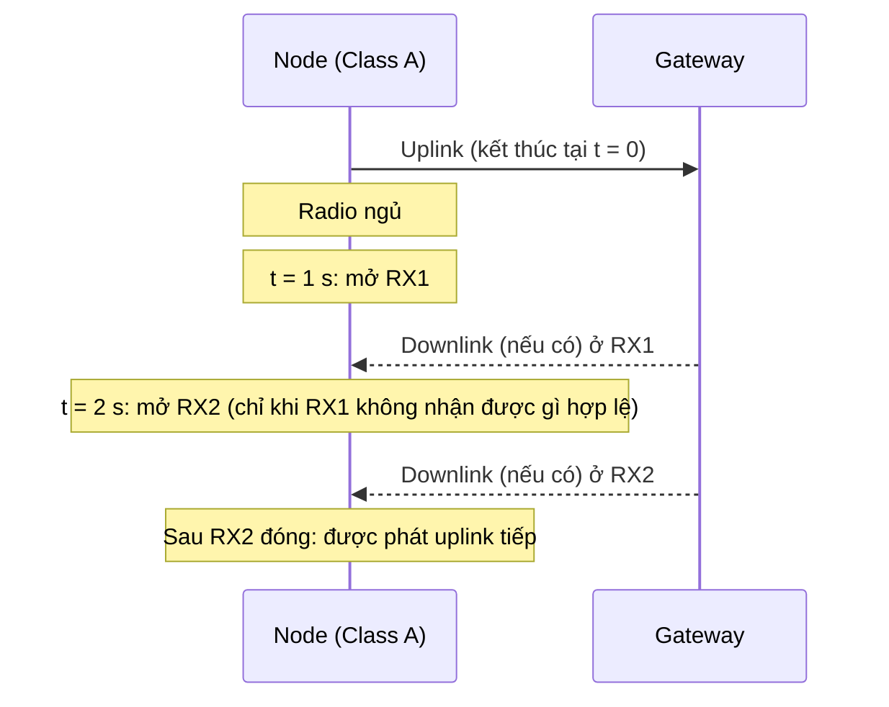

# LoRaWAN Class A: quy tắc gửi, RX1, RX2 và cách xử lý trên RAK3172

Tài liệu mô tả quy tắc gửi uplink của thiết bị Class A (profile A), hai cửa sổ nhận RX1 và RX2, điều kiện để được gửi tiếp, cách module RAK3172 phản ứng khi bị yêu cầu gửi lúc đang bận, và cách xử lý ở phía ứng dụng.

## Về độ tin cậy của nội dung

| Ký hiệu | Nghĩa |
|---|---|
| [RAK] | Có trong tài liệu hoặc diễn đàn chính thức của RAKwireless |
| [Chuẩn] | Kiến thức chung về chuẩn LoRaWAN, mình nhớ theo đặc tả, chưa đối chiếu lại văn bản đặc tả trong lần soạn này |
| [Suy ra] | Suy luận hoặc khuyến nghị thiết kế, cần kiểm tra trên thiết bị thật |

Các con số thời gian cụ thể (độ dài cửa sổ, duty cycle, dwell time) phụ thuộc kế hoạch tần số (region) và firmware. Hãy đối chiếu với Regional Parameters của LoRa Alliance và manual của đúng phiên bản firmware bạn đang dùng.

---

## 1. Class A là gì

Class A là lớp thiết bị LoRaWAN cơ bản, tiết kiệm pin nhất [Chuẩn]:

- Node tự quyết khi nào gửi uplink (không cần mạng cho phép).
- Sau mỗi uplink, node mở hai cửa sổ nhận ngắn (RX1 và RX2) để mạng có cơ hội gửi downlink.
- Ngoài hai cửa sổ này, node không nghe. Do đó mạng không thể gửi downlink cho node Class A bất kỳ lúc nào, chỉ sau khi node vừa gửi uplink.

## 2. Dòng thời gian RX1 và RX2

Cả hai mốc đều tính từ **lúc node phát xong uplink**, không tính nối tiếp từ lúc RX1 đóng [Chuẩn]:

```
t = 0 s     node phát xong uplink
t = 1 s     mở RX1: nghe ngắn, không thấy gì thì đóng ngay
            (khoảng nghỉ, radio ngủ)
t = 2 s     mở RX2: nghe ngắn, không thấy gì thì đóng
```

Sơ đồ Mermaid:



### 2.1. RX1

- Mở sau uplink khoảng 1 giây (mặc định) [Chuẩn].
- Dùng tần số của uplink vừa gửi, tốc độ dữ liệu liên quan tới uplink đó [Chuẩn].
- Mạng được gửi downlink ở đây nếu kịp xử lý.

### 2.2. RX2

- Mở sau uplink khoảng 2 giây (mặc định), tức sau RX1 khoảng 1 giây [Chuẩn].
- Dùng tần số và tốc độ cố định do mạng cấu hình, thường là tốc độ thấp (SF cao) để tăng khả năng nhận [Chuẩn]. Giá trị cụ thể phụ thuộc vùng tần số.
- Chỉ có ý nghĩa khi RX1 không nhận được downlink hợp lệ.

### 2.3. Mỗi cửa sổ mở bao lâu

Chuẩn không quy định một con số cố định chung [Chuẩn]:

- **Không phát hiện được preamble**: node đóng cửa sổ ngay. Thời gian mở rất ngắn, cỡ vài ký hiệu (symbol) LoRa, dài hơn ở SF cao vì mỗi symbol dài hơn.
- **Phát hiện được preamble**: node giữ radio mở để thu hết khung downlink. Thời gian mở bằng airtime của khung đó.

### 2.4. RX1 và RX2 không mở song song

Chúng mở lần lượt, cách nhau khoảng 1 giây tính từ lúc mở. Lý do: mỗi cửa sổ chỉ mở rất ngắn, và chúng dùng tần số, tốc độ khác nhau, trong khi radio chỉ nghe được một cấu hình tại một thời điểm [Chuẩn].

### 2.5. Chỉnh độ trễ

Hai độ trễ 1 giây và 2 giây là giá trị mặc định. Mạng có thể thay đổi bằng lệnh MAC (RXTimingSetupReq) [Chuẩn]. Tài liệu AT của RAK3172 (bản cũ) có lệnh `AT+RX1DL` và `AT+RX2DL` để xem/đặt độ trễ giữa lúc kết thúc TX và cửa sổ RX1/RX2 tính bằng ms, và `AT+RX2FQ` cho tần số RX2 [RAK]. Hãy kiểm tra lệnh còn tồn tại trong manual RUI3 của bạn trước khi dùng.

## 3. Quy tắc: khi nào node được gửi uplink tiếp

Theo chuẩn, node chỉ được phát uplink mới khi một trong hai điều kiện sau đã xảy ra [Chuẩn]:

1. Node đã nhận một downlink hợp lệ ở RX1 hoặc RX2 của lần phát trước.
2. RX2 của lần phát trước đã hết hạn (đã mở và đóng).

| Tình huống | Khi nào node được phát tiếp |
|---|---|
| RX1 không có gì, RX2 không có gì | Sau khi RX2 đóng (khoảng 2 giây cộng thời gian mở cửa sổ, tính từ lúc phát xong) |
| RX1 nhận được downlink hợp lệ | Ngay sau khi nhận xong, không cần mở RX2 |
| RX1 không có gì, RX2 nhận được downlink | Ngay sau khi nhận xong ở RX2 |

Sàn kỹ thuật cho khoảng cách giữa hai uplink liên tiếp chỉ cỡ vài giây. Giới hạn thực tế thường lớn hơn nhiều, xem mục 4.

## 4. Các giới hạn thực tế khác về tần suất gửi

Không có một con số tối thiểu chung dành riêng cho Class A. Giới hạn đến từ nhiều nguồn [Chuẩn]:

| Nguồn | Nội dung |
|---|---|
| Cửa sổ nhận của Class A | Sàn kỹ thuật cỡ vài giây (mục 3) |
| Duty cycle theo vùng | EU868: thường 1% cho các băng con phổ biến. Sau mỗi lần phát, node phải nghỉ khoảng 99 lần thời gian đã phát |
| Dwell time theo vùng | Một số vùng (như US915) giới hạn thời gian phát liên tục mỗi lần, làm SF cao bị hạn chế |
| Quy định từng nước | AS923 và các vùng khác có quy định riêng, có nơi dùng listen-before-talk |
| Join request | Có giới hạn riêng khi gửi liên tục |
| Uplink confirmed | Nếu không nhận ACK, node chờ một khoảng ngẫu nhiên (ACK_TIMEOUT) rồi gửi lại |
| Fair use của mạng công cộng | Ví dụ giới hạn thời gian phát mỗi ngày, không áp dụng cho mạng riêng |
| Duty cycle của gateway | Ảnh hưởng tần suất downlink có thể gửi |

### Ví dụ ước lượng khoảng cách tối thiểu (vùng duty cycle 1%)

Chu kỳ tối thiểu ≈ airtime × 100 [Suy ra]. Ví dụ minh họa: gói ngắn ở SF12BW125 chiếm sóng khoảng 1,3 giây thì chu kỳ tối thiểu khoảng 130 giây. Cùng gói ở SF7 chiếm vài chục ms thì chỉ cỡ vài giây. Hãy tính lại airtime bằng công cụ tính airtime LoRa với payload, SF, BW thật của bạn.

## 5. RAK3172 xử lý ra sao khi bị yêu cầu gửi lúc đang bận

### 5.1. Hành vi theo tài liệu

Theo RUI3 AT Command Manual, ghi chú của lệnh `AT+SEND` [RAK]:

- `AT_BUSY_ERROR` được trả về khi lần gửi trước chưa hoàn tất, ví dụ đang chờ duty cycle hoặc cửa sổ RX chưa được tiêu thụ xong.
- `AT_BUSY_ERROR` cũng được trả về khi một lệnh join hoặc send đang được xử lý.

Các mã trả về của `AT+SEND` là: `OK`, `AT_PARAM_ERROR`, `AT_BUSY_ERROR`, `AT_NO_NETWORK_JOINED` [RAK].

Ví dụ:

```text
AT+SEND=12:112233
OK
```

Nếu lệnh bị từ chối vì module bận, module trả `AT_BUSY_ERROR` thay vì xếp gói vào hàng đợi.

### 5.2. Module có queue không

Mình không tìm thấy trong tài liệu chỗ nào nói module có hàng đợi uplink bên trong khi dùng lệnh AT. Cách hiểu an toàn: **module từ chối lệnh, và nếu ứng dụng không gửi lại thì dữ liệu bị mất**. Mình chưa kiểm tra mã nguồn firmware hay thử trên module thật, nên hãy kiểm chứng bằng thực nghiệm nếu hành vi này quan trọng với thiết kế của bạn.

### 5.3. `AT_BUSY_ERROR` ở chế độ LoRa P2P (nguyên nhân khác)

Ở chế độ LoRa P2P, `AT_BUSY_ERROR` còn trả về khi module đang ở trạng thái nhận (RX mode) mà bạn gửi lệnh gửi hoặc cấu hình lại chu kỳ RX [RAK]. Diễn đàn RAK nhấn mạnh lỗi này không có nghĩa lần gửi trước vẫn đang chạy, mà chỉ là đang ở chế độ RX nên chưa gửi được [RAK]. Muốn gửi trong khi RX còn mở, xem các tùy chọn của lệnh `AT+PRECV`. Nếu đặt `AT+PRECV=65534` (nhận liên tục) thì cần chạy `AT+PRECV=0` trước khi cấu hình lại TX/RX [RAK].

Phần này thuộc chế độ P2P, không liên quan tới Class A của LoRaWAN, nên đừng lẫn hai chế độ khi tra cứu.

### 5.4. Trường hợp bật CAD

Diễn đàn RAK cho biết nếu bật CAD (`AT+CAD=1`), mỗi lần gửi module kiểm tra kênh trước. Nếu kênh đang có hoạt động thì gói chưa được gửi và có thể xuất hiện `AT_BUSY_ERROR`, ứng dụng phải gửi lại [RAK]. Đây là ngữ cảnh P2P, không phải LoRaWAN Class A.

## 6. Cách xử lý ở phía ứng dụng

### 6.1. Nguyên tắc

1. Coi `AT_BUSY_ERROR` là tình trạng tạm thời, không phải lỗi nghiêm trọng.
2. Không đẩy lệnh gửi liên tục. Chỉ gửi khi module rảnh.
3. Tự giữ dữ liệu trong bộ đệm của ứng dụng cho tới khi gửi thành công.
4. Đặt chu kỳ gửi dài hơn tổng thời gian module cần (airtime, hai cửa sổ RX, và khoảng nghỉ duty cycle).

### 6.2. Các phương án

| Phương án | Mô tả | Khi dùng |
|---|---|---|
| Chờ sự kiện hoàn tất | Module phát thông báo `+EVT:...` khi gửi xong hoặc nhận downlink. Gửi tiếp sau khi nhận sự kiện [RAK]. Tên sự kiện chính xác tùy phiên bản firmware RUI3, cần tra manual | Cách ưu tiên |
| Retry có giới hạn | Nhận `AT_BUSY_ERROR` thì đợi một khoảng rồi gửi lại, giới hạn số lần và có timeout [Suy ra] | Khi không bắt được sự kiện |
| Hàng đợi ở MCU | Dữ liệu vào hàng đợi của MCU, chỉ đẩy xuống module khi rảnh [Suy ra] | Khi có nhiều nguồn dữ liệu hoặc dữ liệu không được mất |
| Chu kỳ cố định đủ dài | Lên lịch gửi với chu kỳ lớn hơn mức tối thiểu, tránh va vào lúc module bận [Suy ra] | Ứng dụng cảm biến đơn giản |

### 6.3. Mã giả

```text
queue = []                  # hàng đợi dữ liệu ở MCU
busy  = false

khi có dữ liệu mới:
    queue.push(data)

vòng lặp chính:
    nếu queue không rỗng và busy == false:
        gửi "AT+SEND=<port>:<payload>"
        đợi phản hồi:
            "OK"             -> busy = true (chờ sự kiện hoàn tất)
            "AT_BUSY_ERROR"  -> chờ một khoảng rồi thử lại (giới hạn số lần)
            "AT_NO_NETWORK_JOINED" -> thực hiện join lại
            "AT_PARAM_ERROR" -> bỏ gói, ghi log lỗi tham số

khi nhận sự kiện hoàn tất gửi (và cửa sổ RX đã xong):
    queue.pop()
    busy = false
```

Đây là khung logic minh họa, chưa gắn với tên sự kiện cụ thể của firmware. Hãy thay bằng đúng chuỗi sự kiện của phiên bản RUI3 bạn dùng.

### 6.4. Khuyến nghị đo kiểm

- Ghi lại thời gian từ lúc gọi `AT+SEND` tới khi nhận sự kiện hoàn tất để biết module bận bao lâu ở SF của bạn.
- Đo tỉ lệ `AT_BUSY_ERROR` để chỉnh chu kỳ gửi.
- Theo dõi `fcnt` phía network server để phát hiện gói bị mất.

## 7. Tóm tắt nhanh

- RX1 mở khoảng 1 giây, RX2 khoảng 2 giây sau khi node phát xong, tính từ cùng một mốc, mở lần lượt, mỗi cửa sổ chỉ mở ngắn.
- Node được gửi tiếp khi đã nhận downlink hợp lệ hoặc khi RX2 đã đóng.
- Giới hạn tần suất thực tế do duty cycle, dwell time và quy định vùng, thường lớn hơn nhiều so với sàn vài giây của Class A.
- RAK3172 trả `AT_BUSY_ERROR` khi bị yêu cầu gửi lúc đang bận, không thấy tài liệu nói về hàng đợi bên trong.
- Ứng dụng nên chờ sự kiện hoàn tất, retry có giới hạn và tự giữ hàng đợi dữ liệu.

## 8. Việc cần xác nhận thêm

- Kế hoạch tần số đang dùng và giới hạn duty cycle hoặc dwell time tương ứng.
- Phiên bản firmware RUI3 và danh sách sự kiện `+EVT:` chính xác.
- Lệnh `AT+RX1DL`, `AT+RX2DL`, `AT+RX2FQ` còn tồn tại và hoạt động ra sao trên bản RUI3 của bạn.
- Hành vi thực tế khi gửi dồn (có queue nội bộ hay không) bằng thử nghiệm.
- Thông số RX1/RX2 mà network server (ví dụ network server trong WISE-6610) đang cấu hình.

## 9. Nguồn tham khảo

- RAKwireless: RUI3 AT Command Manual (lệnh `AT+SEND`, mã lỗi `AT_BUSY_ERROR`).
- RAKwireless: RAK3172 WisDuo Evaluation Board Quick Start Guide và Deprecated AT Command Manual (`AT_BUSY_ERROR`, `AT+RX1DL`, `AT+RX2DL`, `AT+RX2FQ`).
- Diễn đàn RAKwireless: các thảo luận về `AT_BUSY_ERROR` khi dùng `AT+PSEND` và CAD.
- LoRa Alliance: LoRaWAN Specification và Regional Parameters (cần đối chiếu cho vùng tần số cụ thể).
