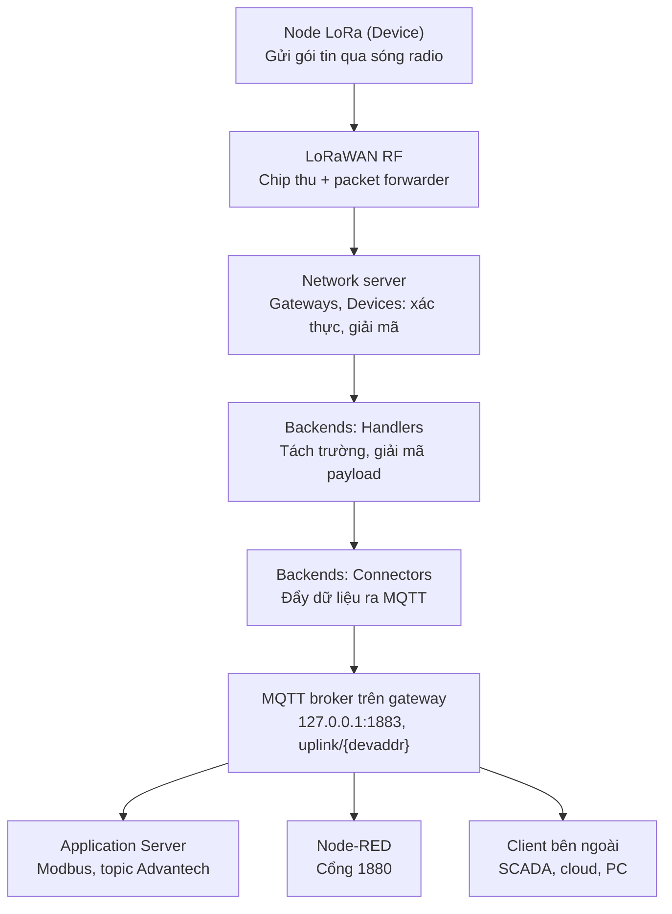

# Advantech WISE-6610: luồng dữ liệu và hướng dẫn cấu hình

Tài liệu mô tả cách một gói tin LoRaWAN đi từ node (device) qua gateway WISE-6610 và ra ngoài, cùng cách cấu hình từng thành phần: Network Server, Handler, Connector, Application Server, Node-RED.

## Về độ tin cậy của nội dung

Nội dung được chia theo mức độ chắc chắn để bạn biết chỗ nào cần kiểm tra lại trên thiết bị:

| Ký hiệu | Nghĩa |
|---|---|
| [Manual] | Có trong manual hoặc tài liệu hướng dẫn của Advantech |
| [Upstream] | Lấy từ tài liệu mã nguồn mở lorawan-server, là nền tảng của network server tích hợp trong WISE-6610. Firmware Advantech có thể khác phiên bản |
| [Suy ra] | Kiến thức chung về LoRaWAN hoặc suy luận từ cấu hình thực tế. Cần xác nhận trên thiết bị |
| [Thực tế] | Quan sát từ ảnh chụp giao diện của thiết bị này |

---

## 1. Tổng quan

WISE-6610 không chỉ chuyển tiếp sóng LoRa. Nó chạy sẵn một LoRaWAN network server, có thể giải mã dữ liệu LoRaWAN ngay trong thiết bị [Manual]. Vì vậy mọi tầng xử lý nằm trong cùng một hộp:

1. **Tầng radio**: nhận sóng từ node.
2. **Tầng network server**: xử lý giao thức LoRaWAN, quản lý gateway và device, đưa dữ liệu qua Handler và Connector.
3. **Tầng ứng dụng**: Application Server của Advantech và Node-RED lấy dữ liệu từ MQTT broker nội bộ.

Điểm dễ nhầm: menu **Backends** thuộc network server, còn menu **Application Server** là phần mềm riêng của Advantech chạy phía sau, lấy dữ liệu từ MQTT broker.

## 2. Sơ đồ luồng uplink

Hình dưới nằm trong file `wise6610_uplink_flow.svg`. Để hình hiện đúng, đặt file SVG cùng thư mục với tài liệu này.


Phiên bản dạng Mermaid (hiển thị được trên GitHub và các trình xem Markdown hỗ trợ Mermaid, không cần file ảnh):



Chú thích màu trong hình SVG: xám là tầng radio, tím là network server (Handler, Connector), xanh lục là MQTT broker, vàng là các bên dùng dữ liệu.

## 3. Các thành phần trong gateway

Menu của giao diện LoRaWAN Service trên thiết bị này [Thực tế]:

| Menu | Vai trò |
|---|---|
| Overview | Trang tổng quan trạng thái |
| LoRaWAN RF | Cấu hình tầng radio (kế hoạch tần số, packet forwarder) |
| Infrastructure | Cấu hình hạ tầng mạng LoRaWAN |
| Gateways | Danh sách gateway mà network server quản lý |
| Devices | Danh sách node (device) được phép tham gia mạng |
| Backends | Gồm Custom Database, Handlers, Connectors, Data Decoders: nơi quyết định dữ liệu được xử lý và gửi đi đâu |
| Application Server | Phần mềm ứng dụng của Advantech |
| System | Cấu hình hệ thống |

Menu cấp ngoài của giao diện quản trị chung của thiết bị [Thực tế]: Overview, Interface, LoRaWAN, System Management (Password Manager, Syslog, NTP/Time, SNMP, Network Access, Configuration Manager, Firmware Upgrade, Reset System, Reboot Device, Apply Configuration), Application Tools, Diagnostics Tools, IPK Management.

### 3.1. MQTT broker nội bộ

Manual cho biết broker và websocket trên WISE-6610 được bật sẵn, và bạn có thể subscribe topic `#` tại địa chỉ 192.168.1.1 để nhận bản tin từ node [Manual]. Đây là điểm trung chuyển dữ liệu trong gateway.

## 4. Chi tiết từng bước trong luồng uplink

### Bước 1. Node gửi gói tin tới tầng radio

Node phát gói đã mã hóa. Chip thu của gateway nhận sóng, packet forwarder đóng gói và chuyển cho network server. Tài liệu cấu hình của Advantech nêu có thể trỏ gateway tới network server là chính nó (127.0.0.1) [Manual]. Với thiết bị của bạn, nên để trỏ về chính nó.

### Bước 2. Network server

[Suy ra] Network server kiểm tra gói tin có thuộc thiết bị đã khai báo trong mục **Devices** không, kiểm tra tính toàn vẹn, giải mã payload và tạo dữ liệu thô dạng hex (trường `data`). Mục **Gateways** là danh sách gateway mà network server chấp nhận.

Điều kiện để node gửi dữ liệu được: node phải được khai báo trong **Devices** với thông số khớp với node thật (DevEUI và khóa; hoặc DevAddr và khóa nếu kích hoạt kiểu ABP). Tên trường chính xác trong form phụ thuộc firmware nên cần xem trực tiếp trên màn hình.

### Bước 3. Handler (Backends > Handlers)

Handler là nơi định nghĩa ứng dụng và dữ liệu được tách thành những trường nào [Upstream]. Một handler được tạo sẵn cho WISE-6610 [Manual]: `WISE6610_Handler`.

Các ô chính của form handler [Upstream]:

| Ô | Ý nghĩa |
|---|---|
| Application | Tên ứng dụng. Connector liên kết với handler qua tên này |
| Uplink Fields | Các trường dữ liệu gửi tới backend Connector |
| Payload | Định dạng giải mã tự động: ASCII Text, Cayenne LPP, CBOR hoặc Custom Binary |
| Parse Uplink | Hàm Erlang để tách `data` thô thành các trường có nghĩa, mở rộng danh sách Uplink Fields |
| Event Fields | Các trường gửi đi khi có sự kiện (joined, delivered, lost, test) |
| Parse Event | Hàm điều chỉnh dữ liệu sự kiện |
| Build Downlink | Hàm dựng khung downlink từ dữ liệu backend |
| D/L Expires | Khi nào downlink bị bỏ: Never hoặc When Superseded |

Nếu không có hàm Parse Uplink thì chỉ các Uplink Fields được gửi đi [Upstream].

Cấu hình hiện tại [Thực tế]: Application = `WISE6610_Handler`, Uplink Fields = `devaddr`, `deveui`, `port`, `data`.

### Bước 4. Connector (Backends > Connectors)

Connector định nghĩa luồng dữ liệu: sau khi handler xử lý xong thì dữ liệu đi đâu, ví dụ lưu vào MQTT broker hoặc websocket [Manual].

Các ô của form connector, kèm cấu hình hiện tại [Thực tế]:

| Ô | Giá trị hiện tại | Ý nghĩa |
|---|---|---|
| Connector Name | WISE6610_Broker | Tên nhận diện |
| Application | WISE6610_Handler | Handler mà connector gắn vào |
| Format | JSON | Định dạng bản tin gửi đi |
| URI | 192.168.50.43:1883 | Địa chỉ MQTT broker đích |
| Publish Uplinks | uplink/{devaddr} | Topic gateway publish dữ liệu uplink |
| Publish Events | event/{devaddr} | Topic gateway publish sự kiện của node |
| Subscribe | downlink/# | Topic gateway lắng nghe để nhận lệnh |
| Received Topic | downlink/{devaddr} | Mẫu để tách `devaddr` từ topic nhận được |
| Enabled | bật | Bật/tắt connector |
| Failed | connect_failed | Trạng thái lỗi |

Theo manual, topic mặc định là uplink/{devaddr} cho uplink và out/{devaddr} cho downlink [Manual]. Thiết bị của bạn dùng downlink/{devaddr}, nên có thể đã được chỉnh khác mặc định.

Quy tắc quan trọng [Upstream]: các trường dùng trong mẫu topic (ví dụ `{devaddr}`, `{deveui}`) phải nằm trong Uplink Fields của handler. Vì vậy không được bỏ `devaddr` khỏi handler khi topic còn dùng `{devaddr}`.

### Bước 5. MQTT broker

Bản tin JSON được publish vào topic `uplink/<devaddr>`. Bản tin có dạng sau (giá trị chỉ minh họa, bản tin thật có thể có thêm trường):

```json
{"devaddr":"01A2B3C4","deveui":"0123456789ABCDEF","port":1,"data":"0A1B2C"}
```

### Bước 6. Dữ liệu đi ra ngoài gateway

Có ba đường:

1. **Máy bên ngoài kết nối vào broker của gateway**: dùng MQTT client tới `<IP gateway>:1883` và subscribe `#` hoặc `uplink/#`.
2. **Connector đẩy sang broker bên ngoài**: đặt URI của connector là broker đích. Gateway phải có đường mạng tới broker đó (đúng dải IP, có gateway mặc định).
3. **Application Server hoặc Node-RED**: xử lý, chuyển đổi, Modbus TCP hoặc đẩy lên cloud. Bản User Module mới của LoRaWAN Gateway có tính năng MQTT bridge hỗ trợ TLS [Manual].

## 5. Hướng dẫn cấu hình từng bước

### 5.1. Truy cập gateway lần đầu

IP mặc định của WISE-6610 thường là 192.168.1.1 [Manual]. Nếu gateway không cùng dải với router:

1. Nối cáp LAN trực tiếp từ máy tính vào gateway.
2. Đặt IP tĩnh cho máy tính cùng dải, ví dụ `192.168.1.10`, mask `255.255.255.0`, để trống gateway.
3. Mở trình duyệt vào `http://192.168.1.1`. Tài khoản mặc định ghi trên tem thiết bị hoặc trong manual.
4. Trong giao diện cấu hình mạng của gateway, đổi sang DHCP hoặc đặt IP tĩnh cùng dải với router.
5. Trả card mạng máy tính về tự động rồi cắm gateway vào router.

### 5.2. Sửa lỗi connect_failed của connector

Hiện tại URI trỏ tới `192.168.50.43:1883`, nhưng gateway nằm ở dải khác nên không kết nối được [Thực tế]. Hướng dẫn của Advantech dùng `127.0.0.1` vì chính WISE-6610 có MQTT broker [Manual].

1. Vào **Backends > Connectors**, bấm vào `WISE6610_Broker`.
2. Sửa **URI** thành `127.0.0.1:1883`.
3. Giữ nguyên Format = JSON, các ô topic giữ nguyên.
4. Bấm **Submit**.
5. Quay lại danh sách Connectors, tải lại trang, xem cột **Failed** đã hết `connect_failed` chưa.

Nếu vẫn lỗi, broker nội bộ có thể chưa được bật. Kiểm tra mục System và Application Tools.

### 5.3. Kiểm tra dữ liệu trên broker

1. Dùng MQTT Explorer (hoặc `mosquitto_sub`) kết nối tới `<IP gateway>:1883`.
2. Subscribe `#`.
3. Cho node gửi một gói. Bản tin sẽ xuất hiện tại `uplink/<devaddr>`.

Ví dụ với mosquitto:

```
mosquitto_sub -h 192.168.1.1 -p 1883 -t "#" -v
```

### 5.4. Chọn Uplink Fields

Vào **Backends > Handlers**, mở `WISE6610_Handler`. Ô Uplink Fields cho phép chọn nhiều trường. Danh sách đầy đủ ở mục 6. Gợi ý nên thêm: `datetime`, `rssi`, `lsnr`, `fcnt`, `battery`. Giữ `devaddr` vì topic đang dùng `{devaddr}`.

### 5.5. Giải mã payload thành giá trị đọc được

Trường `data` là hex thô. Có hai cách:

**Cách 1: giải mã tại gateway bằng Parse Uplink** [Upstream]. Ví dụ node gửi 2 byte nhiệt độ (đơn vị 0,01 độ) và 1 byte độ ẩm:

```erlang
fun(Fields, <<Temp:16/signed, Hum>>) ->
  Fields#{temp => Temp/100, hum => Hum}
end.
```

Manual của Advantech cũng có ví dụ rule dạng `Fields#(device => pm25, temp => Temp/100, hum => Hum/100, sensor => Sensor)` [Manual]. Hàm này phải khớp đúng cấu trúc byte của node thật.

**Cách 2: để nguyên hex, giải mã ở phía nhận** (ví dụ trong Node-RED). Phù hợp khi muốn linh hoạt hơn.

Nếu node dùng Cayenne LPP, chỉ cần chọn Payload = Cayenne LPP, server tự tạo các trường `fieldN` [Upstream].

### 5.6. Gửi lệnh xuống node (downlink)

1. Publish vào topic `downlink/<devaddr>` một bản tin JSON.
2. Tối thiểu cần payload dạng hex.

Ví dụ [Upstream]:

```json
{"data":"0026BF08BD03CD35000000000000FFFF"}
```

Các trường tùy chọn [Upstream]: `port` (1 đến 223), `confirmed` (true/false), `time`, `pending`, `receipt`.

Lưu ý quan trọng về thời điểm gửi, xem mục 7.

### 5.7. Application Server của Advantech

[Manual] Application Server subscribe MQTT broker và hiển thị dữ liệu trên trang của Advantech. Ngoài trang này, bạn có thể subscribe topic `#` hoặc `Advantech/+/data` từ MQTT server của WISE-6610 để dùng cho phần mềm khác. Để node Advantech (dòng BB-WSW, Wzzard) dùng được topic dạng `Advantech/<địa chỉ>/data`, cần điền `Advantech` vào ô **App Arguments** của node.

Một hướng dẫn khác của Advantech (iFactory) cho biết application server subscribe topic `upload/#` để nhận dữ liệu từ connector của network server [Manual]. Tên topic phụ thuộc cấu hình connector và phiên bản tài liệu, nên cần đối chiếu với connector thực tế của bạn.

Dòng WISE-6610 v2 còn hỗ trợ Modbus TCP server để đọc dữ liệu I/O của node [Manual]. Chi tiết cấu hình Modbus chưa được kiểm chứng trong tài liệu này.

### 5.8. Node-RED

[Manual] Node-RED chạy như một User Module, truy cập qua `http://<IP gateway>:1880`. Trên trang hỗ trợ Advantech, Node-RED có gói User Module riêng cho WISE-6610.

Các bước:

1. Kiểm tra mục **Application Tools** và **IPK Management** xem đã có Node-RED chưa. Nếu chưa, tải đúng gói theo phiên bản firmware từ trang hỗ trợ Advantech rồi cài [Suy ra: vị trí cài đặt có thể khác tùy firmware].
2. Bật dịch vụ Node-RED. Nếu cổng 1880 không mở, kiểm tra firewall trong **Network Access**.
3. Mở `http://<IP gateway>:1880`.
4. Trong flow, dùng nút **mqtt in** làm đầu vào: broker `127.0.0.1`, cổng 1883, topic `uplink/#` hoặc `#`. Hướng dẫn Advantech cũng mô tả Node-RED cần cấu hình đầu vào (inbound) lấy dữ liệu từ connector của network server [Manual].
5. Thêm nút **json** để chuyển chuỗi thành đối tượng, rồi **function** để giải mã hex nếu cần, rồi nút **debug** để xem kết quả.
6. Đầu ra: lưu CSDL, đẩy cloud (MQTT, HTTP), v.v.

Ví dụ nút function giải mã `data` hex thành nhiệt độ và độ ẩm (cần chỉnh theo node của bạn):

```javascript
const buf = Buffer.from(msg.payload.data, "hex");
msg.payload = {
  devaddr: msg.payload.devaddr,
  temp: buf.readInt16BE(0) / 100,
  hum: buf.readUInt8(2)
};
return msg;
```

## 6. Các trường Uplink Fields [Upstream]

| Trường | Kiểu | Ý nghĩa | Đang chọn |
|---|---|---|---|
| `netid` | Hex | Mã định danh mạng (NetID) | |
| `app` | Chuỗi | Tên ứng dụng (Handler) | |
| `devaddr` | Hex | Địa chỉ 4 byte của node | ✔ |
| `deveui` | Hex | Mã nhận dạng 8 byte của thiết bị | ✔ |
| `appargs` | Bất kỳ | Tham số ứng dụng gắn cho node | |
| `desc` | Chuỗi | Mô tả tự đặt của node | |
| `battery` | Số nguyên | Mức pin gần nhất thiết bị báo | |
| `fcnt` | Số nguyên | Số thứ tự khung uplink | |
| `port` | Số nguyên | Cổng LoRaWAN (FPort) | ✔ |
| `data` | Hex | Payload thô dạng hex | ✔ |
| `datetime` | ISO 8601 | Thời điểm nhận theo đồng hồ gateway | |
| `freq` | Số | Tần số nhận (MHz) | |
| `datr` | Chuỗi | Tốc độ dữ liệu LoRa, ví dụ SF12BW125 | |
| `codr` | Chuỗi | Tỉ lệ mã sửa lỗi, thường 4/5 | |
| `best_gw` | Đối tượng | Gateway thu mạnh nhất | |
| `mac` | Hex | MAC của gateway thu mạnh nhất | |
| `lsnr` | Số | Tỉ số tín hiệu/nhiễu SNR (dB) | |
| `rssi` | Số | Cường độ tín hiệu thu (dBm) | |
| `all_gw` | Danh sách | Mọi gateway đã nhận khung | |

Các trường bên trong đối tượng gateway (`best_gw`, `all_gw`): `mac`, `desc`, `rxq` (gồm `rxq.lsnr`, `rxq.rssi`, `rxq.tmst`), `gpsalt`, `gpspos`.

### 6.1. `datr`: tốc độ dữ liệu LoRa

`SF12BW125` gồm hai tham số điều chế:

- **SF (Spreading Factor)**, từ 7 đến 12: SF cao thì thu xa hơn, chịu nhiễu tốt hơn, nhưng tốc độ thấp và gói tin chiếm sóng lâu hơn, tốn pin hơn.
- **BW (Bandwidth)**, thường 125, 250 hoặc 500 kHz: BW rộng thì nhanh hơn nhưng kém nhạy hơn.

[Suy ra] Ở BW 125 kHz, SF7 cho tốc độ bit cỡ vài kbps, SF12 chỉ cỡ vài trăm bit/s. Node báo SF12 cùng `rssi` thấp thường là đường truyền yếu. Node bật ADR sẽ được server hạ SF khi tín hiệu tốt.

### 6.2. `rxq.tmst`: mốc thời gian nội bộ

[Upstream] Là số nguyên không dấu 32 bit, đánh dấu sự kiện "RX finished" và dùng để lên lịch phản hồi, không phải ngày giờ thật.

[Suy ra] Đơn vị là micro giây từ lúc chip khởi động, quay vòng sau khoảng 71,6 phút. Network server dựa vào nó để canh cửa sổ nhận RX1 (sau 1 giây) và RX2 (sau 2 giây) cho downlink. Không dùng làm dấu thời gian ghi dữ liệu, hãy dùng `datetime`.

## 7. Downlink Class A và độ trễ

[Suy ra, kết hợp tài liệu handler] Với Class A, node chỉ mở cửa sổ nhận ngay sau khi nó gửi uplink. Vì vậy:

- Lệnh bạn publish được xếp hàng và chỉ đi ra sau uplink kế tiếp của node.
- Độ trễ trung bình khoảng nửa chu kỳ gửi của node. Node gửi mỗi 10 phút thì lệnh có thể đến sau vài giây hoặc gần 10 phút.
- Khoảng cách từ lúc node phát xong tới cửa sổ nhận cố định (RX1 khoảng 1 giây, RX2 khoảng 2 giây theo mặc định), nhưng mốc tuyệt đối thay đổi theo từng uplink.

Các tình huống khác [Upstream]:

| Cấu hình | Hành vi |
|---|---|
| D/L Expires = Never | Mọi downlink Class A của thiết bị được xếp hàng và cuối cùng được gửi. Downlink confirmed được gửi lại cho tới khi node xác nhận |
| D/L Expires = When Superseded | Chỉ downlink mới nhất được giữ, các downlink bị ghi đè sẽ bị bỏ |
| Có trường `time` trong bản tin | Được coi là Class C. Giá trị là mốc ISO 8601 hoặc `immediately`. Chỉ hiệu quả nếu node thật sự là Class C |

Muốn giảm độ trễ: rút ngắn chu kỳ gửi của node, dùng node Class C nếu cần lệnh gần tức thì, hoặc thiết kế ứng dụng chấp nhận độ trễ.

## 8. Xử lý sự cố nhanh

| Hiện tượng | Nguyên nhân thường gặp | Cách xử lý |
|---|---|---|
| Không vào được trang cấu hình | Máy tính khác dải IP với gateway | Nối cáp trực tiếp, đặt IP tĩnh cùng dải (mục 5.1) |
| Connector báo `connect_failed` | URI trỏ tới broker không với tới được | Đổi URI thành `127.0.0.1:1883` (mục 5.2) |
| Không thấy dữ liệu trên broker | Node chưa khai báo trong Devices, connector đang lỗi, hoặc sai topic | Kiểm tra Devices, trạng thái connector, subscribe `#` |
| `data` toàn hex khó đọc | Chưa có rule parse | Dùng Parse Uplink hoặc giải mã trong Node-RED (mục 5.5) |
| Không vào được `:1880` | Node-RED chưa cài hoặc chưa bật, firewall chặn | Kiểm tra Application Tools, IPK Management, Network Access |
| Lệnh downlink tới chậm | Node Class A chỉ nhận sau mỗi uplink | Xem mục 7 |

## 9. Việc cần xác nhận thêm trên thiết bị

- Phiên bản firmware và User Module LoRaWAN Gateway đang cài.
- Tên trường chính xác trong form **Devices** và **Gateways**.
- Vị trí và trạng thái của Node-RED trên bản firmware này.
- Danh sách Uplink Fields thật sự có trong ô chọn (có thể khác danh sách upstream).
- Cấu hình Modbus TCP và các topic của Application Server nếu cần dùng.

## 10. Nguồn tham khảo

- Advantech WISE-6610 Series User Manual (các mục LoRaWAN Server, Backends, Handlers, Connectors).
- Advantech: WISE-6610 & BB-WSW Series Configuration Guide; iFactory PHM/Sensor Installation Guidebook.
- Advantech Support: WISE-6610 User Module (firmware, Node-RED User Module).
- Dự án mã nguồn mở lorawan-server: tài liệu Handlers.md, Connectors.md, JSON.md.
